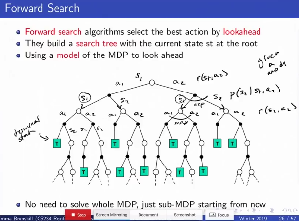
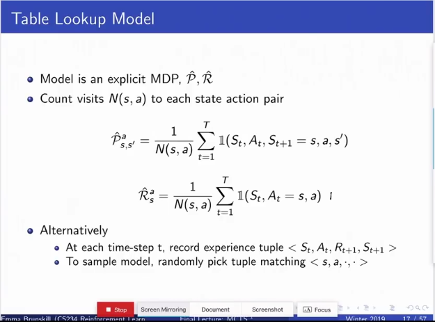
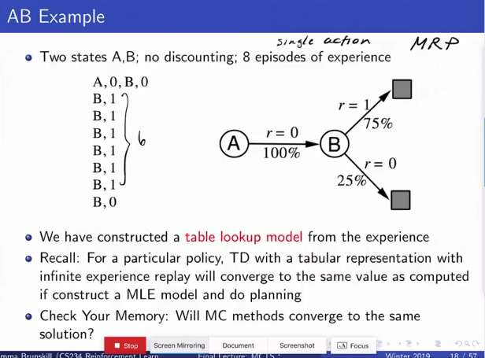
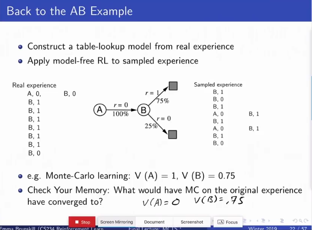
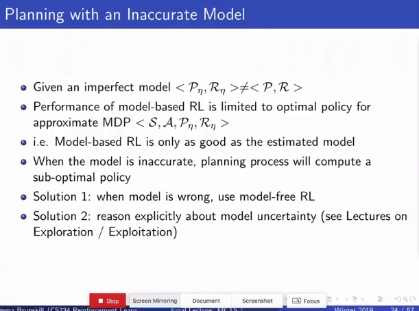

**Model Free and Model Based RL**

Monte Carlo Tree Search Is Model-Based Reinforcement Learning. Deep RL has not been so successful in Model-Based RL so far, so Model-free approaches have dominated so far.

Model-Free RL:

 - No Model

 - *Learn* Value function (and/or policy) from experience

Model-Based RL

 - Learn a model from experience (“simulator”). 

 - *Plan* value function (and/or policy) from model.

 - Can also use the model to do DP updates, or simulate model-free RL, or do policy search. However, estimates may be bad if simulator is bad.

 - Pros:

 - Can effectively learn model by supervised learning models

 - Can reason about model uncertainty (like in upper confidence bound methods for exploration/exploitation trade offs)

 - Very poweful for transfer learning

 - Cons: First learn a model, then construct a value function - two sources of approximation error.

## Def: MDP Model
A model M is a representation of an MDP <S,A,P,R>, parameterized by $\eta$. Assume the state space $S$ and action space $A$ is fixed and known. A model $M = <P_\eta, R_\eta>$ represents state transitions $P_\eta \approx P$ and $R_\eta \approx R$ s.t.
$$S_{t+1} \sim P_\eta (S_{t+1}|A_t, A_t) \\
R_{t+1} = R_\eta (R_{t+1} | S_t, A_t)$$
We typically assume conditional independence between state transitions and rewards 
$$\mathbb{P}[S_{t+1}, R_{t+1} | S_t, A_t] = \mathbb{P}[S_{t+1} | S_t, A_t] \mathbb{P}[R_{t+1} | S_t, A_t]$$

## Model Learning
Goal: Estimate model $M_\eta$ from experience $\{S_1, A_1, R_2, ..., S_T\}$.
This is a supervised learning problem 
$$ S_1, A_1 \rightarrow R_2, S_2 \\
S_2, A_2 \rightarrow R_3, S_3 \\
  \vdots \\
  S_{T-1}, A_{T-1} \rightarrow R_T, S_T
$$
Learning $s,a \rightarrow r$ is a regression problem.
Learning $s,a, \rightarrow s'$ is a density estimation problem.
Pick loss function e.g. MSE, KL divergence, and find parameters $\eta$ that minimize empirical loss.

Possible Models: Table Lookup Model, Linear Gaussian Networks, Bayesian DNNs (very exciting - but have been hard to train so far). (Appendix 1. for Table Lookup Model)

## Sample-Based Plannig
Use the model _only_ to generate samples
  $$S_{t+1} \sim P_\eta (S_{t+1} | S_t, A_t) \\
  R_{t+1} = R_\eta (R_{t+1}|S_t, A_t) $$
Then apply model-free RL to samples, eg MC Control, SARSA, Q-learning.

Note: You built the model with data. We do not reuse that data to generate our actual training examples, we only use data generated by the current version of our model!
Why: Sample-based planning methods are often more data efficient.

# Search Algorithms
## Forward Search

In order to figure out the value of each state in the tree, take a max over actions and take an expectation over states. There might be too many states and actions so often we just use simulation based search:

## Simple MC Search
Starting from a current state, perform a lot of simulations about the rewards from the current state $s_t$, then take one action (depth 1) from that state. Works but slow since we are only taking one step at a time.

Given a model $M_v$ and a simulation policy $\pi$, and that we are currently at a real state $s_t$.
For each possible action $a \in A$:
  - Simulate $K$ episodes from the current (real) state $s_t$:
    $$\{s_t, a, R_{t+1}^k,...,S_T^k\}_{k=1}^K \sim M_{v, \pi}$$
  - Evaluate actions by mean return (Monte-Carlo Evaluation)
    $$Q(s_t,a) = \frac{1}{K} \sum_{k=1}^K G_t \rightarrow q_\pi (s_t,a)$$

Select current (real) action with maximal value $a_t = \arg \max _{a \in A} Q(s_t,a)$.
This is essentially doing 1 step of policy improvement according to the simulation policy.

## Expectimax Tree
Full depth simulation, and then take the optimal path found my simulation.  Tree gets very big, grows exponentially with the horizon.

We can do better than 1 step of policy improvement. If we have the MDP model $M_v$, we can compute the optimal q(s,a) values for the current state by constructing an expectimax tree. Expectatons over states, max over actions. 
But problem: tree gets very big, grows exponentially with the horizon $O((|S||A|^T))$

Note: In 2 player adversarial settings, use minimax instead of expectimax tree.
## Monte Carlo Tree Search (MCTS)
This is what the robot does in its head to simulate and plan for the next action:

Medium depth simulation, trying to compute the value at a higher depth than 1 but in a computationally tractable way.
Given Model $M_v$, build a search tree rooted at the current state $s_t$. Samples actions and next states.
Iteratively constriuct and update tree by performing K simulation episodes starting from the root state. After search is finished, select current (real) action with maximum value in each search tree: $a_t = \arg \max_{a \in A}Q(s_t,a)$

Sample until termination or a horizon H, and then go back to start state and start another trajectory. Then take the expectimax reward over the partial tree computed so far to propagate the reward back to the root state. "Slowly fill in the expectimax tree but only have a partial tree because Expextimax tree might be intractible" (Appendix 2)

Simulating an episode involves two phases (in-tree, out-of-tree)
  - **Tree policy**: What do you do in some part of the tree where you have some data and have visited many times? Genearlly: Use Upper Confidence Tree Search (below). Or, pick actions for tree nodes to maximize Q(S,A) according to some heuristic.
  - **Roll out policy**: What should you do if you reach a node if you've never been before, or you only visited a few times? Generally: pick actions randomly, or another policy.
  
To evaluate the value of a tree node $i$ at state action pair $(s,a)$, average over all rewards recieved from that node onwards across simulated episodes in which this tree node was reached.

$$Q(i) = \frac{1}{N(i)} \sum_{k=1}^K \sum_{u=t}^T \mathbb{1}(i \in epi.k) G_k(i) \rightarrow q(s,a)$$

Under mild conditions, this converges to the optimal search tree $Q(S,A) \rightarrow q^*(S,A)$. Note that we're no longer doing expectation or max anymore, but this is okay because we are going to sample actions in a way that over time we will sample actions that look better much more.

**Advantages of MC Tree Search**
  - highly selective best-first search.
  - Evaluates states dynamically (unlike DP)
  - Uses sampling to break the curse of dimensionality
  - Works for black-box models (only requires samples)
  - Very sample efficnet
  - Very computationally effiicent, anytime, parallelizable

### Upper Confidence Tree (UCT) Search
This is a way to implement the **tree policy** above in MCTS.
Idea: borrow idea from banit literature and treat each node where we can selection each action as a multi-armed bandit problem. Treat every distinct node in the tree (could be very many) as a bandits problem, and uses optimism.

For each node $s_i$ and action from that state $a_j$, we compute a empirical Q function $\hat Q(s_i,a_j)$ based on adding the future rewards we obtained every time we were in that node during simulation previously, and also add a optimistic confidence bound adjustment (usually in the form of $\sqrt{\frac{\cdot}{n(s_1,a,1)}}$, $\sqrt{\frac{\ln (n(s))}{n(s_1,a,1)}}$ is a common pick) such that our final $Q$ functions we compare to pick the next action is $\hat Q(s_i,a_j) + \sqrt{\frac{\cdot}{n(s_1,a,1)}}$.

In other words, we maintain an upper confidence bound for every action and every state in our tree. Formally

$$Q(s,a,i) = \frac{1}{N(s,a,i)} \sum_{k=1}^K \sum_{u=t}^T \mathbb{1}(i \in epi.k) G_k(s,a,i) + c \sqrt{\frac{\ln (n(s))}{n(s,a)}}$$

(Appendix 3)

## Other parts of Alpha Go
Action heuristics (what order to try actions in was pretty important)
Self-play - use the current agent as the opponent as the minimizer of the minimax.
   - If you have two players that are both bad (like two models), one will win and one will lose, and you always get signal (for one of the models) each time.
   - If you only play against a grandmaster, you won't get reward signals for a long time.
   - Self play can get stuck in local optimal but if you are exploring you can likely get out of it.
# Appendices

**Appendix 1: Table Lookup Model**

LIterally the current reward and transition model is just the proportions of the counts seen so far.

MC methods will converge to the min MSE model, and does not make a Markovian assumption, so it will converge in all cases including the case above. But in general it will will not converge to the same policy as if we took the MLE model and did planning.

Solution 1: It depends why the model is wrong. If you assumed the world is not Markov, Q learning wont help because it also assumes Markov

Solution 2 still makes the basic assumption that your model class is correct. 

The models we need to make decisions are not the models that we need for preductive accuracy. It doesn’t matter that we can represent many parts of our world accurately, if those parts are irrelevant to our decision-making.

**Appendix 2:**** Monte Carlo Tree Search**

**
**