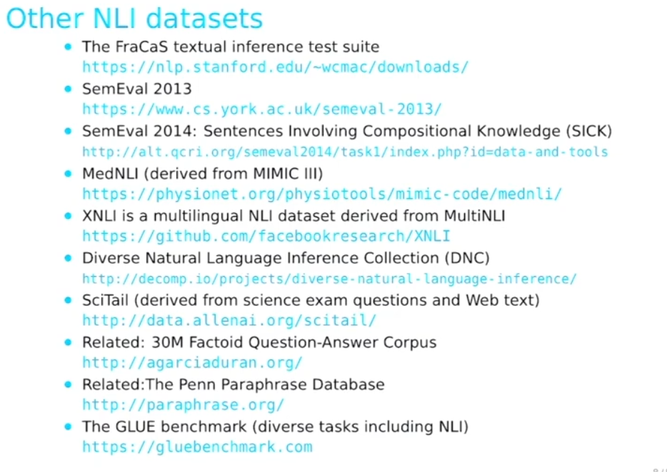
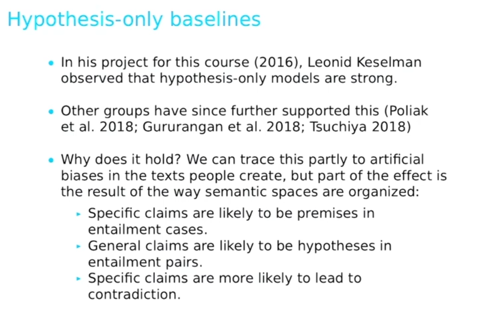
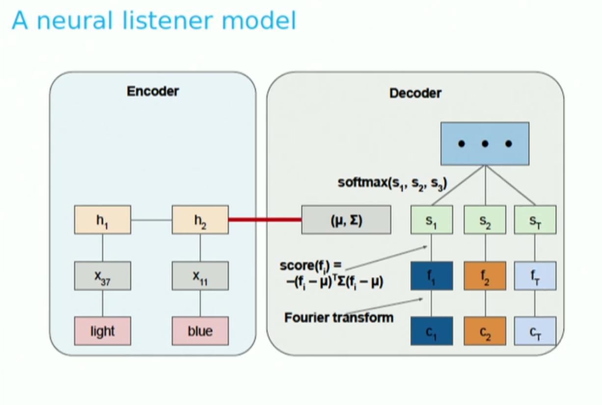
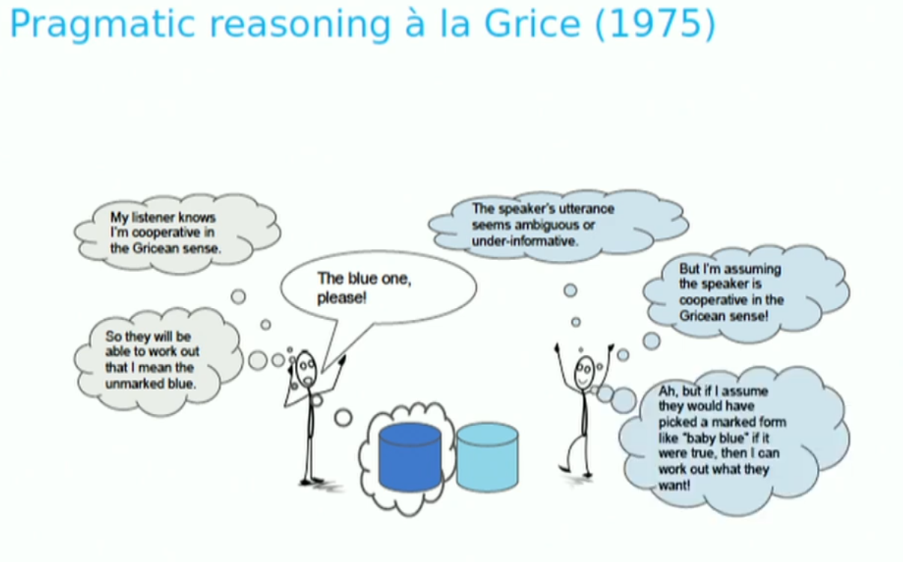
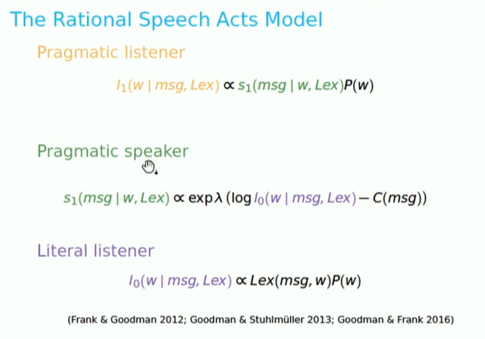
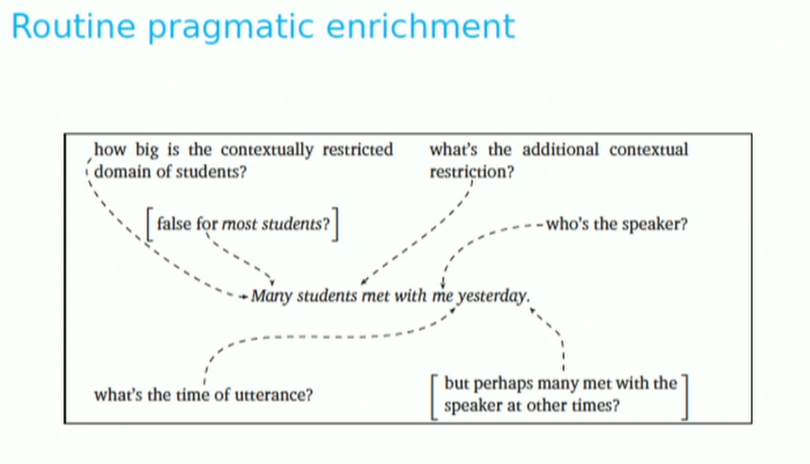
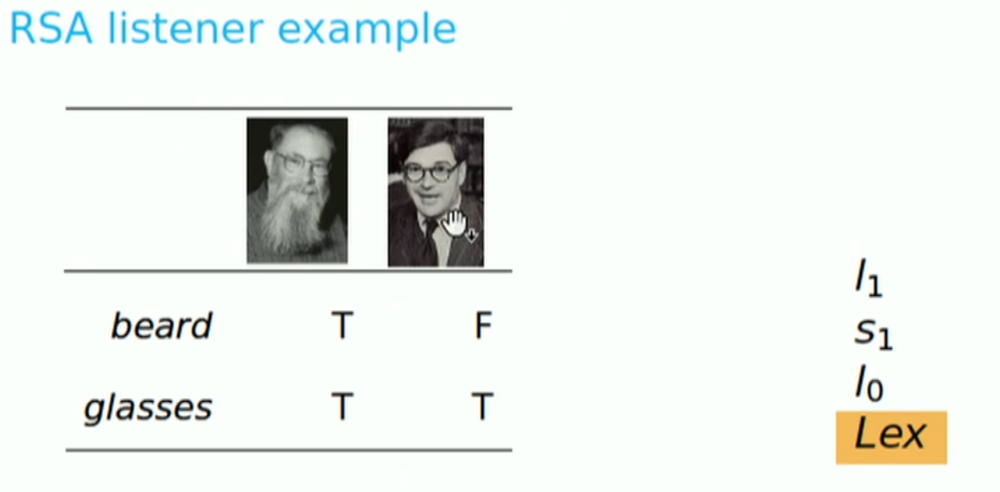
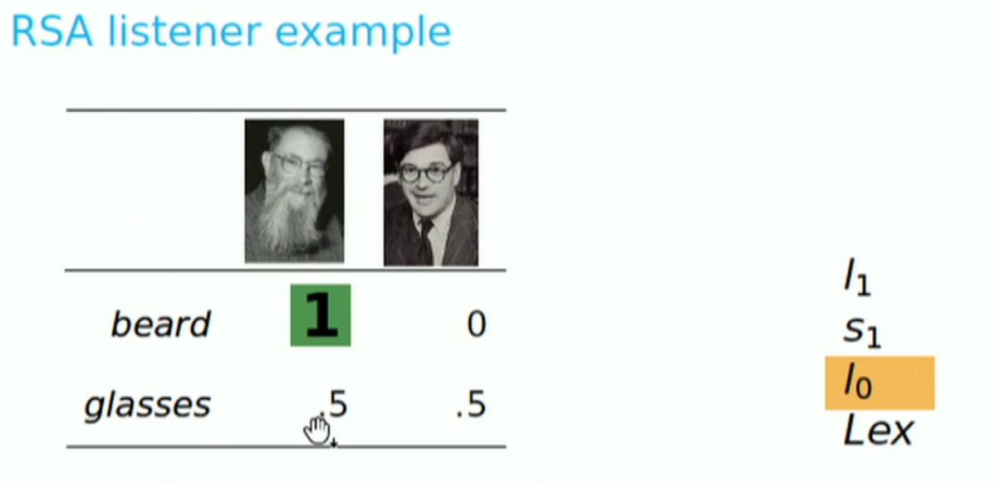
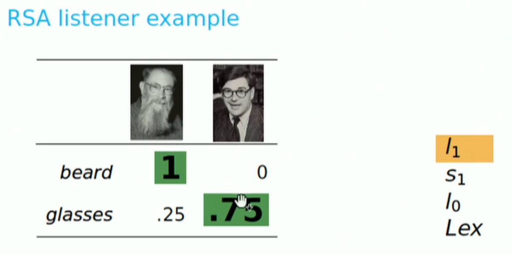

Natural language inference

Natural language inference is the task of determining whether a “hypothesis” is true (entailment), false (contradiction), or undetermined (neutral) given a context string.

**Datasets**

SNLI- Dataset from tagged Flickr images, data that describes the event in the image.

MultiNLI - Train premises frawn from five genres: 

 - Fiction, Government, Slate, Telephone, Travel, test set available on Kaggle on different Genres.

**Hand Built Features**

 - Word\_overlap\_phi

 - Edit distance

 - word differences/ word overlap

 - alignment based features

 - negation

 - quantifier relations

 - NER features 

**Chained Models**

Chain together the query and the hypothesis

NLI’s baselines use hypothesis only (query only, no context).

**Grounded Language Understanding**

**
**

**Issues of Indexicality in Language**

 - What does “I”, “we”, “three days ago” mean?

 - “We won” - who is “we”?

 The answer to those questions are dependent on what goals the speaker has - which is why you need lingustic grounding.

 There’s a lot of disambiguation work, and a lot of contextual gounding necessary (Appendix 1)

**Semantic parsers **consume langauge, construct ricj latent representaitons, and predict into structured output spaces. 

How to do grounding - Use Encoder-Decoder.

FAIR negotiation dataset - 5808 dialogues grounded in 2236 unique scenarios. 

The Rational Speech Acts Model

**
**

(Example in Appendix 2)

Appendix 1.

Winograd sentences require information about the world.

The city councilmen refused the demonstrators a permit because they [feared/advocated] violence.

Appendix 2:

A lot of lingusitic problems in pragmatics have been solved by this model, but very high bias and very hard for computers becuse of the number of concepts in the world is very large.

