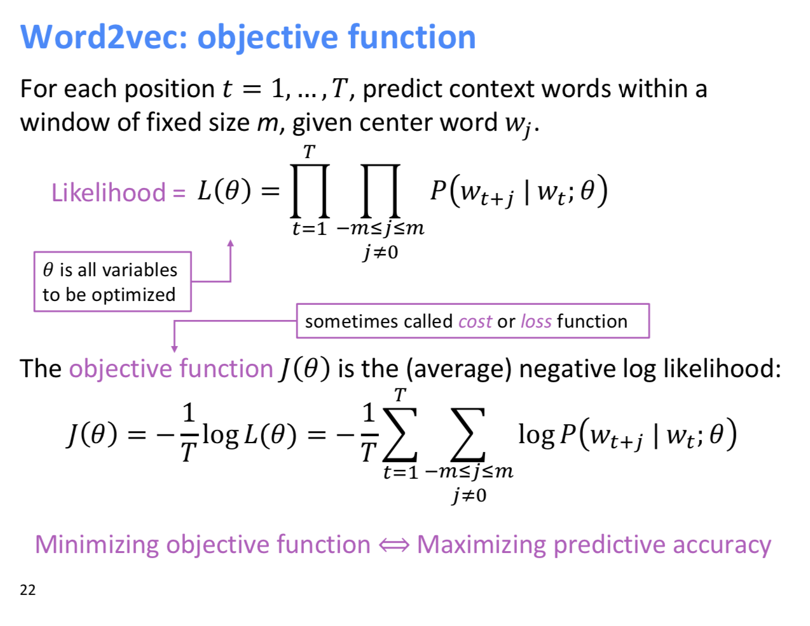
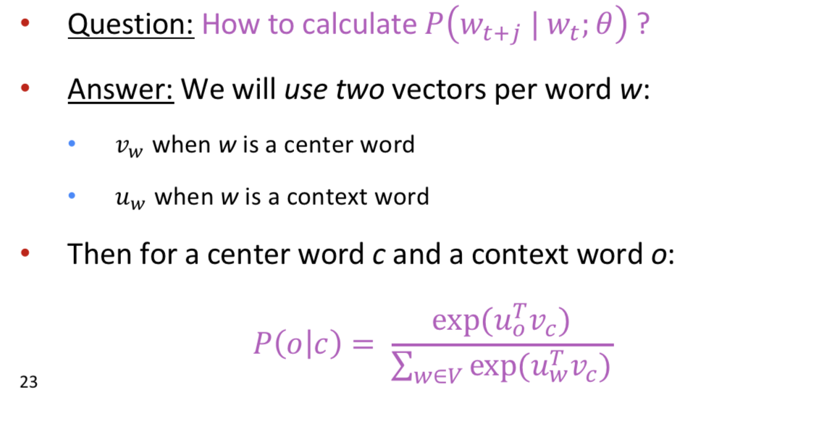
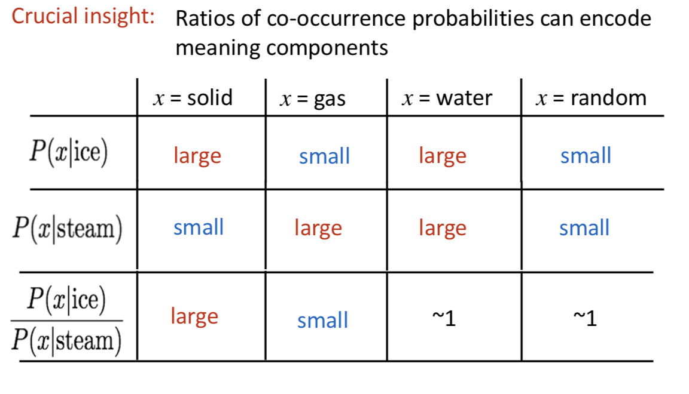

# Word Vectors
Represent words by distributional semantics - "by the company they keep". 100-dim vectors do really well in capturing word semantics. Words will be similar in vector space if they appear in similar contexts over the corpus.

How to word vectors capture semantic meaning? Whatever 'units' of meaning (captured by ferquency of context words) exist, the process to generate the word vectors must linearly map them.

## Word2Vec, Skipgrams Implementation
Use the similarity of word vectors for _context_ or _outside_ (o) and _center_ (c) to calculate c given o or vice cersa. 

### Word2Vec: Skipgrams 
- Softmax over similarities is the prob given context word.
- The objective function is the sum over all positions, of the sum over the context of the log probabilities.
- Has a shitton of parameters - $2dV$, because we have $2$ vectors for each word, $d$ dims for each word, $V$ words in vocab. This means that gradients are very sparse for each update (they only touch a few words a time). 
Alternate Word2Vec formulation is **CBOW** - Predicted center word from bag of context words. Very similar.

### Training Word2Vec: Negative Sampling
**Naive softmax** is the method presented above
- The inside part of the naive softmax gradient update for Word2Vec is:
\begin{align}
\frac{\partial}{\partial v_c} \log p(o | c) & = u_o - \sum_{x=1}^{V} p(x|c) u_x \\
& = u_o - E_{x \sim p(x|c)}(u_x)
\end{align}
The gradient update equals the observed representation of the context word minus what the model thinks the context should look like (as the weighted average of the representation of each word multiplied by its probability in the current model). This difference gives us the gradient update.
Naive softmax is really slow since you have a million words so you are taking a softmax over a million words. In real implementation use negative sampling.

**Negative Sampling** is a variant of **max-margin loss** (where we try to maximize the margin between positive examples and negative examples).
Main Idea: Train binary logistic regressions for a true pair (center word and word in its context window) vs several noise pairs (the center word paired with a random word). So we avoid having a million terms in the deonminator. The Negative Sampling Objective Function is:
$$J_t(\theta) = \log \sigma (u_o^T v_c) + \sum_{i=1}^k E_{j \sim P(w)} [\log \sigma (-u_j^T v_c)]$$
essentially, we want to maximize the similarity of the context word and push the similarities of the negatively sampled words to be as low as possible. 
- They sampled words according to the distribution $P(w) = \frac{U(w)^{3/4}}{NormFactor}$, where the $3/4$ power downsamples frequent words. 

## Aside: GloVe
How to word vectors capture semantic meaning? Whatever 'units' of meaning (captured by ferquency of context words) exist, the process to generate the word vectors must linearly map them.

### Count-based Word Vectors: Old way to make word vectors
- (Relationship between Word2Vec and LSA)
- If we set the window to be the whole document size, and don't use dense embedding vectors (just use one-hot), then we have "Latent Semantic Analysis". The traditional approach to language embedding. Then you can do dimensionality reduction (SVD) on the giant matrix, and you get SVD word vectors. (This never really worked really well, so it never really caught on.)
- Then you fiddle with the counts to scale the high frequency words, count closer words more, replacing counts with Pearson correlations etc you get getter word vectors..
Issues with co-occurence vectors - very huge because of large vocabulary, and very sparse.

This sums up the two philosophies to making word embeddings:
  - Skipgram
    - Scales well
  - Count-based
    - Primiarily used to capture word similarity, gave disproportional importance to large counts

Large or small ratios are dimensions of meaning whereas ratios close to 1 are not.

### Key insight in GloVE:
If you set $w_i^Tw_j = \log P(i | j)$, the immediately we get $w_x^T(w_a-w_b) = \log \frac{P(x|a)}{P(x|b)}$, i.e. if you make the dot products = log(co-occurence probability), then the vector differences occur with a ratio of the co-occurence probabilities.
So the objective function to train GloVE is 
$$J = \sum_{i,j=1}^V f(X_{ij})(w_i^T\tilde w_j + b_i + \tilde b_j - \log X_{ij})^2$$
where the $f(X_{ij})$ function controlls the influence of very common word pairs.
Essentially, set the loss to the square difference between the doct product and the log probabilities (with bias terms)

Based on count occurences but trained iteratively like Work2Vec ## Evaluation of Word Vectors
- Intrinsic word vector evaluation- Performance on Analogy tasks

## Appendix: 
### The Structure of Langauge
We assume people have a lot of world knowledge, so we can express a lot with very limited information.

### Notes On Word Vectors
- **The high frequency effect** - 'the' 'and' 'or' have high dot products with every word - the 'high frequency effect'. The first principal component of all word vectors is the 'high frequency effect' and if you just lop it off you can make your semantic representation better. 
- Because of sparse coding (in sparse vector spaces) you can actually denoise superpositions (independent component analysis), to separate out multiple senses of a word. (Can look at the paper: Linear Algebraic Structure of Word Senses, with Applications to Polysemy).
- Wikipedia data works very well for word vectors, better than news (prob b/c of topical coveraeg).

### Evaluation of Word Vectors
- Intrinsic word vector evaluation- Performance on Analogy tasks

### Old Stuff 
**WordNet** - synonym sets, people don't really use it anymore.
**NLTK** - swiss army knife of nlp - can do anything but not good at anything.
Always use good tools.