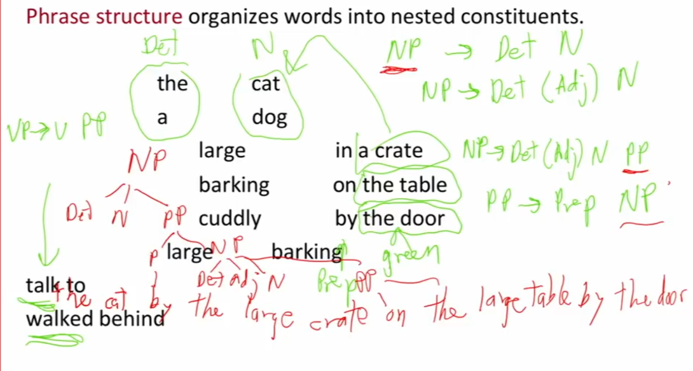
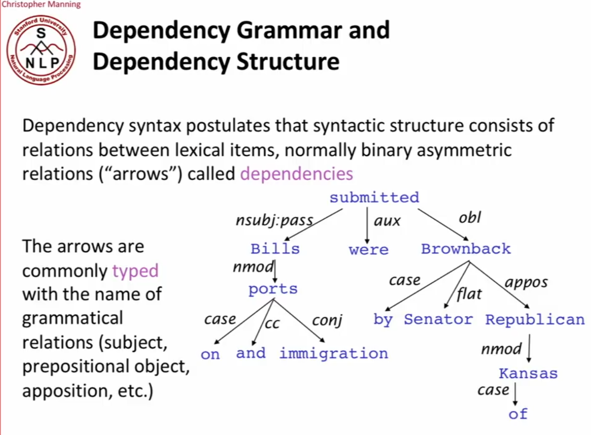
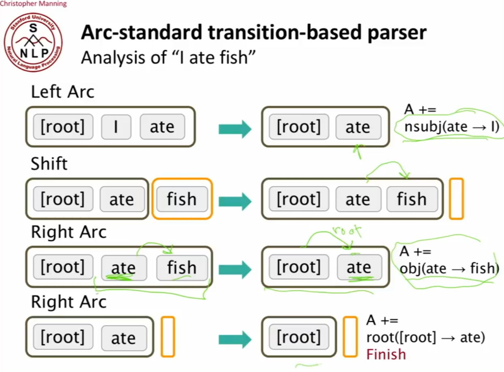
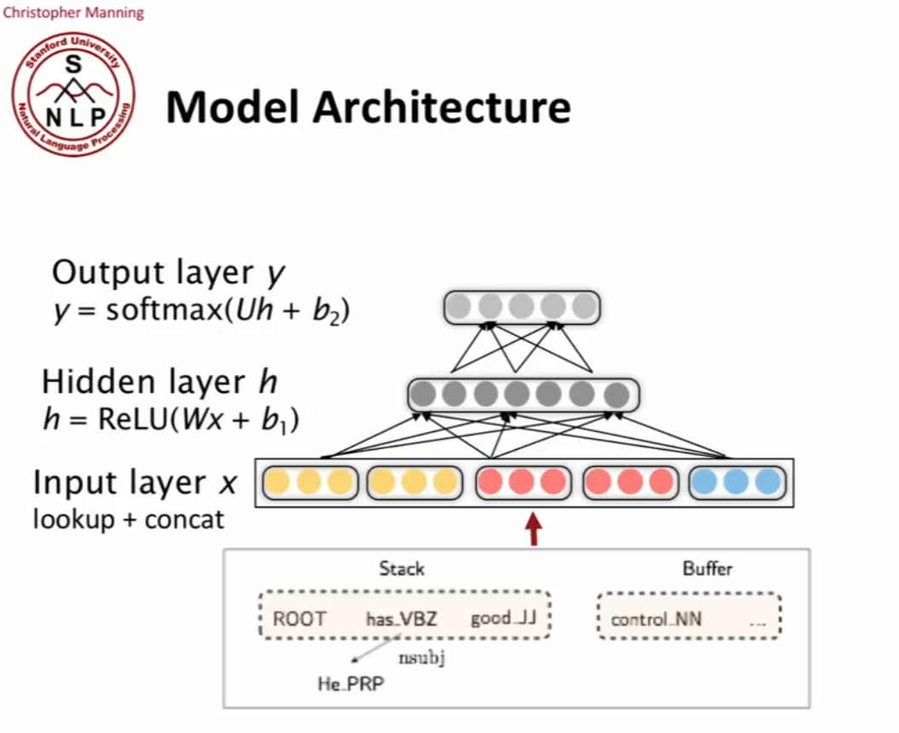
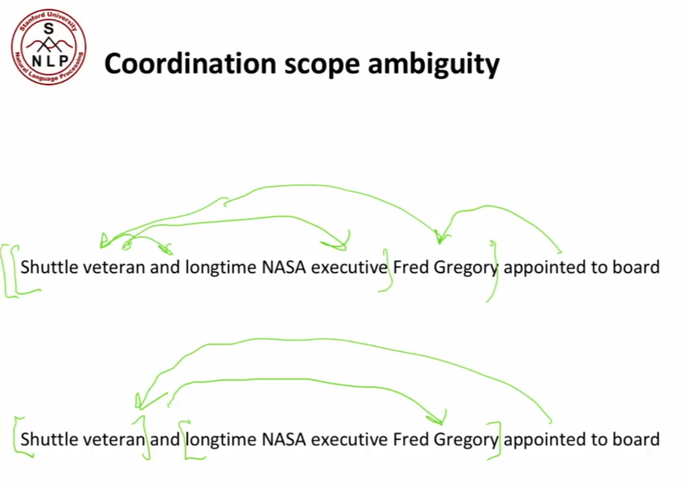

**Two views of linguistic structure**

**- Phrase Structure = ****Context Free Grammars = ****The Lingustics Approach. Not used much in CS.**

- **Dependency Structure**

 - Look at how words are arguemnts of (modify, are dependents of) other words.

Alternative way to represent a dependency parse is with arrows from words to each other.

Dependency Parses are listed in treebanks. You can use treebanks to build parsers.

You can use it to break ambiguities and do all sorts of ML NLP things.

**Dependency Parsing**

A sentensed is parsed by choosing for each word what other word (including ROOT) it is a dependent of. The parse usually has some constraints, namely, only one word is a dependent of ROOT and the parse as no cycles (it is a Tree). 

The final issue to decide is whether arrows can cross (**non-projective dependency**) or not (**projective dependency**). Most of the time, dependencies don’t cross but it does happen rarely. 

**Methods of Dependency Parsing:**

There have been many methods of dependency parsing historically but the most popular one right now is **Transition-based or deterministic dependcy parsing** popularized by MaltParser (2008).

This works like a **shift-reduce parser** (that compilers use).

**Transition-based or deterministic dependcy parsing**

There are many transition schemes: An arc-standard transition-based parser works as follows:

I have a stack (what I’ve built) and a buffer (all the words I haven’t dealt with yet).

In each step, I could either *shift* the next word onto the stack, or reduce the stack through the* left-arc *or *right-arc* actions by adding arcs between objects on the stack. Possible actions at any given point in time are:

 1\. Shift

 2\. Left-arc

 3\. Right-arc

**How to make parsing decisions at each step?**

Use a machine learning classifier to decide the next action: Shift, left-arc, or right-arc. (Note that if we wnat to add relation tags and there are n of them then we build a classifier over 2n+1 actions.)

Finish condition is buffer is empty and only root is on stack.

**
**

**
**

**Neural Dependency Parsers**

(Chen and Manning 2014)

The features to learn parsers before were hand-engineered, and very very time costly to compute. 

Represent each word as a d-dimensional dense vector (i.e. word embedding). Similar words are expected to have close vectors

They also represented **part of speech tags** and** dependency labels** as d-dimensional vectors. These are smaller discrete sets (only tens of elements) and are embedded into a space where semantical similarities are preserved (like plural noun is close to singular noun etc). 

They had the top positions of the stack and the first positions of buffer, and for each of those positions you had a word and a POS, as well as any dependncies that have already been built. So we have a triple for each position, and each is converted into a distributed repreesntaiton which we are learning, and those distributed repreesntaitons were used to learn the parser. A simple FF NN which was a simple classifier was used to learn the next parse decision.

Now all the parsers are Neural Dependency Parsers and UAS is up to 95%.

**Evaluating Dependency Parsers:** Test correctness on treebank test set. Compute the unlabeled attachment score (UAS) = accuracy of \# correct arcs / total \# of arcs ignoring labels, or the labeled attachment score (LAS) with labels.

**
**

**
**

**
**

**
**

**Appendix:**

** - There is possible ambiguities in grammar**

**Other Notes:** 

David Hays, one of the founders of computational lngustics in the US started the dependencey parser thing.