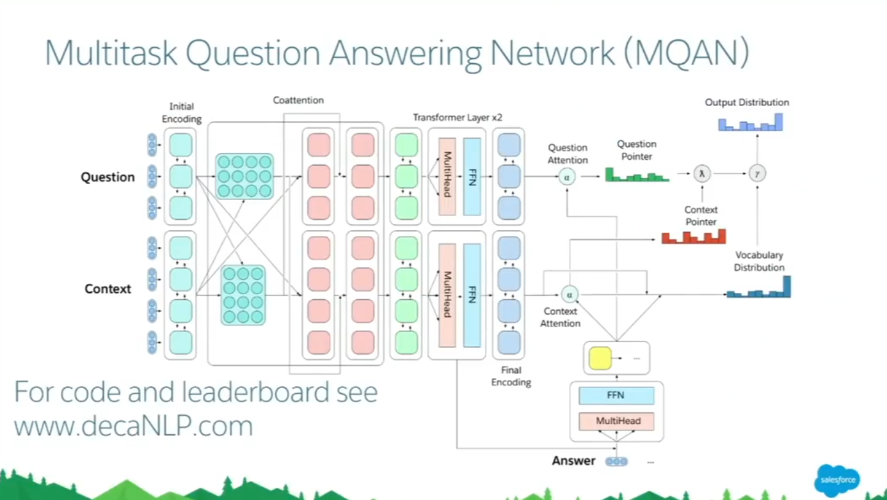
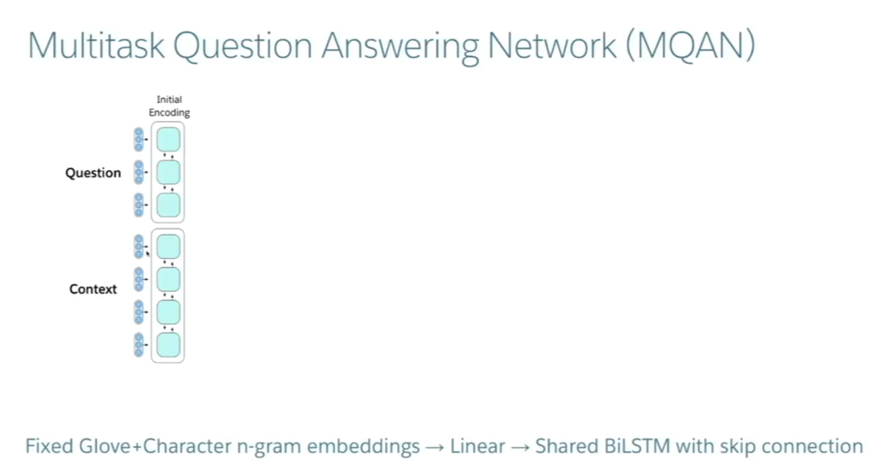
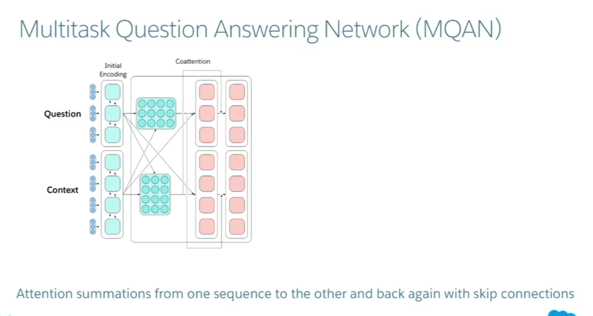
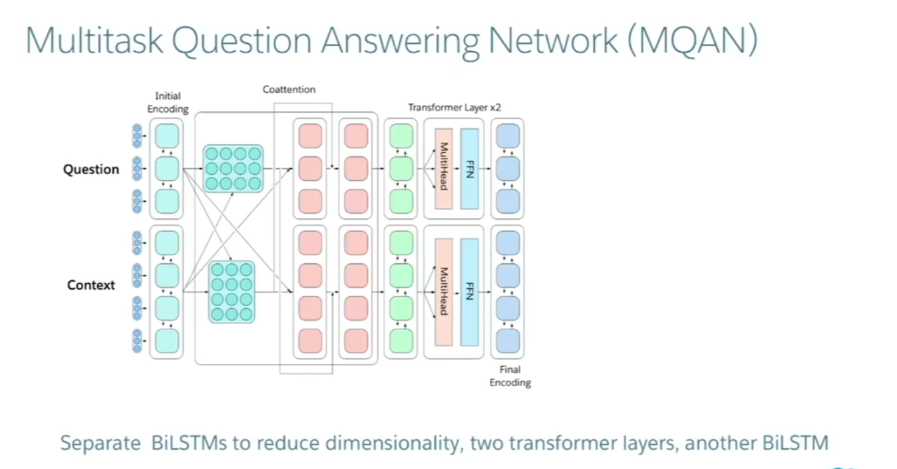
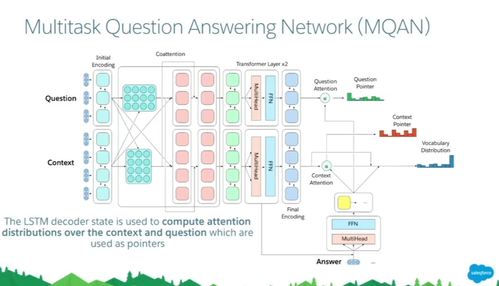
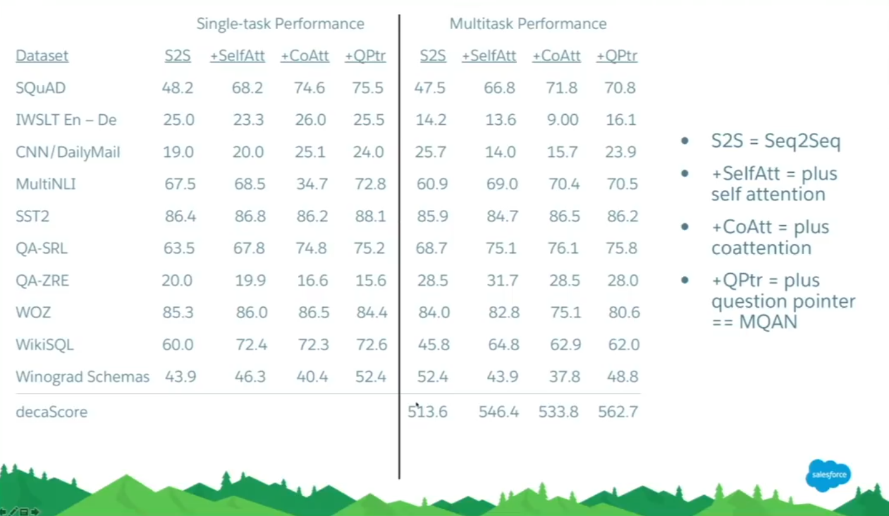
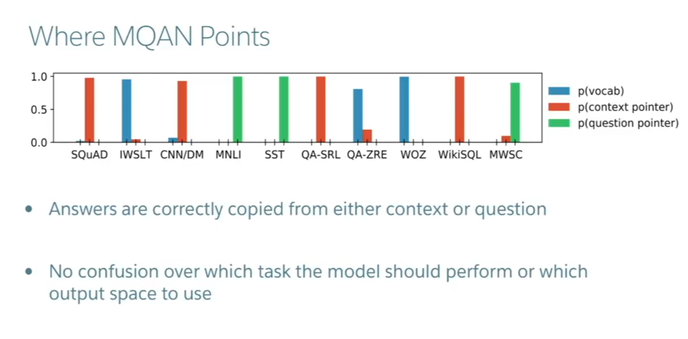
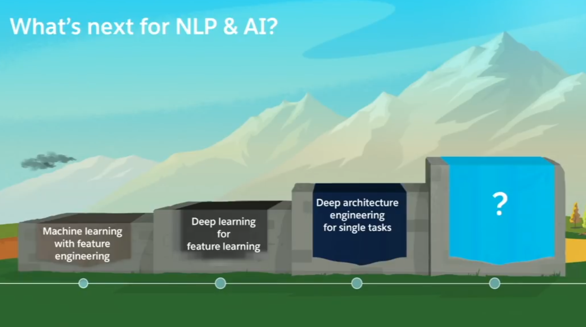
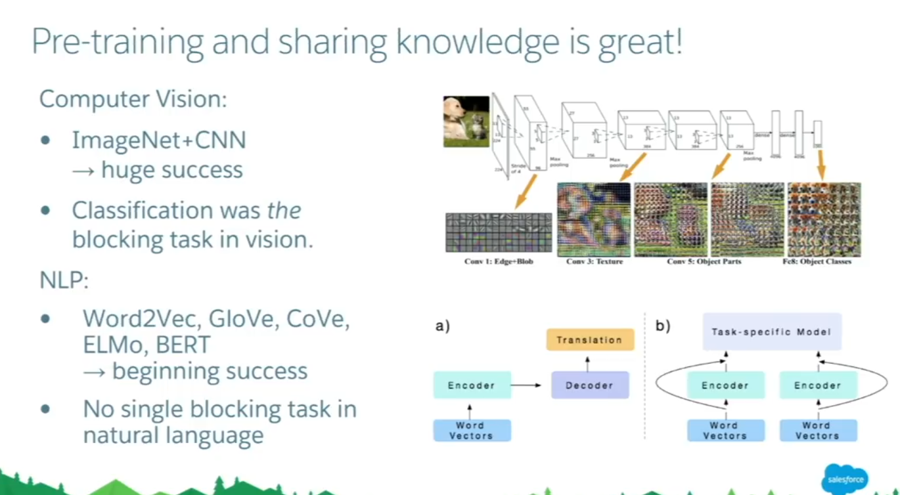
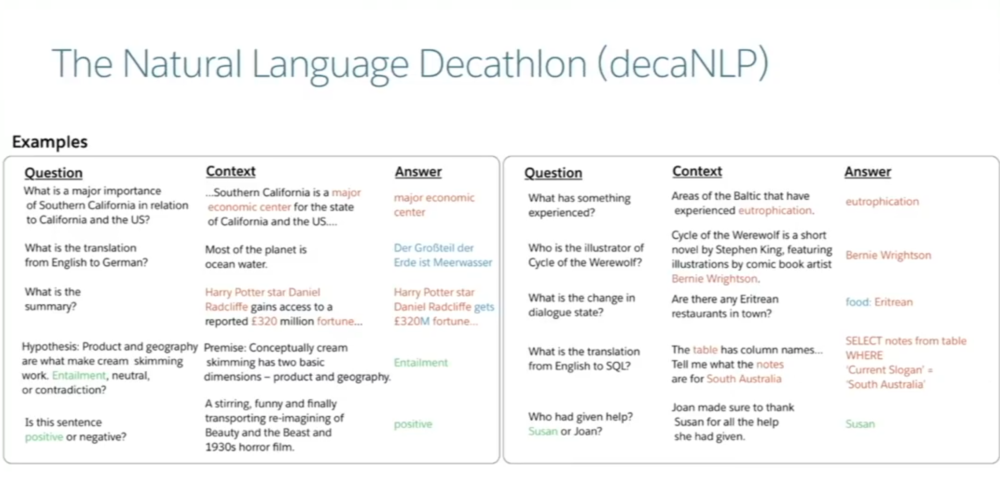

**Richard Socher - **

**The Natural Langauge Decathlon- MultiTask Learning for Question Answering.**

One Model to Rule All The Different Tasks. 

One model, using a lot of preprocessing, for 10 different tasks.

Great performane improvements given {dataset, task, model, metric}

With image and langauge models, 

we can hill-climb to local optima as long as |dataset| \> 1000 x |num-classes to work with|

We’ve seen the benefits of pre-training in NLP (word2vec,…, BERT). Why not just pretrain the entire model, and see if a single task solve it all?

Why is this difficult:

 - NLP requires many times of reasoning: logical, linguistic, emotional, etc

 - NLP requires short and long term memory

 - NLP had been divided into intermediate and separate tasks (articifically) to chase benchmarks

Can a single unsupervised task solve it all? No. Language clearly requires supervision in nature.

**Multi-task learning is a blocker for general NLP systems**

Unified models can decide how to transfer knowledge (domain adaptation, weight sharing, transfer and zero-shot learning).

Unified, multi-task models can

 - More easily adapt to new tasks, make deploying to production X times simpler

 - Lower the bar for more people to solve new tasks, potentially move towards continual learning.

**Approach:**

Classify NLP tasks into these categoies:

 - Sequence tagging (NER, aspect specific sentiment)

 - Text classification: (Dialogue state tracking, sentiment classification)

 - Seq2Seq: (Machine translation, summarization, QA)

**How to model the general MLP tasks?**

Idea: There are about 3 Equivalent Supertasks of NLP: **Langauge Modeling** (however, only used to rescore or pretrain these days, used less and less), Question Answering (we used this one), Dialogue Systems (Currently no real good dialogue datasets out there).

They use Question Answering as the main formalism for modeling all the below NLP tasks. (See Appendix 1)

 - Question Answering, Machine Translation, Summarisation, Natural Langauge Inference, Sentiment Classification, Semantic Role Labelling, Relation Extraction, Dialogue, Semantic Parsing, Commonsense Reasoning. 

 (Meta supervised learning: From {x,y} to {x,t,y}, t is the task. The question q is a natural description of the task t. x is the context necessary to answer q.)

**Model for DecaNLP**

 - No task specific modules or parameters; we assume the taskID is not available.

 - Must be able to adjust internally to perform disparate tasks

 - Start with a context

 - Ask a question

 - Generate the answer one word ad a time by

 - Pointing to context

 - Pointing to question

 - Choosing a word from an external vocabulary

 - Pointer switch mechanism chooses how much to weight each of these three mechanisms.

Full model (decaNLP.com) takes the best of all SOTA techniques and puts them to gether in a model that can generalize well enough.

**1\. Initial Embedding Layer:**

Fixed Glove + Character n-gram embeddings -\> Linear -\> Shared BiLSTM with skip connection.

(Fixed because some of the tasks have very small datasets. If you allow the word embeddings to move too much its very hard to generalize.)

**2\. Co-attention layer:**

Outer products between all the hidden states of those two sequences. With skipconnections to circumvent some of them also. Now we have context representations, representations of the context.

**3\. Transformer Layers**

**
**

Transformers had biLSTMs before and after the transformer layers, because they weren’t robust enough at time of model to do all tasks well in one model. 

Output of layers (final embedding) is piped into a standard autoregressive decoder to get the next word, with three pointer mechanisms which basically learn to point to question words, context words, or words in the vocabulary based on the hidden states of the final encoding. The output distribution is a weighted convex sum of these three distributions of output words.

**Evaluated on a ton of datasets**

**Results**

**Takeaways:**

QA and Semantile Role Labelling have a strong connection.

Pointing to the question is essential

Most of the architecture got really really good at pointing to things to answer questions.

This model does exceptionally well on Zero-shot relation extraction, accuracy went up almost 2x when you learned it with everythign else.

There is still a gap between the combined single task models and the single multi-task model.

**Complexities**

How to train: 

1\. Fully joint: Train a minibatch from each task at a time, train from that task, and loop over each of the tasks (so the next minibatch is from the next task, etc)

2\. An Optimization: Anti-Curiculum Learning- Start with the hardest tasks, train on those first, then train on simple tasks. Otherwise your hard task training might forget your simple tasks embeddings in the beginning.

Also, pretraining on decaNLP improves final performacne on other tasks (e.g. other IWSLT language pairs, NER).

Zero-shot domain adapcation for pretrained MQAN (NLI) - 80% accuracy on Amazon and Yelp reviews. Zero-shot classification, etc.

**Appendix 1**:

Socher’s Slides

**Appendix 2:**

**Notes about companies**

Companies have lots of different groups (incl for NLP): The search group and the chatbot team and the translation team and the social sentiment analysis team and they all use different models and they all deploy different models and they all have to deal with a lot of overhead into the core of the model.

**Appendix 3:**

BERT only works for 500 words

