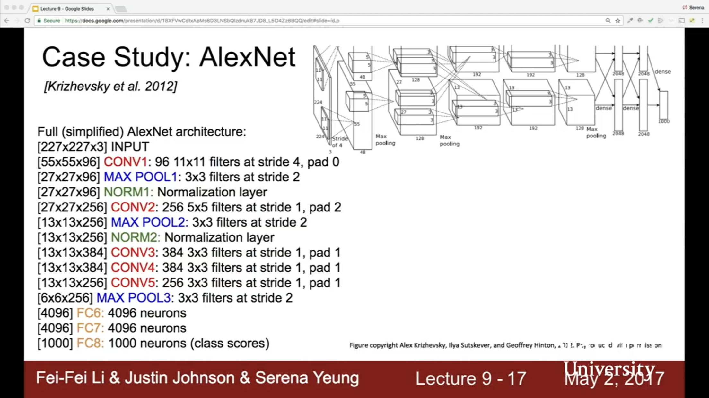
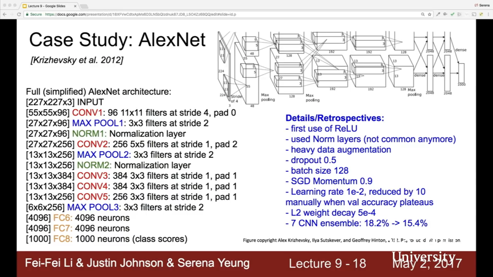
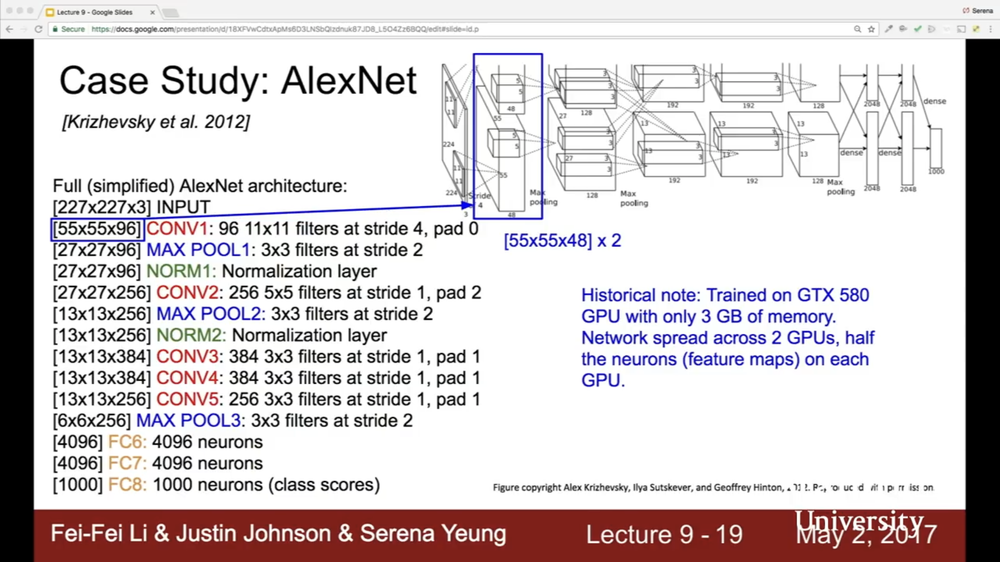
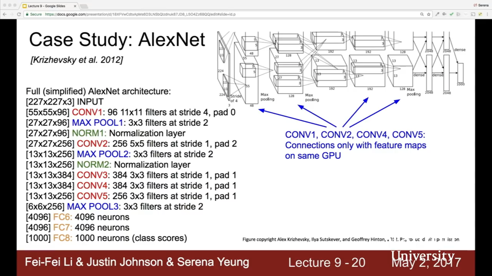
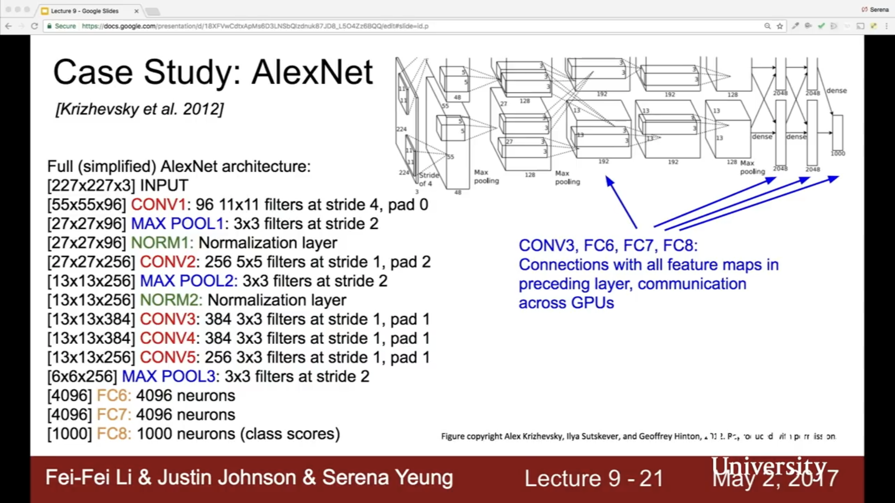
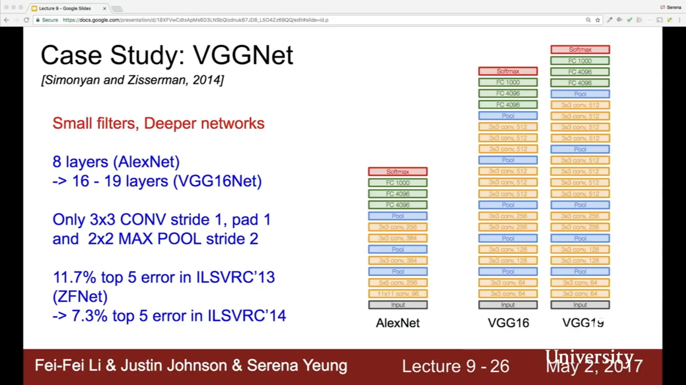
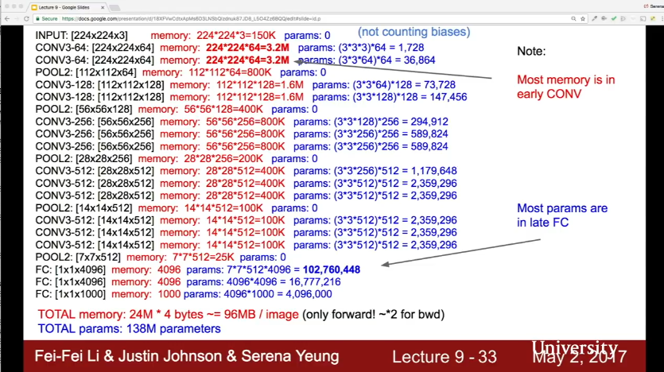
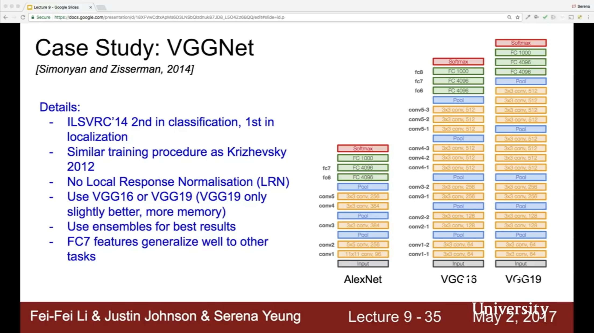
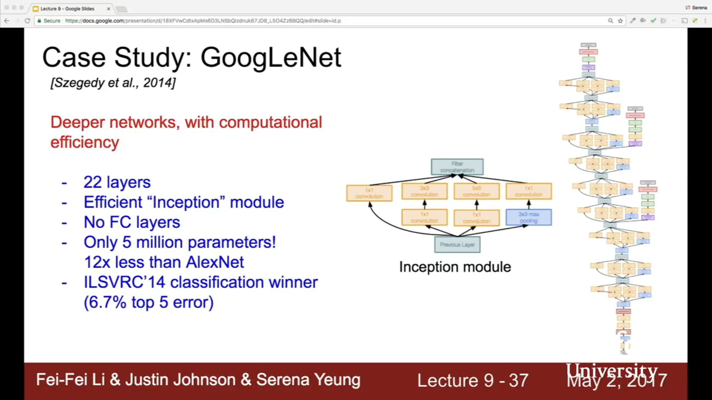

**CNN History - **

**
**

**AlexNet**

**ZFNet**

Basically just improving hypterparameters over AlexNet (changing stride size, changing the number of filters). Not really worth knowing.

**VGG**

Smaller Filters, Deeper networks - They essentially used 3x3 conv layers for everything, and tried to see if they could stack it deeper.

All their Pools were 2x2 MAX POOL stride 2, they did

 ((3x3 conv) x2 + Pool) x 3 + ((3x3 conv) x (3 or 4) + Pool) x2 + FC x3

The number of filters doubles in each group of CONV layers.

Note: 3x3 conv stacked twice has same receptive field as 7x7 single conv layer. However, it has fewer parameters (3 \* 3^2C^2 vs 7^2C^2) 

The reason why as you go deeper into the network the number of filters increases (you don’t have to do this) is because people want to keep a constant amount of comute, after downpooling you perform less compute so you can use more filters to keep it about constant, but you don’t have to do this.

Uses a lot of memory! ~100MB / image \*2\. Total params - 138M params!

**
**

**GoogLeNet** 

Really looked at computational efficiency. Tried to design an architecture that was computationally efficient. 

They saved a lot of parameters by using no fully connected layers, and an efficient “inception” module. - only 5 million parameters! 1/20 the amount of VGG.

