Note that appendices for this lecture are in a separate note becase of space limitations.

**1\. Algorithms for Efficient Inference**

**1.1\. Deep Compression**

Song Han: We can applying truning and retraining, Trained Quantization, and Huffman Encoding to pretrained Neural Networks like ResNet, reducing the networks to ~3% their original size. These together is called **Deep Compression.****
**

**
**

**A. Pruning**

(See Appendix 1.1)

(1) Train connectedly -\> (2) Prune Connections Permanently -\> (3) Retrain Weights -\> Iterate (2)(3) ~10x. You can iteratively prune a big neural network of 60 million parameters down to 10% of original size. 

**B. Weight Sharing (Trained Quantization)**

Group similar weights according to k-means, and keep just the centroids

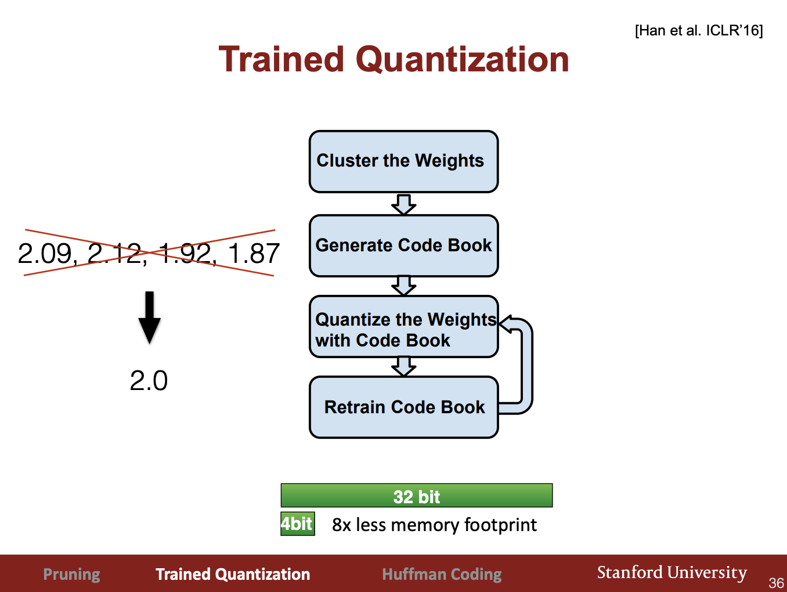

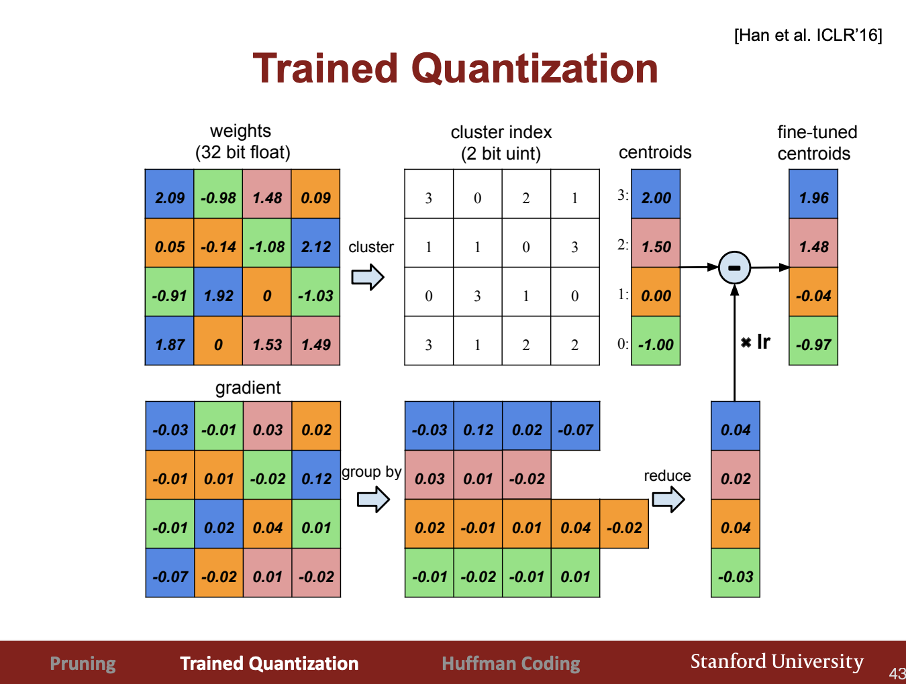

This procedure is done per layer. We only need 4 bits per weight for each conv layer and 2 bits per weight for each fully connected layer! (Q: Are centroids recomputed after n steps or is the cluster index always fixed? Yes, seems that they are always fixed.)

**Pruning + Trained Quantization** together can compress the model to 3% of its original size with negligeable loss of accuracy! (Appendix 1.1)

C. **Huffman Encoding**

Finally, we can use huffman encoding to use more bits to represent infrequent numbers (quanta/centroids from the above step) and less bits to represent frequent numbers. (Appendix 1.1)

Pruning + Trained Quantization + Huffman encoding together is called **Deep Compression. **

**
**

**1.2\. ****Quantization**

Train the NN with normal floating point numbers, and then gather statistics for each layer- what is the maximum number, minimum number, how much bits is enough this dynamic range. Then convert the trained nueural network to a compressed quantized version: use that number of bits for the integer part of the weights for that layer, and the rest of the 8 or 7 bits remaining for the rest of the 8 bit representation.

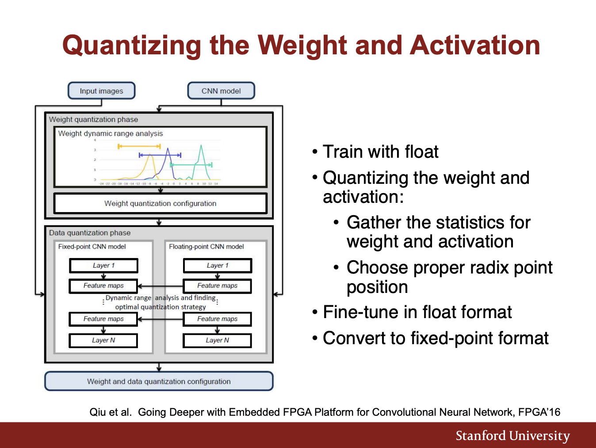

If you stick to 8 bits, the accuracy drop will be almost negligeable (Appendix 1.2).

**1.3\. Low Rank Approximation**

Break up k x k x d convolutions into k x k x c and 1 x 1 x d where c \< d. (MobileNet).

We can use deep compression to achieve a speedup of ~2x with almost no loss of accuracy. (Appendix 1.3)

We can also apply low rank approximation to fully connected layers, by using SVD to factorize the fully connected layers into two lower-dimensionality sublayers. (Appendix 1.3)

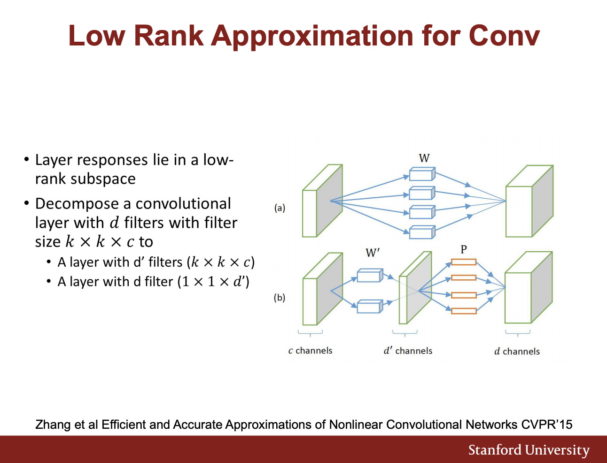

**1.4\. Binary/Ternary Weight**

Use the full precision weights during training time, but swap out all weights with (1, -1, 0) at infernece time. Basically can get the same accuracy as AlexNet. (Appendix 1.4)

**1.5\. Winograd Convolution**

An equivalent (lossless) but faster convolutional method to training neural networks. 

<https://blog.usejournal.com/understanding-winograd-fast-convolution-a75458744ff> is a good summary. First of all note that convolutions are not implemented by sliding in real GPUs, they are implemented by a single multiply, making each convolutional kernel a column vector (this requires some replicating data and some additional memory overhead).

Winograd convolutions is an alternate formulation of the multiply that uses less matmuls and more adds. (It produces 2.25x speedup)

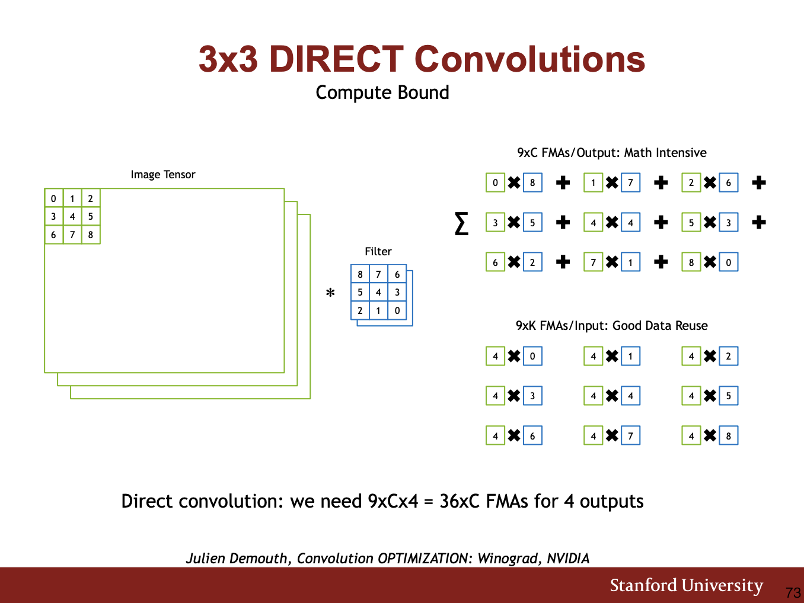

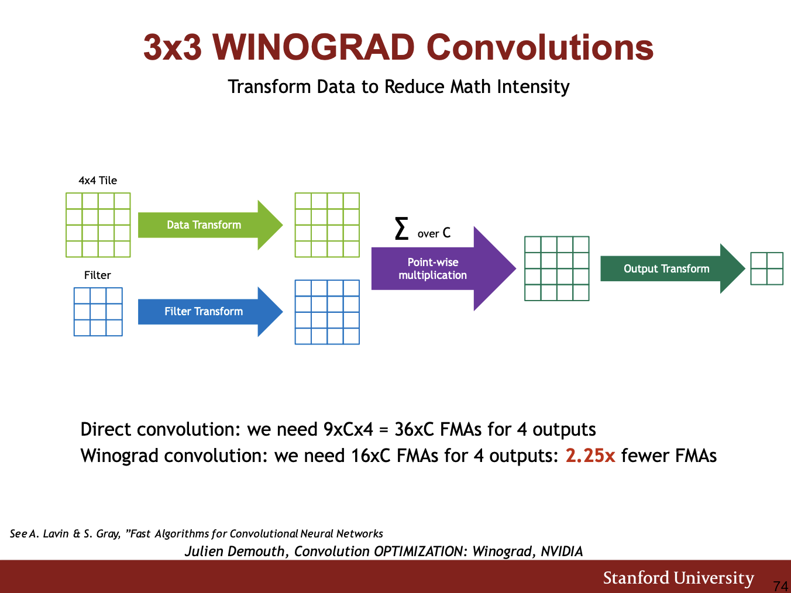

Winograd convolutions transforms the convnet layer into a batch of direct matrix multiplications. (Appendix 1.5) Winograd convolutions bring about 2x speedup. (Appendix 1.5)

**2\. Algorithms for Efficient Training**

**2.1\. Parallelization**

Moore’s law is stopping because of the power constraint. To make up for this, the number of cores in each machine is increasing. So what we really need is parallelization.

** - Data Parallelization - **Training more data at once with the model, with more cores. N x more cores effectively increases the effective batch size by n, but it requires coordinated weight update across cores. Google Uses a parameter server which syncs all the executors that are making the weight updates.

** - Model Parallelization****
**

Idea 1: For example, chop the image into 4 2x2 blocks such that each processor only handles 1/4 of the image.

Idea 2: Parallelize by feature maps.

** - Hyperparameter Parallelization**

Easy to get 16-64 GPUs training one model in parallel.

**2.2\. Mixed Precision Training with FP16 and FP32**

We can do the multiplucation using FP16 (gaining a lot of speedup), but we still have to do the summation in 32bit. The result is 32bit float. 

More specifically, we can do the entire feedforward part of training using FP16, and all intermediate steps to compute activation gradients in FP16\. When we get the gradient of a weight in FP16, we convert it back to FP32 and add it to our original weight. The result is an updated weight in FP32.

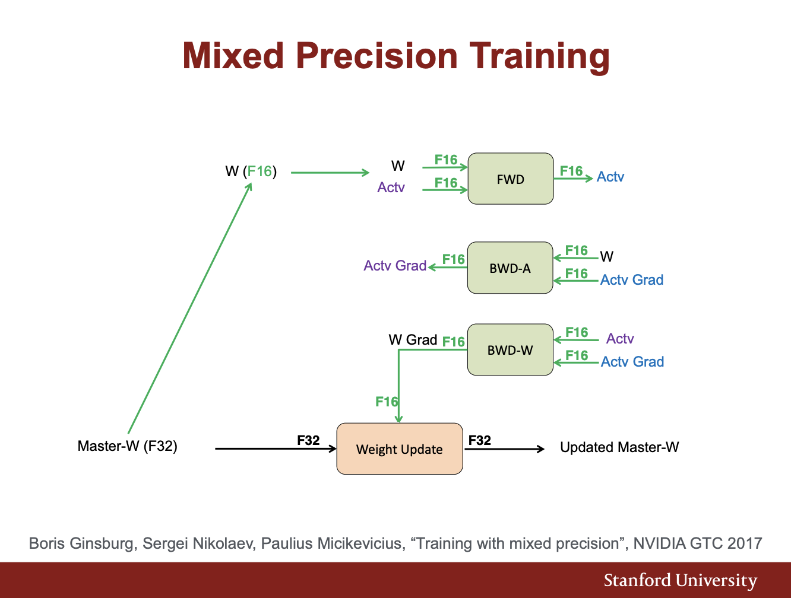

Basically the results are the same as full precision weight.

**2.3\. Model Distillation (Teacher-Student)**

Take multiple large, powerful “teacher” NNs and use them to train a much smaller “student” NN.

Take a geometric ensemble of the prediction softmax outputs, and soften them by dividing the softmax score by a “temperature" (make values very close to 1 not so close to 1, very close to 0 not so close to 0, but keep relative ranking).

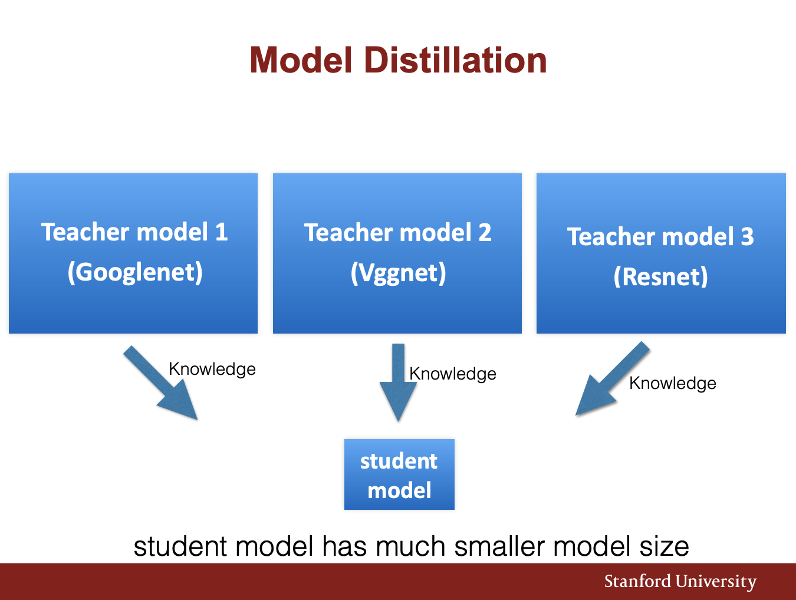

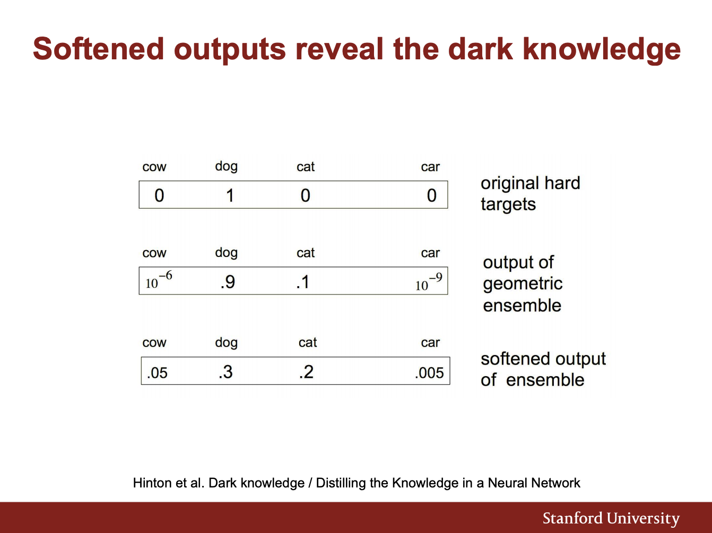

**4\. Dense-Sparse-Dense Training.**

A better regularization.

Train NN first with all connections, then drop out a certain amount of connections, retrain to convergence, then add back in the original connections, and train them again to convergence.

DSD training arrives at better minima.

Leads to about 1% absolute (3% relative) accuracy improvement in almost all models.

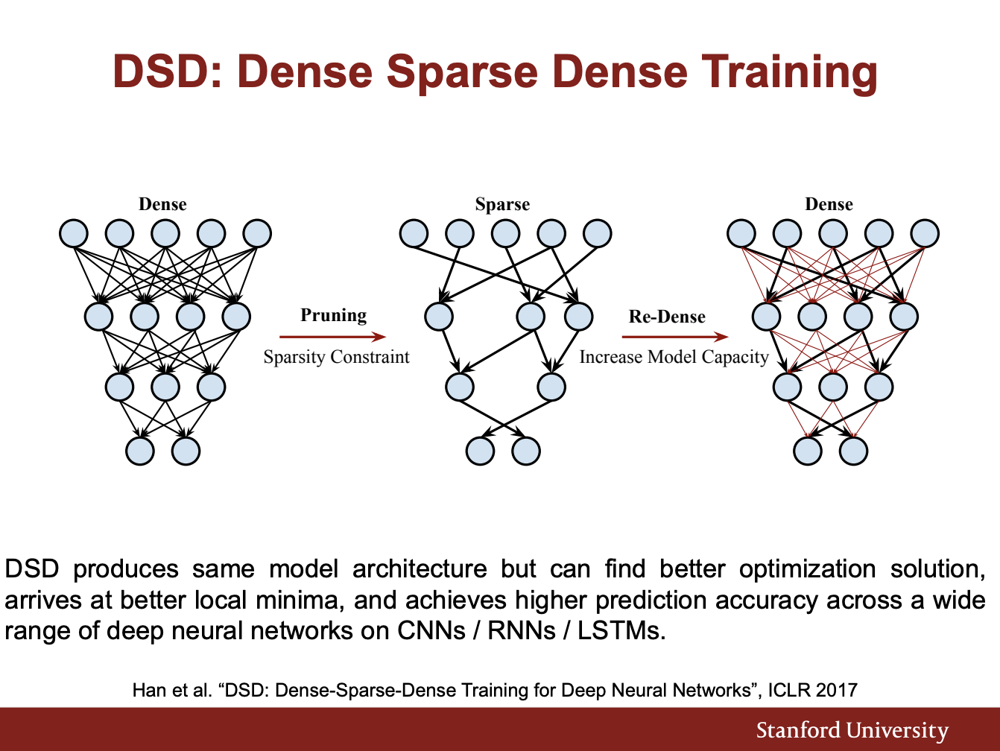

**3\. Optimal Hardware for Efficient Inference**

**Asafs**

All ASICs for NN training have a common goal, which is to **minimize memory access during training and inference.**

Eyeriss (MIT) - Use “RS Dataflow” to minimize offchip access

Dadiannao (Chinese CAS) buffer all weights on on-chip DRAM so that they wont have to talk to extenal memory

Google TPU - uses 8 bit integer (for dense NN infernece)

Stanford EIE - for sparse NN inference

**3.1 Google TPU - **

TPUs can be slotted into the disk drive, up to 4 cards/server.

At the center is a HUGE matrix multiply unit - 256x256 = 65536 8 bit units, at 700MHz clock rate, can perform 65536 \* 84 \* 700M = 92 Tera-ops.

Has a really large unified on-chip buffer of 24MB (3x as much on chip memory as GPU).

Powered by 2 DDR3 DRAM channels.

Area: Half the size of GPU/TPU, power consumtion is 1/2 of CPU/GPU, Peak TOPS/s is ~2x CPU/GPU. (Appendix 2.1)

The performance (Tera-Ops/sec) on GPU/CPU/TPU of different models are shown below against theoretical maximum. Why are they so far below the rooflines? It is because in MLPs and LSTMs, there is a requirement for fast, real-time, low-latency computation. This prevents us from batching more at inference -\> low ops/byte.

The solution to this problem is to have a less memory footprint so that you can reduce the memory footprint requirement. One solution is to compress the model. Can we build hardware that can do inference directly on a compressed model? -\> EIE.

**3.2 Stanford EIE (Efficient Inference Engine)**

**Challenge: Hardware that can infer on compressed model.**

1\. Anything times 0 is 0 - Don’t store it, don’t compute on it (Appendix 2.2)

2\. Weight sharing - Change all weights to similar discrete values.

Note:

- “Sparse Weight” refers to keeping the weights in a sparse matrix. The 2x difference between the computational and memory savings is due to overhead of keeping track of indices.

- “Sparse Activation” means, after ReLU, if activation is 0, then ignore it. 

- Weight sharing to use 4 bits, not 32 bit weights. 

This is how the weights are stored logically and physically:

The lecture has an animation for how the multiplication is computed, but basically it goes down the array a (top row) and skips all entryes which are 0, goes down the relevant column to find all entries that are 0, performs the multiplucation, and then adds the results to the running sum array.

There is then a lookup table used to get the 16-bit real weight form the 4 bit virtual weight used to do the computation

Hardware Architecture of EIE at high level.

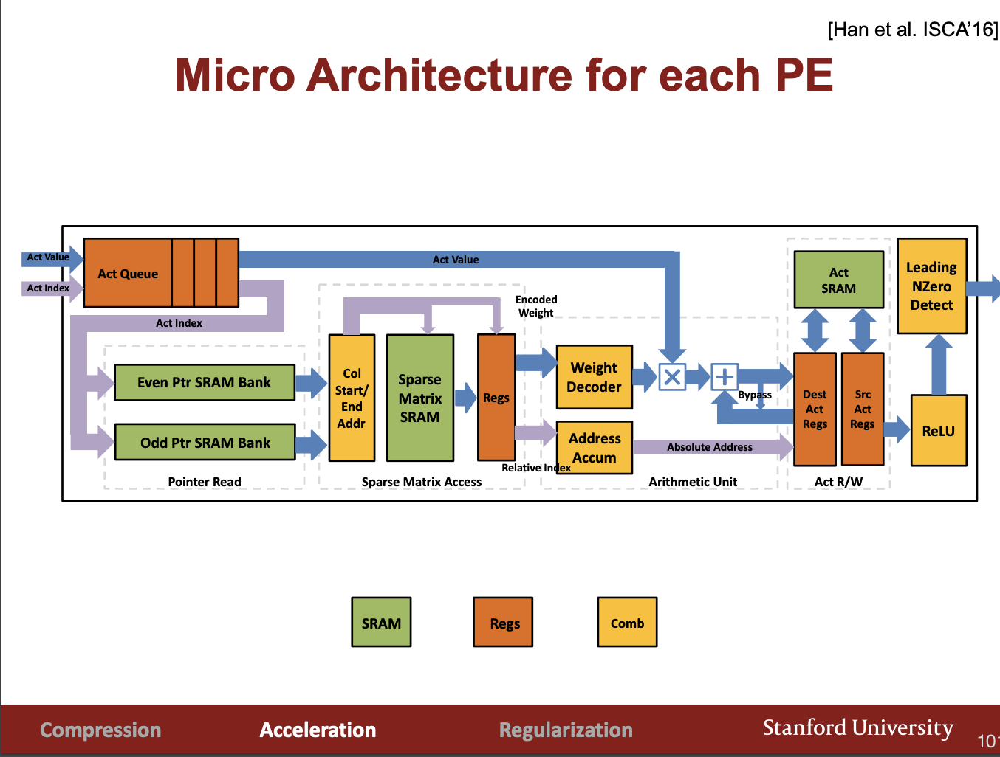**
**

Immense Speedups! 189x faster than CPU, 24,000x more energy efficient than CPU. EIEs have higher throughput and are more energy efficient than other ASICs also by an order of magnitude.

**4\. Optimal Hardware for Efficient Training**

(A bit dated as of 2017)

Computation and memory bandwidth, and communication (NV link) determines your overall performance.

1\. GPUs - NVIDIA PASCAL GP100

750 GB/s bandwidth - this is very high bandwidth. 300W, 16nm process, 160 GB/s NV link

2\. Nvidia Volta GV100

120 Tensor TFLOPS specifically designed for deep learning. Plus 15 FP32 TFLOPS with Tensor Core.

16GB HBM2 @ 900 GB/s bandwidth 

12 nm process

die size 815 mm2 - really large chip

suported by 300GB/s NVlink.

The Tensor Core of Volta is a new instruction that performs 4x4x4 fused-multiply-add mixed precision operations in one single clock cycle. 12x increase in throughput for Volta V100 compared to Pascal P100.

Training is 2.4x faster in Tensor Core than FP32, Inference is 3.7x faster.

The below figure is a single SM (Stream Multiprocessor) in the Volta CV100\. The SM is partitioned into 4 processing blocks, in each block the cores are listed below.

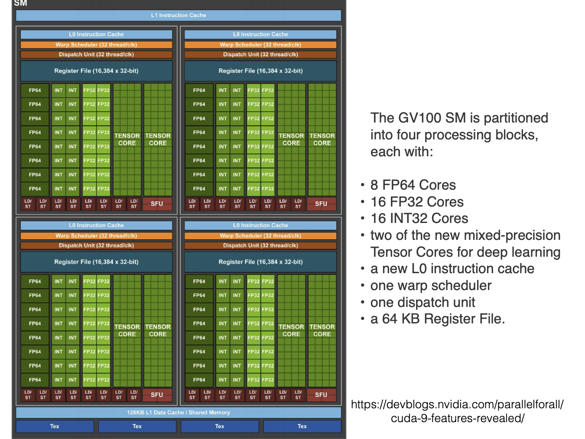

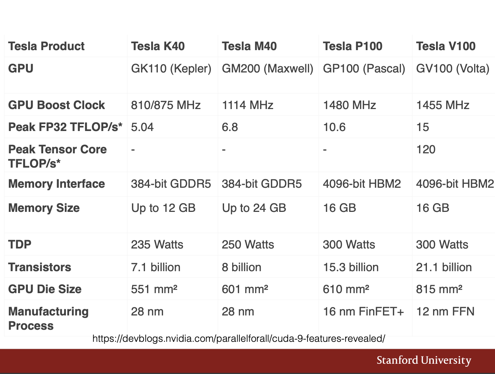

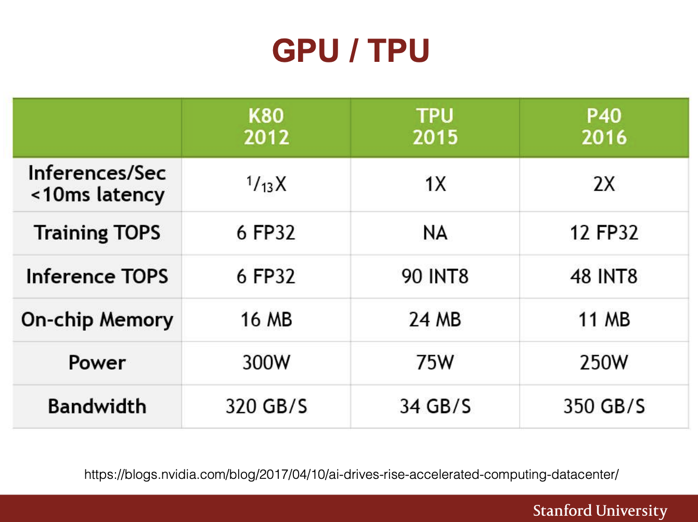

TPU has a really large on-chip memory and is a lot more efficient.