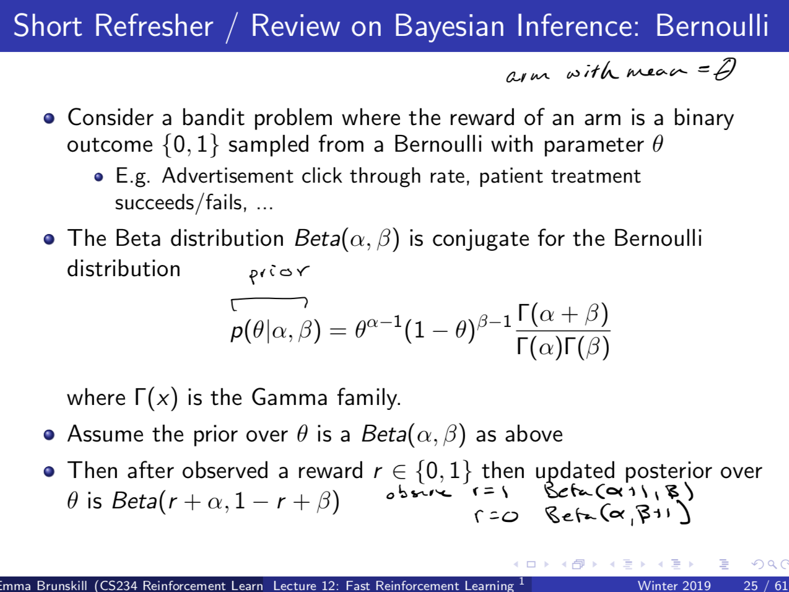
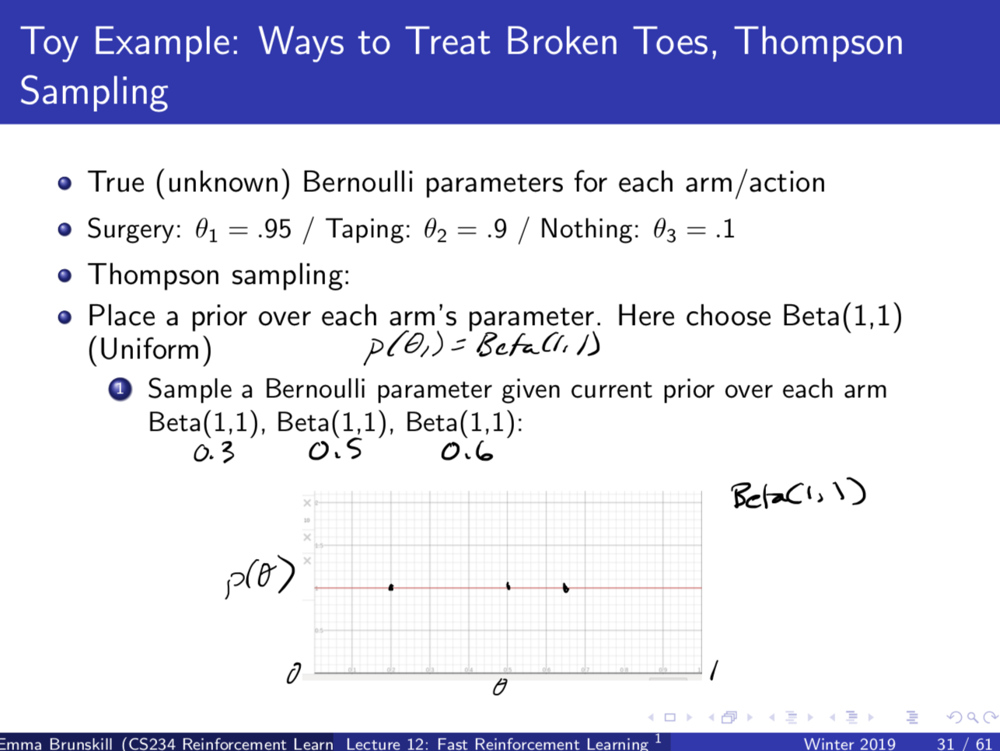
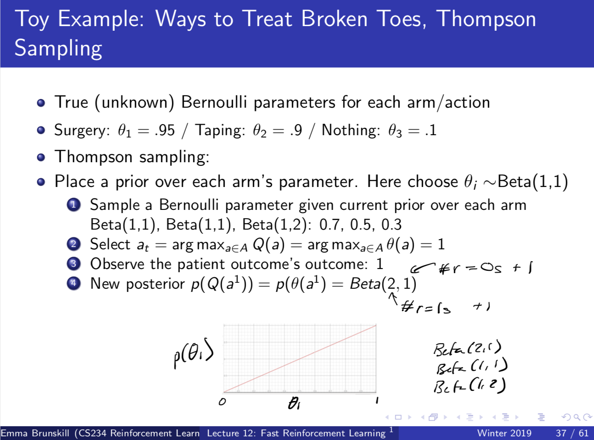
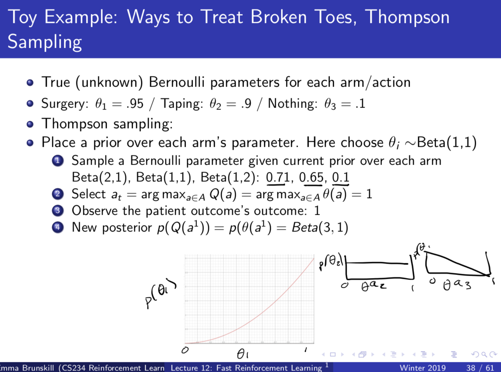

Q learning is computationally efficient (needed for example, simulators, robotics), however, we also want to be **sample efficient** (when experience is costly or hard to gather, data about students, patients or customers).

**Bandits**

Framework: Regret

Approach: Optimism under uncertainty

Framework Bayesian Regret

Approach: Probability matching / Thompson Sampling

****

## Multiarmed Bandits
MAB is a MDP with only one state and no transition matrix. 
MAB is a tuple of $(A,R)$, where $A$ is a known set of $m$ actions and $R^a(r) = \mathbb{P}[r|a]$ is an unkown probability distribution over rewards.
At each time step $t$ the agent selects an action $a_t \in A$, and recieves a reward $r_t \sim R^{a_t}$.
Goal: Maximize cumulative reward $\sum_{\tau=1}^t r_{\tau}$, or minimize total regret.

Def: **Action-value** is the mean reward for action $a$.
$$Q(a) = \mathbb{E} [r | a]$$
Def: **Optimal Value** $V^*$ 
$$V^* = Q(a^*) = \max_{a \in A}Q(a)$$
Def: **Regret** is the opportunity loss for one step
$$l_t = \mathbb{E}[ V^* - Q(a_t) ]$$
Def: **Total Regret** is the total opporutnity loss
$$L_t = \mathbb{E} [\sum_{\tau=1}^t V^* - Q(a_T)]$$
The expected number of selections for action $a$ is the **count** $N_t(a)$.
The difference in value between action $a$ and optimal action $a^*$ is the **gap** $\Delta_i = V^* - Q(a_i)$.
Regret is then a function of gaps and counts
$$l_t = \mathbb{E}[ V^* - Q(a_t) ] = \sum_{a\in A} \mathbb{E}[N_t(a)](V^*-Q(a)) = \sum_{a\in A} \mathbb{E}[N_t(a)]\Delta_a$$
A good algorithm ensures small counts for large gap, but gaps are not known.

**Algorithms**:
  - Greedy: Linear Total Regret
  - Constant e-greedy: linear total regret
  - Decaying e-greedy: Sublinear total regret if we can use the right schedule for decaying e, but that requires knowledge of gaps which are unknown.
  - Optimistic initialization: Sublinear regret if initialize values sufficiently optimistically, else linear regret. 
  - **UCB**: Sublinear Regret
Generally we want to use **decaying $\epsilon$-greedy** selection.

**Low Bounds for Total Regret**: The total regret will of course grow with the passage of time, but can we make it grow slower and slower (obtain sublinear total regret)? 
The below theorem provides a lower bound (minimum) of the regret growth rate in terms of the gaps over all actions $\Delta_a$ and the similarity in the current reward distribution to the optimal reward distribution $D_{KL}(R^a || R^{a^*})$.
**Theorem**: Asymptotic total regret is at least logatithnic in the number of timesteps (Lai and Robbins):
$$\lim_{t \to \infty} L_t \ge \log_t \sum_{a | \Delta_a > 0}\frac{\Delta_a}{D_{KL}(R^a || R^{a^*})}$$

**Upper Confidence Bounds**:
Approach: Optimism in the face of uncertainty.
Evaluate an upper confidence $U_t(a)$ for the value of each action (an optimistic estimate of $Q(a_t)$), dependent on the number of times an action $a$ has been selected $N_t(a)$, such that $Q(a) \le U_t(a)$ with high probability. This is set using **Hoeffding's Inequality**: Let $X_1, \dots, X_n$ be iid random variables in [0,1], and let $\bar X_n = 1/n \sum_{\tau=1}^n X_{\tau}$ be the sample mean. Then,
$$\mathbb{P}[\mathbb{E}[X] > \bar X_n + u] \le \exp(-2 n u^2)$$

To generate our upper bound $U_t(a_t)$, we set 
$ \mathbb{P}[\mathbb{E}[X] > \bar X_n + u] \le \exp(-2 n u^2) = \delta/t^2 \Leftrightarrow u = \sqrt{\frac{\log(t^2/\delta)}{2N(a_t)}}$, and define as follows:

Def: **Upper confidence bound** $U_t(a_t) = \tilde Q(a_t) + \sqrt{\frac{\log(t^2/\delta)}{2N(a_t)}}$.

Def: **UCB1 Algorithm**: At every time step, we choose the action $a_t$ which maximizes the UCB: $\arg \max_{a_t} U_t(a_t)$.

Suppose $a^*$ is the optimal action. Note that if the upper confidence bounds hold (in the most probable case), $U_t(a_t) > Q(a^*)$, because if $a_t$ is the optimal action $a^*$, then the inequality is by definition, and if $a_t$ is not the optimal action, then since we chose $a_t$ over $a^*$ means that $U_t(a_t) > U_t(a^*) > Q(a^*)$.

Tthe probability that our UCB has underestimated the value of our optimal policy's value is less than the probability that the UCB bounds hold, which is bounded below by $1-2m\delta$ using $\sum_{t=1}^\infty t^{-2} = \pi^2/6 < 2$ at the last step.
\begin{align}
& \cup_{t=1}^T P(Q(a^*) > U_t(a_t)) \\
& \le \cup_{t=1}^T\cup_{i=1}^m   \mathbb{P}[|Q(a_t) - \hat Q(a_t) > u] \\
& \le \cup_{t=1}^T\cup_{i=1}^m   \delta / t^2 \\
& \le 2m\delta 
\end{align}

So the probabilty that the UCB is indeed higher than the value of our optimal policy's value is at least $1 - 2m \delta$.

Now, assuming confidence bounds hold, we can upper bound the regret
\begin{align}
regret(UCB, T) & = \sum_{t=1}^T Q(a^*) - Q(a_t) \\
& = \sum_{t=1}^T U_t(a_t) - Q(a_t)  + \underbrace{ Q(a^*) - U_t(a_t)}_{\le 0} \\
& \le \sum_{t=1}^T U_t(a_t) - Q(a_t) \\
& = \sum_{t=1}^T \sqrt{\frac{\log(t^2/\delta)}{2N(a_t)}} \\
& \le \sqrt{\log t^2/\delta }\sum_{i=1}^m\sum_{n=1}^{N_t(i)} \sqrt{1/n} \tag{1*} \\
& \le \sqrt{\log t^2/\delta }\sum_{i=1}^m\sum_{n=1}^{T/m} \sqrt{1/n} \tag{2*} \\
& \le \sqrt{\log t^2/\delta }\sum_{i=1}^m 2\sqrt{T/m} \tag{3*} \\
& \le 2\sqrt{\log(t^2/\delta) Tm/2}
\end{align}

This shows that if we use UCB, the rate that our regret grows is sublinear (is $\sqrt{(T*log(T^2)}$)
using 
1*: Here we divide the above sum into separate cases for each of the actions
2*: The sum is maximized when we pull all arms equally
3*: $\sum_{n=1}^T \sqrt{1/n} \le 2^\sqrt{T}$

Another Theorem: The UCB algorithm achieves logarithmic asymptotic total regret
$$\lim_{t \to \infty} L_t \le 8 \log t \sum_{a | \Delta_a > 0} \Delta_a$$
(This is a "problem dependent bound" depending on the problem at hand).

## Bayesian Bandits
So far we have made no assumptions about the reward distribution $R$. In the Bayesian case, we assume a prior over the reward distribution and implements Probability Matching through Thompson Sampling.
Def **Probability Matching**: Select an action $a$ according to the probability that it is the optimal action, given what we how about the history thus far.
$$\pi(a|h_t)  = \mathbb{P}[Q(a) > Q(a'), \forall a' \ne a | h_t] \\
              = \mathbb{E}_{R|h_t} \left[\mathbb{1}(a = \arg \max_{a \in A} Q(a))\right]$$




To update the Beta Prior analytically: If you see reward 1, just add 1 to your alphas in the Beta distrbution, if you see reward 0, just add 1 to your betas in the Beta distribution.

## Thompson Sampling:
For each action, we sample from our reward posterior (is probably totally wrong), we treat that as if it was right, and we pick the max action according to those samples. 
```
Initialize a prior over each arm a, p(R_a)
loop
  For each arm a:
    Sample a reward distribution $R_a$ from posterior
    Compute action-value function Q(a) = E[R_a]
  a_t = arg max_{a \in A} Q(a)
  Observe reward r
  Update posterior p(R_a|r) using Bayes Law
end loop
```
Thompson Sampling implements probaility matching. Example in Appendix 1.

**Appendix 1: Thompson Sampling**

**
**

Note that B(1,1) is uniform U(0,1). Starting off with an unintuitive prior will bias your distribution, but could be good if you have information about your distribution (a good prior is similar to having a good history of virtual actions).


Using the fact that the Beta distrbution is conjugate to the Bernoulli, and to update the Beta Prior analytically: If you see reward 1, just add 1 to your alphas in the Beta distrbution, if you see reward 0, just add 1 to your betas in the Beta distribution. The posteriors at time-step 1 is drawn in the above slide.





Thompson sampling: Exploiting faster once you see actions that are pretty good.
 Thompson sampling achiees the Lai and Robbins Lower Bound; Bounds for optimism are tighter than for Thompson sampling. Empirically Tompson Sampling is very efective. Often start with Thompson Sampling if you have any prior idea about Reward distribution. Issue with UCB is UCB is too optimistic for too long. If you bumped into the door 1000 times, you will likely bump into the door again and no longer need to be optimistic about it. If you have a prior over rewards it could fix that. Thompson Sampling also has log regret growth like UCB.

Mixed Approaches - **PAC-Bayesian Approaches**: Bayesian update if your prior is very food, frequentist if your prior is wrong.

Thompson Sampling for News Article Recommendation (Chapelle and Li 2020) - Important paper. Thompson Sampling for Contextual Bandits. Thompson sampling did much better than UCB.