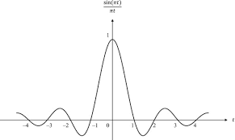
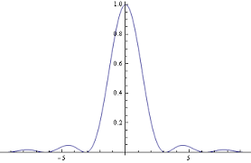

**0. Intro To Fourier Transforms**
Fourier Series - Periodic Phenomena
Fourier Transforms - Nonperiodic Phenomena

View view non-periodic function as the limiting case of a periodic function as the period goes to infinity. The Fourier Transform is the generalization of the Fourier coefficient (analysis of a function into its components). The Inverse Fourier transform is the geneneralization of the Fourier series (synthesis of a function from its components).

We have a function $f(t)$ which is periodic with period $T$ and will try take a limit as $T \rightarrow \infty$.
Building blocks are like $e^{2 \pi i (k/T) t}$. These are periodic with period $T$.
Fourier Series (synthesis) is $ \sum_{k=\infty}^\infty c_k  e^{-2\pi i k/T t}$.
Fourier coefficients (analysis) are $c_k = \frac{1}{T} \int_{-T/2}^{T/2} e^{-2 \pi i (k/T) t} f(t) dt$.

If the period of a function is $T$, then the spacing of its Fourier frequencies is $1/T$. As $t \to \infty$ the spectrum becomes continuous.

**Why we cannot simply take the limit as T goes to infinity:** Suppose the function $f(x)$ is 0 outside of the range $(a,b)$, and pick the period $T$ to be larger than the range between $a,b$. Then recall Fourier coefficients are $c_k = \frac{1}{T} \int_{a}^{b} e^{-2 \pi i (k/T) t} f(t) dt$.

This integral is bounded as $|c_k| = \frac{1}{T} \left| \int_{a}^{b} e^{-2 \pi i (k/T) t} f(t) dt\right| \le \frac{1}{T} \int_{a}^{b} \underbrace{\left| e^{-2 \pi i (k/T) t} \right| }_{=\text{ norm }=1} |f(t)| dt = \frac{1}{T} \int_{a}^{b} |f(t)| dt = \frac{1}{T} M$. So as $t \to \infty$, we have $c_k \to 0$, ie the Fourier coefficients degenerate in the limit, and we cannot use them Fourier coefficients in the limit.
Solution: Scale up by T.

**Intuitve Derivation of Fourier Transform**
Write $Ff(k/T) = \int_{-T/2}^{T/2} e^{-2 \pi i (k/T) t} f(t) dt$. [analogy to $T \cdot c_k$] 
Then the fourier series is $ \frac{1}{T} \sum_{k=\infty}^\infty Ff(k/T) e^{-2\pi i k/T t}$.
Now, let $t \to \infty$. The discrete variables $k/T$ tends to the continuous variable $s$. 
We write $Ff(s) = \int_{-\infty}^{\infty} e^{-2 \pi i s t} f(t) dt$
Then the sum in the Fourier series is replaced with the integral $ \int_{-\infty}^\infty Ff(s) e^{-2\pi i s t} ds$.

$t$ is often thought of as the time variable and $s$ as the frequency variable.

## 1. Fourier Transform
Def: If $f(t)$ is a function defined on $(-\infty, \infty)$, then its **Fourier Transform** Ff(s) is 
$$Ff(s) = \int_{-\infty}^\infty e^{-2\pi i s t} f(t) dt$$

The Fourier Transform decomposes a function f(t) into its compoments, which is a continuous family of exponentials. The Fourier Transform is a function on the frequency domain $s$, where $t$ is the time-domain. The Fourier Transform is the **spectrum** of the function (or signal) $f$.

Def: The **Inverse Fourier Transform** $F^{-1}g(t)$ is an operator that allows us to synthesisze f(t) from its constitutent parts (if we plug in $g(s) = Ff(s)$ below).
$$F^{-1}g(t) = \int_{-\infty}^\infty e^{2\pi i s t} g(s) ds$$

Def: **Fourier Inversion** states that you $F^{-1}Ff = f$ and $FF^{-1}g =g$

**Corrolary:** Every function (signal) has a spectrum, and the spectrum determines the signal.
The set of $s \in R$ for which $Ff(s)$ is defined is called the **spectrum** of f.

Variations: Sometimes the $Ff(s)$ is denoted $\hat f(s)$, $F(s)$ and so on. Sometimes the constants are neglected and the Fourier Transform is written $\int e^{- i s t} f(t) dt$, or $\frac{1}{2\pi}\int e^{- i s t} f(t) dt$, and sometimes with pos/neg signs swapped.

Note that $Ff(0) = \int_{-\infty}^\infty e^{-2\pi i 0 t} f(t) dt =  \int_{-\infty}^\infty f(t) dt = \overline{f(t)}$.
Note that $F^{-1}g(0) = \int_{-\infty}^\infty e^{-2\pi i s 0} g(s) ds =  \int_{-\infty}^\infty g(s) ds = \overline{g(s)}$.

## 2. Fourier Transform Duality
Exploit similarity in formulas for Fourier Transform and Inverse Fourier Transform. Recall, 
\begin{align}
Ff(s) = \int_{-\infty}^\infty e^{-2\pi i s t} f(t) dt \\
F^{-1}g(t) = \int_{-\infty}^\infty e^{2\pi i s t} g(s) ds
\end{align}
Then, we have $Ff(-s) = F^{-1}f(s)$ (Although here we have to give up the interpretation of $t$ as the time domain and $s$ as the frequency domain)

Def: If $f(t)$ is a function (signal), define $f^-(t) := f(-t)$ as the **reverse signal** of f. (Interpretation: reversing in "time" dimension, going 'backwards' in time). 

According to the above definition, we define $(Ff)^-(s) := Ff(-s)$, and thus we have equivalence in operations $(Ff)^- = F^{-1}f$ (the reverse signal of the Fourier Transform is the Inverse Fourier Transform). 
Also, $F(f^-)(s) = F^{-1}f(s)$, so $F(f^-) = F^{-1}f$ (the Fourier Transform of the inverse signal is also the Inverse Fourier Transform).
As a Corollary, $(Ff)^-(s) = F(f^-)(s); \;\; (Ff)^- = F(f^-)$ (The Fourier Transform reversed is the Fourier Transform of the function reversed).
(2.1) In summary, **duality** states that $(Ff)^-(s) = F^{-1}f(s) = F(f^-)(s)$. 

(2.2) Finally, $FFf(s) = f^-(s)$ (The Fourier Transform of the Fourier Transform is the reverse signal). 

## 3. Examples of Fourier Transforms
### Rectangle (Indicator) Function 
$$f(t) = \begin{cases} 1, \; |t| < 0.5 \\ 0, \; |t| \ge 0.5 \end{cases}$$
Has the Fourier Transform $sinc(s)$ defined as 
\begin{align}
Ff(s) & = \int_{-1/2}^{1/2} e^{-2\pi i s t} f(t) dt = \left[ -\frac{1}{2\pi i s} e^{-2\pi i s t}\right]_{t=-1/2}^{t=1/2}
= \frac{1}{\pi s} \frac{e^{\pi i s} - e^{- \pi i s}}{2i} = \sin(\pi s)/(\pi s) := sinc(s)
\end{align}

### Triangle Function 
$$f(t) = \begin{cases} 1 - |t|, \; |t| < 1 \\ 0, \; |t| \ge 1 \end{cases}$$
Has the Fourier Transform $sinc^2(s)$ derived by
\begin{align}
Ff(s) = \int_{-1}^{1} e^{-2\pi i s t} f(t) dt = \int_{-1}^{0} e^{-2\pi i s t} (1+t) dt + \int_{0}^{1} e^{-2\pi i s t} (1-t) dt = \\ \underbrace{ \left[(1+t)(-\frac{1}{2\pi i s}e^{-2\pi i s t}) \right]_{t=-1}^{t=0} - \int_{-1}^{0} -\frac{1}{2\pi i s}e^{-2\pi i s t} dt}_{u=1+t, dv = e^{-2\pi i s t} \implies v = -\frac{1}{2\pi i s}e^{-2\pi i s t}} + \underbrace{ \left[(1-t)(-\frac{1}{2\pi i s}e^{-2\pi i s t}) \right]_{t=0}^{t=1} + \int_{0}^{1} -\frac{1}{2\pi i s}e^{-2\pi i s t} dt}_{u=1-t, dv = e^{-2\pi i s t} \implies v = -\frac{1}{2\pi i s}e^{-2\pi i s t}} (\\
= [-\frac{1}{2\pi i s}e^{-2\pi i s t}]_{-1}^1 + \frac{2}{2\pi i s}e^{-2\pi i s t} - \left(\left[ \frac{1}{(2\pi i s)^2} e^{-2\pi i s t}\right]_{t=0}^{t=1} - \left[ \frac{1}{(2\pi i s)^2} e^{-2\pi i s t}\right]_{t=-1}^{t=0} \right)
= \cdots \\
= \frac{sin^2 (\pi s)}{\pi^2 s^2} \\
= sinc^2(s)
\end{align}

where integration by parts is used in the steps above.

### Gaussian
$$f(t) = e^{-\pi t^2}$$
The Fourier Transform of the Gaussian is a Gaussian in frequency dimensions $Ff(s) = e^{-\pi s^2}$.
\begin{align}
Ff(s) & = \int_{-\infty}^{\infty} e^{-2\pi i s t} e^{-\pi t^2} dt \\
Ff'(s) &=  \int_{-\infty}^{\infty} \frac{d}{ds}e^{-2\pi i s t} e^{-\pi t^2} dt  \; \;\; \; \text{here we do a trick where we take a derivative}\\
Ff'(s) &=  \int_{-\infty}^{\infty} (-2 \pi i t)e^{-2\pi i s t} e^{-\pi t^2} dt \\
Ff'(s) &=   i \int_{-\infty}^{\infty} \underbrace{e^{-2\pi i s t}}_{u \implies du = -2\pi i s e^{-2\pi i s t}} \underbrace{(-2 \pi t e^{-\pi t^2})}_{dv \implies v = e^{- \pi t^2}} dt \\
Ff'(s) &=   i \left[ \underbrace{\left[ e^{-\pi t^2}e^{-2\pi i s t} \right]_{-\infty}^{\infty}}_{=0} - \int_{-\infty}^{\infty}e^{-2\pi t^2} (-2 \pi i s) e^{-2\pi i s t} dt \right] \\
Ff'(s) &=   - (2 \pi s) \int_{-\infty}^{\infty}e^{-2\pi t^2} e^{-2\pi i s t} dt \\ 
Ff'(s) &=   - (2 \pi s) Ff(s) \implies \\
Ff(s) & = \underbrace{Ff(0)}_{=1} e^{-\pi s^2}  \;\;\; \text{the Fourier Transform at 0 is the mean value of the function over time}\\
Ff(s) & = e^{-\pi s^2}
\end{align}
The last step is because the fourier transform at 0 is the mean value of the function over time, and this can also be shown using $\int_{-\infty}^\infty e^{-\pi t^2} = 1$, due to Euler.
This says the Gaussian is "equally spread out in the time and frequency domains".

## Appendix 2:
**Integration By Parts**
$$\int_a^b u dv = [uv]_b^a - \int_a^b v du \tag{A.1}$$ 

