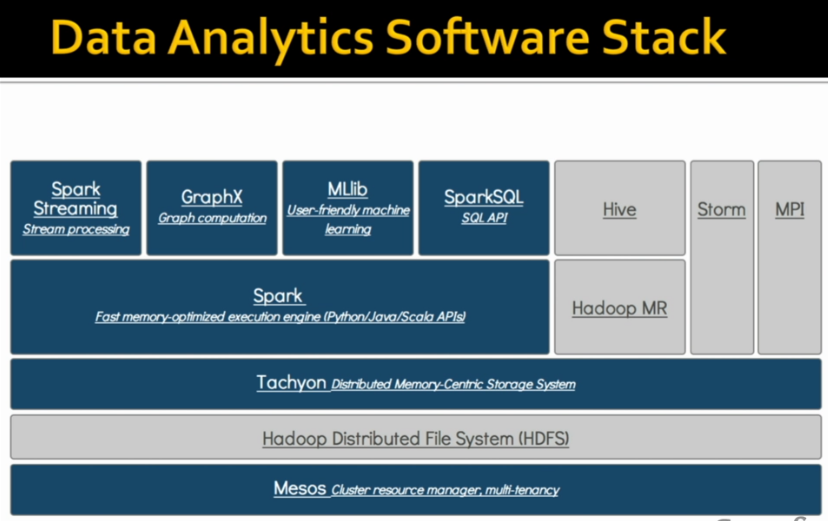

# Lecture 1 
Link for Azure: [Microsoft Azure](https://portal.azure.com/#create/hub)
New Topics:
- Real World Problems
	- Market Basket Analysis 
- Dynamic Programming
	- Frequent Itemsets
- Hashing
	- Locality Sensitive Hash, Bloom Filters
- High Dim Data
	- Locality Sensitive Hashing
	- Clustering
	- Dimensionality Reduction
- Streams:
	- Filtering Data Streams
	- Web Advertising
	- Queries on Streams
- Apps
	- Recommender Systems
	- Association Rules
	- Duplicate Document Detection

To be able to answer: How do you want that data? To be a master chef that singlehandedly does everything.

Distributed File Systems
- Data is rarely updated in place. Reads and appends are common.
- Chunk Servers
	- File is split into contiguous chunks (partitions)
	- Typically each chunk 16-64 MB
	- Each chunk is replicated, in different racks
	- Chunk servers also serve as compute servers
- There is a master node/name node
	- Stores metadata about where the files are stored. Might be replicated
- Client library for file access
	- Talks to master to find chunk servers
	- masters talk to chunk servers to get the data

# MapReduce
- Designed for Easy Parallel Programming
- Invisible management of hardware and software failures
- Easy management of very laser scale data
- Hadoop, Spark, Flink
	
## 3 Steps of MapReduce

- Map
	- **parallel operation**
	- Apply a **user-written map function** to each input element.
	- Mapper applies the map function to a single element
		- many mappers group in a map task
	- outputs set of key value pairs
- Group by Key (**bottleneck in practice**)
	- system groups all k,v pairs by value, outputting key, (list of values) pairs.
	- System does this, user does not do anything.
	- Group occurs across chunks
- Reduce **parallel operation**
	- **user written reduce function** is applied to each (key-list of values)
All the mappers have to finish before we can start reducing. So we may start all the map operations on multiple chunks and only keep the fastest.

MapEnvironment takes care of
	- Partitioning the input data
	- Scheduling the program’s execution across a set of machines
	- Performing the group by key step
	- handling machine failures
	- managing inter-machine communication

Dealing with failures
	Map worker failure
	Reduce worker failures **harder**:
		- Only in-progress tasks need to be reset and reduce task is started

## Example: Word Counting
This is a completely sequential problem. No memory is necessary for intermediate storage
	- Find Popular URLS in web logs, 5-character word string are **word counting problems**.
	- Map: Word -> (Word, 1)
	- Groupbykey (System does this): group by word
	- Reduce: sum by key

## Spark
**Spark** written in Java
	- Is a DataFlow system
	- Allows for chaining of multiple map-reduce steps
	- MapReduce uses two “ranks” of tasks
		- One for Map and the second for Reduce, data flows from teh first to the second
	- Dataflow Systems generalise this in two ways
		- Allow any number of tasks and ranks
		- Allow functions other than Map and Reduce
		- As long as data flow is in one direction only, we can have the blocking property and allow recovery of tasks rather than whole jobs.
	- Spark = Map Reduce + Fast data sharing (caching), DAG execution graphs, Richer functions than Map or Reduce
	- Spark high level APIs: DataFrame, Datasets are useful.
	- Spark RDD
		- Partitioned collection of records
		- Spread across the cluster, read only
		- Cached dataset in memory
			- Different Storage levels available, fallback to disk possible
		- RDDs can be created from Hadoop or by transforming other RDDs. You can stack RDDs
		- RDDs are best suited for applications that apply the same operation to all elements of a dataset.

Transformations build RDDs through 
	- map filter join union intersection distinct
	- Lazy evaluation
Actions (force evaluation) return value or export data
	- count, collect, reduce, save
Action can be applied to RDDs, actions force computations to occur

Spark features
	- Spark supports general task graphs
	- Pipelines functions where possible
	- Cache aware data reuse and locality
	- Partitioning-aware to avoid shuffles

Abstractions 
	- DataFrame - Unlike RDD, data organised into named column, imposes a structure on to the distributed collection of data
	- Dataset - Type safe OOP interface w/ compile time error detection

Libraries.- Spark SQL, Spark Streaming, MLLIb, GraphX

