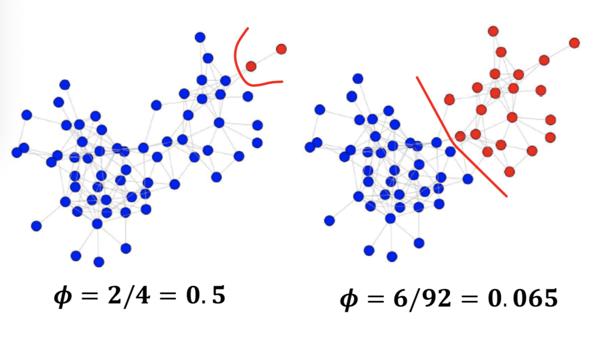
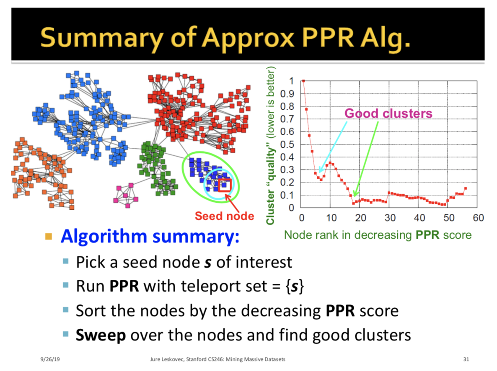
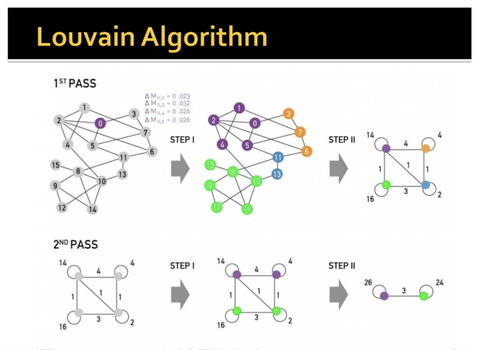
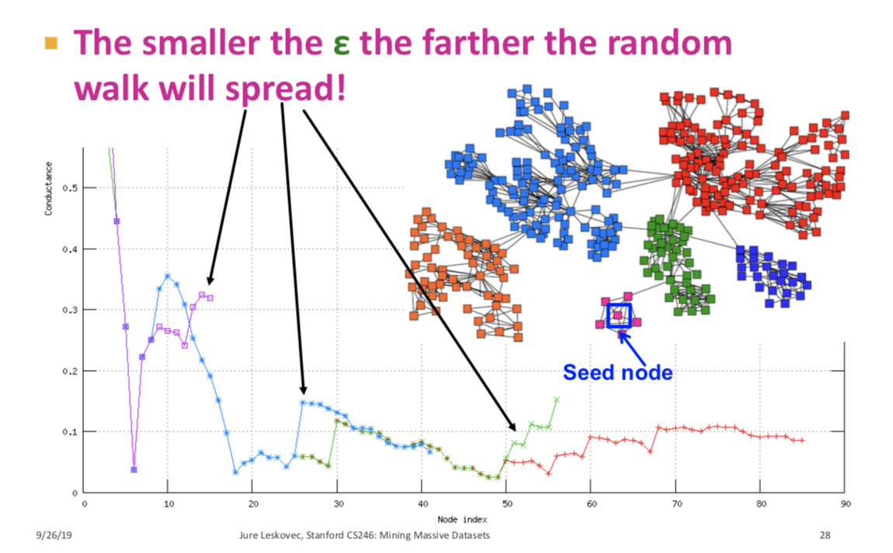
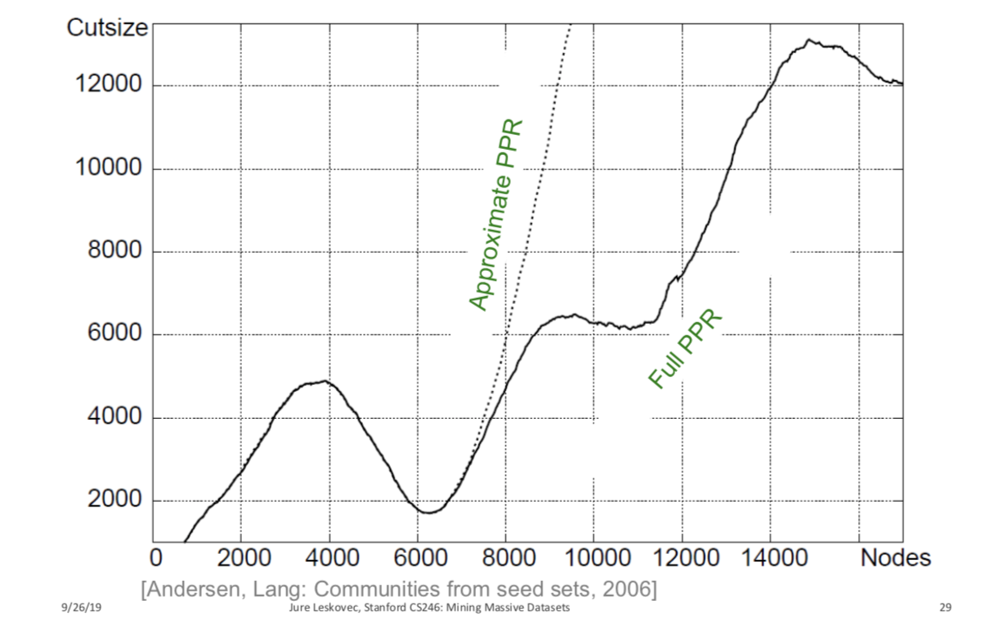

### Intro

### Applications
  - Finding Micro-markets (e.g. in sponsored search), customer segmentation (10)
  - Finding clusters in social networks
  - Clusters in Movies to Acctors Graphs
  
Assume the graph fits in main memory (~< 200 Million nodes and 2B edges if 16GB memory), and too big for algorithms slower than linear.

## Approximate Personalized PageRank for cluster discovery
Discovering clusters based on seed nodes:
Algorithm:
  - Given seed node s.
  - Compute (approximate) personalized pagerank (PPR) around node s (with teleport set = {s}). Idea is that if s belongs to a nice cluster, the random walk will get trapped inside the cluster.
  - Then sort the nodes by decreasing PPR score, sweep over nodes and find good clusters as follows: Determine, if I take the first node with highest PPR score, best 2 nodes, n nodes with best PPR score, how good of a cluster do I get by conductance? (Plotted below) Local minima of the plot correspond to good clusters.
    - What makes a good cluster?
    - Def: **Conductance (Graph Partitioning Criteria)**: Connectivity of the group to the rest of the network reliative to the density of the group. (Suface to variance ratio)
        - $Cond(A) = \frac{CutScore(A)}{min(vol(A), vol(A')}$ where A' is the complement of A. (1)
          - Def: **Cut**: Set of edges with only one node inside the cluster. **Cut score**: the sum of edges (or edge weights) in the cut.
          - Def **Volume**: vol(A): total weight of the edges with at least one endpoint in A. 
          $vol(A) = \sum_{i \in A} d_i = $  2 * (num edges in A}) + (num edges pointing out of A)
          - Conductance keeps both in mind and produces balanced cuts.
  - The whole sweep can be computed in linear time:
    - Iterate over the nodes
    - Keep hash-table of nodes in set $A_i$
    - To compute $\phi(A_{i+1}) = Cut(A_{i+1})/Vol(A_{i+1})$
      - $Vol(A_{i+1}) = Vol(A_i) + d_{i+1}$
      - $Cut(A_{i+1}) = Cut(A_i) + d_{i+1} - 2 *$ #(edges of $u_i+1$ to $A$)
  - How to compute Personalized PageRank (PPR) without touching the whole graph? Power method won't work since each iteration accesses all nodes of the graph. So we use **Approximate PageRank**.
  - ApproxPageRank(s, \beta, \epsilon)
    - $s$ = seed node
    - $\beta$ teleporation parameter
    - $\epsilon$ - approximation error parameter.
  - Overview of ApproxPageRank:
    - Lazy random walk, which is a variant of a random walk with proabbilty 1/2 at each time step, and walks to a random neighbor the other hald of the time:
      - Keep track of residual PPR score $q_u = p_u - r_u^{(t)}$. 
        - Residual tells us how well PPR score $p_u$ of $u$ is approximated.
        - $p_u$ is the "true" Personalized PageRank of node $u$
        - $r_u^{(t)}$ is the PageRank estimate of node $u$ at around $t$. If residual $q_u$ of node $u$ is too big above some $\epsilon$, that is, $\frac{q_u}{d_u} \ge \epsilon$ then push the walk further (distribute some residual $q_u$ to all u's neighbors along out-coming edges, else don't touch the node.
        - Finish when every node's $\frac{residual}{degree}  < \epsilon$
    - A different way to look at the PageRank:
      - $p_{\beta}(a) = (1-\beta) a + \beta p_{\beta} (M \cdot a)$ (2) 
        - Note: $M \cdot a$ is one setep of a random walk, where $M$ is the stochastic PageRank transition matrix.

**Approx PPR Algo**: $ApproxPageRank(S,\beta, \epsilon)$:
Idea: Recall the residual PPR score: $q_u = p_u - r_u$, where $r$ is approx PageRank vector, $q$ is residual PageRank vector, and $p_u$ is the true PPR score.
 Start with trivial approx: $r=0, q=a$. Iteratively push PageRank from $q$ to $r$ until $q$ is small.
  - Set $r = [0 ... 0]$, $q=[0 ... 0 1$ [at index s] $ 0 .. 0]$
  - While $\max_{u \in V} \frac{q_u}{d_u} \ge \epsilon$:
    - Choose any vertex $u$ where $\frac{q_u}{d_u} \ge \epsilon$
    - Push(u,r,q): (3)
      - $r' = r, q' = q$
      - $r'_u = r_u + (1-\beta ) q_u$
      - $q_u' = \frac{1}{2}\beta q_u$
      - For eahc v s.t. $u \rightarrow v$:
        - $q'_v = q_v + \frac{1}{2} \beta q_u/d_u$, $r=r', q=q'$
    - return $r$
  - Intuition: if $q_u$ is large, this means we have underestimated the importace of node $u$. Then we want ot take some of tha tresidual ($q_u$) and give it away, since we know we have too much of it.
  So we keep $\frac{1}{2} \beta q_u$ and then give away the rest to our neighbors, so we can get rid of it.
  This corresponds to the spreading of the $\frac{1}{2} \beta q_u/d_u$ term.
  Each node wants to keep giving away this excess PageRank until al nodes have no or a very small gap in exceess PageRank.

### Runtime and Graph Cut Approximation Guarentees (4)

The $\epsilon$ will control how far out we push the PageRank comptuation before it decays. We don't trust the latter part of the curve because there the error is too big (5, 6) 

## Modularity Maximization to find Clusters using the whole network
### (Louvain Method)

Def: Communities: sets of tightly connected nodes
Def: Modularity $Q$: The number of edges within each group - expected number of edges within each group, for some partition of $G$ into groups. Defined below.
 - A measure of how well a network is partitioned into communities (a measure for how well the whole network is partitioned into clusters as a whole, not just the quality of a particular cluster)
 - Given a partition of the network into groups $s \in S$, heuristically, modularity
$$ Q = \sum_{s \in S} [ (\# edges \; within \; group \; s)- (expected \;\#\; edges \; within \; group \;  s)]$$

 - **What is the expected number of edges within a group?** The expected number of edges in group s is the found as follows: Take the degree distribution of your network G, which has n nodes and m edges, and constrict rewired network $G'$ with the same degree distribution but random edges, by taking multiple pairs of nodes randomly and connecting them. Let $G'$ be a  multigraph, that is, allow more than one edge between two nodes. Then the expected number of edges between nodes $i$ and $j$ of degrees $k_i$ and $k_j$ equals to $k_i * \frac{k_j}{2m} = \frac{k_i k_j}{2m}$. This model used for graphs is called the **configuration model**. (0, 7)

So, the modularity is defined formally as:
$$Q(G,S) = \frac{1}{2m} \sum_{s \in S} \sum_{i \in S} \sum_{j \in S} (A_{ij} - \frac{k_i k_j}{2m})$$ where $S$ are the groups the graph is partitioned into, $i,j$ are nodes, $k_i, k_j$ are the degrees of $i, j$, and $1/2m$ is a normalizing constant. (8)

Modularity is normalized to take values in range $[-1,1]$. Modularity is positive if the number of edges within groups exeeds the expected number. If modularity is around 0.3-0.7,  significant community structure exists.

Our goal is to identify comunities by maximizing modularity over cuts $s$.

### Louvain method:
#### Heuristic but very fast and the most popular method to maximize modularity
Greedy community detection algotithm in O(n \log n) time.
Supports weighted graphs. Provides hierarchical partitions.
Widely used to study large networks, most popular community detection algorithm, because:
  - Fast
  - Rapid convergence propoerties.
  - High modularity output (i.e. "better communities")

Louvain algorithm greedily maximizes modularity as follows:
#### Algo (Louvain Algorithm for Community Detection):
Each pass has two phases. 
  - Phase 1: Modularity is optimized by allowing only local changes of communities. (repartitioning)
    - Put each node in the graph into its own community (one node per community)
    - For each node i, perform the following:
      - For every neighbor $j$ of $i$, compute the modularity gain ($\Delta Q$) when putting node $i$ from its current community into the community of neighbor $j$.
      - Move $i$ to a community that yields the largest modularity gain $\Delta Q$. The equation to compute $\Delta Q$ is quite involved and is given in full in (9).
  - Phase 2: The identified communities are aggregated in order to build a new network of communities. (restructuring)
    - The partitions obtained in the first phase are constracted into super-nodes, and the weighted network is created as follows:
      - Super-nodes are connected if between the two super-nodes is the sum of the weights from all edges between their corresponding partitions.
  - Repeat Phase 1 and 2 iteratively until modularity stops increasing.
  
  Since the loop runs until there is no more modularity gain, you will reach a local maximum. In reality, the value of the local maximum depends on the order in which you looped through the nodes $i$, but people have found that the order doesn't matter so much and that the local maximum is good enough.

### How to pick between the above two methods?
If you care more about the local neighborhood of a node and find the cluster around it, use the first method. It is faster, you only need to look into the neighborhood of that node.
If you want to break the entire network into communities use the second method.

## Notes:
(0) Since the degree of a full network with m edges is is 2m
(1) Since the degree of a full network with m edges is is 2m (0), conductance is also written

$$Cond(A) = \phi(A)=  \frac{|{(i,j) \in E ; i \in A, j \notin A}|}{min(vol(A),2m-vol(A)}$$

(2) Proof that $p_{\beta}(a) = (1-\beta) a + \beta p_{\beta} (M \cdot a)$. The prob of a walk of length 0 is ($1-\beta$), where the walker ends where it started, with walker distribution $a$.
- The prob of a walk length >0 is $\beta$, and then the walk starts at distribution $a$, takes a step (so it has distribution $Ma$), then takes the rest of the random walk with distrbution $p_{\beta}(Ma)$.
  - (Here we use the memoryless nature of the walk - after we know the location of the secind step has distribution $Ma$, we can forget where it starter and behave as if it started at $Ma$.)
  - Note that $a$ can be either any particular node or a prob distribution over telport nodes.

(3) - **Algo: Push Operation: $Push(u,r,q)$**
  - $r' = r, q' = q$
  - $r_u' = r_u + (1 - \beta) q_u$
    - $r_u$ is the approximated PPR at point u. On each iteration, we add the teleportation probabilty times the residual to $r_u$.
  - $q_u' = \frac{1}{2} \beta q_u$ for each $v$ s.t. $u \rightarrow v$:
    $q_v' = q_v + \frac{1}{2} \beta \frac{q_u}{d_u}$.
  - Return $r', q'$
  This is essentially:  Update $r$ and do 1 step of a random walk: Stay at $u$ with prob 1/2, Spread remaining 1/2 fraction of $q_u$ as if a single step fo a random walk were applied to $u$.

(4) Runtime: Pagerank-Nibble computes PPR in time $O(\frac{1}{\epsilon (1-\beta)})$. Better than Power method which would take time $O(\frac{log(n)}{\epsilon (1-\beta)})$.
ApproxPageRank comes with a graph cut approximation guarentee:
If there exists a cut of conductance $\phi$ and volume $k$ then the method finds a cut conductance at least $O(\sqrt{\phi / \log(k) }$ (very close to the optimal).

(5)

(6)

(7) This causes the expected number of edges in multigraph $G’$ to be =:
$$\frac{1}{2} \sum_{i \in N} {\sum_{j \in N} {\frac{k_i k_j}{2m}}} = \frac{1}{2} \frac{1}{2m} \sum_{1 \in N} k_i (\sum_{j \in N} k_j) = \frac{1}{4m}{2m \cdot 2m} = m$$

(8) Equivalently, modularity can be written as 
$$Q = \frac{1}{2m} \sum_{ij}\left[ A_{ij} - \frac{k_ik_j}{2m}\right] \delta(c_i,c_j)$$
- $A_{ij}$ represents the edge weight between nodes i and j
- k_i, k_j are the sum of the weights of the edges attached to nodes $i$ and $j$ respectively
- $2m$ is the sum of all the edge weights in the graph
- $c_i$, $c_j$ are the communities of the nodes and 
- $\delta$ is an indicator function.

(9)
What is $\Delta Q$ if we move node $i$ to community $C$?
Define
$$\Delta Q(i \rightarrow C) = $$
$$\left[ \frac{\Sigma_{in} + k_{i,in}}{2m} - \left(\frac{\Sigma_{tot} + k_i}{2m}\right)^2 \right] - \left[ \frac{\Sigma_{in}}{2m} - \left( \frac{\Sigma_{tot}}{2m} \right)^2 - \left( \frac{k_i}{2m} \right)^2  \right]$$
  where 
  - $\Sigma_{in}$ = sum of link weights between nodes in $C$
  - $\Sigma_{tot}$ = sum of all link weights of nodes in $C$
  - $k_{i,in}$ = sum of link weights between node $i$ and $C$
  - $k_i$ =sum of all link weights (i.e., degree) of node $i$.
  are sufficient statistics to compute $\Delta Q$. 

When you compute the node, you only have to compute $k_{i,in}$. You already have $\Sigma_{in}, \Sigma_{tot}, k_i$.
So the only thing you have to do is to get the number of edges between $i$ and $C$, and use the other values. 

You also need to similarly derive $\Delta Q(D \rightarrow i)$ of taking node i out of community D. Then sum the two: $\Delta Q = \Delta Q(i \rightarrow C) + \Delta Q (D \rightarrow i)$. This is cheap to compute.

(10)

