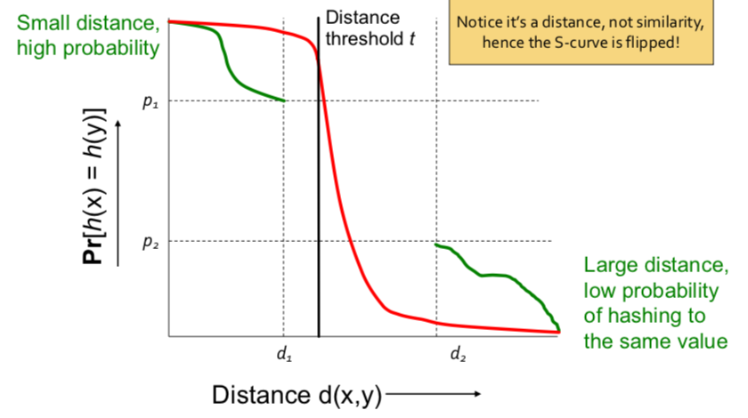
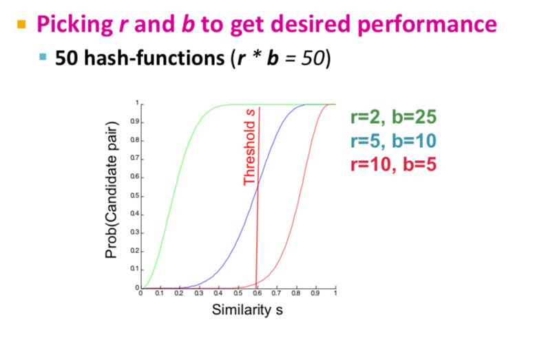
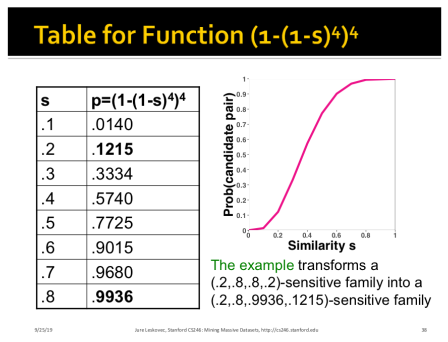
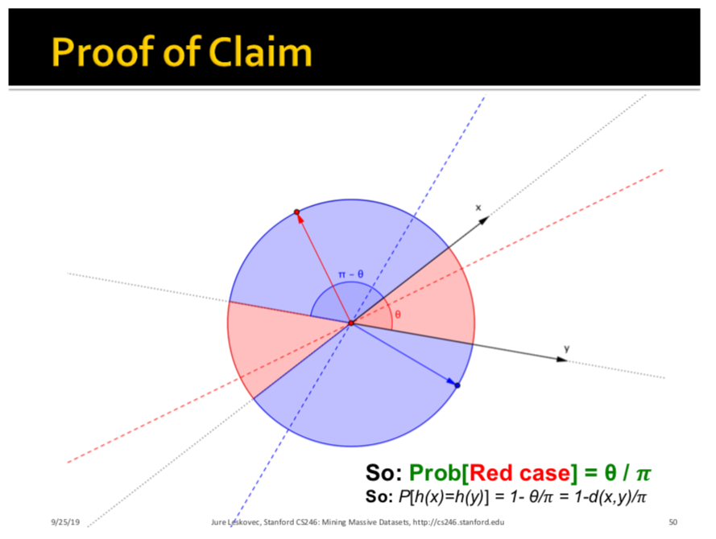
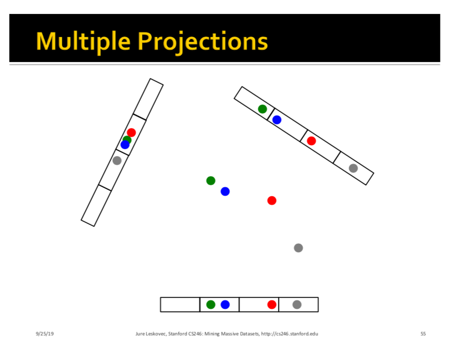
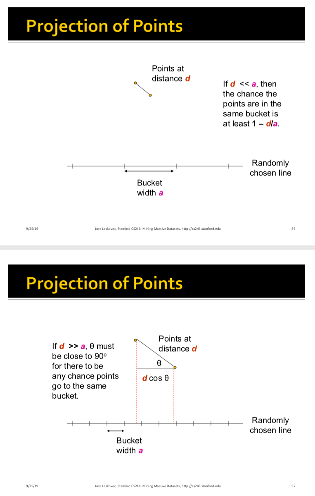

# Lecture 4 - Theory of Locality Sensitive Hashing
LSH requires some dimensionality reduction first. You do need to do some preprocessing beforehand to get rid of outliers to make your LSH perform most effectively. 

Design a locality sensitive hash function that can be applied to any distance metric
Once you know what is the threshold you care about, you tune the curve so that you can get the value you want. (1)
Prob that all bands are not equal = P(C1, C2 is a candidate pair)
	= `1-(1-s^r)^b`

- **Families of Hash functions**
		- For min-hashing signatures, we have a min-hash function for each permutation of rows
	- def: a **family** of hash functions is any set of hash functions form which we can pick one at random efficiently.
			- Ex: the set of min-hash functions generated form permutations of rows
	- Suppose we have a space S of points with a distance measure d(x,y)
		- A family H of hash functions is said to be **(d1,d2,p1,p2)-sensitive** if for any x and y in S:
			1. if d(x,y) < d1, then the probability over all h in H that h(x) = h(y)  is at least p1
			2. If d(x,y) > d2, then the probailitiy over all h in H that h(x)=h(y) is at most p2.
	- We want to stretch p1 to be close to 1 and p2 close to 0, and we want to squeeze d1 and d2 to be close to each other at the distance threshold T. (Img 1)
	- Example
		- Let S = space of all sets, d = Jaccard distance, H is family of Min-hash functions for all permutations of rows
			- Then for any hash function h in H, `Pr[h(x)=h(y) = 1-d(x,y)`
			- Min-hash H is a (1/3,2/3,2/3,1/3) sensitive family for S and d.
	
- **Bands Techniques AND and OR**
	- The bands technique for signature matrices can be generalised to AND and OR on any (d1,d2,p2,p2) sensitive has functions!
	- AND - “number of rows in a band”
		- This corresponds to creating a band of size r because it amplifies the probability that entries hash to the same bucket to the power or r.
		- Given family H, construct family H’ containing r functions from H. For `h = [h1,…,hr] in H’`, we way that `h(x) =h(y)` if and only if `h-(x) = hi(y)` for all `i:1≤i≤r`
		- Theorem: If H is `(d1,d2,p1,p2)` sensitive, then `H’` is `(d1,d2,p1^r,p2^r)` sensitive.
			- p1 getting smaller is bad for us, this is lowering the probability for the smaller distances. P2 getting smaller is good, it is lowering the probability of large distances
			-  Proof: Use the fact that two hash functions, in the average, are independent.
		- AND makes all probs shrink, but by choosing r correctly, we can make the lower prob approach 0 while the higher does not.
	- OR construction like “how many bands”
		- This corresponds to the number of bands, because it is true if one of its constituents are true.
		- Given family H, construct family `H'` containing `b` functions from H.
		- For `h=[h1,…,hb]` in `H'`, `h(x)=h(y)` if and only if `hi(x)=hi(y)` for at least one `i`.
		- Theorem: if H is `(d1,d2,p1,p2)` sensitive, then `H'` is `(d1,d2,1-(1-p1)^b,1-(1-p2)^b)` sensitive
			- p1 getting larger is good for us, it raises the prob of small distances, p2 getting larger is bad for us, it raises the probability for large distances.
			- Proof: Use the fact that the `hi’s`are on average, independent
		- OR makes all probs grow, but my choosing r correctly, we can make the higher prob approach 1 while the lower does not. 
By choosing b and r correctly, we can make the lower probability approach 0 while the larger approaches 1.
Apply AND and OR in any order.
Note we fix the total number of hash functions` n`, so `n=r*b`

**How to pick r and b**
	- Pick any two distances d1<d2
	- Start with a (d1,d2,(1-d1),(1-d2) family
	- Apply constructions to amplify into a (d1,d2,p1,p2) sensitive family, where p1 is almost 1 and p2 are almost 0. The curve we plot for the function is `1-(1-s^r)^b` (Img 3)
	-  We can accept false positives, but false negatives are lost to us forever. (Img 2)

**LSH for other distance measures**
	- **Cosine distance** - random hyperplanes
		- Cosine Distance = angle between vectors from the origin to the points in question
			- polar version: ` d(A,B)= theta = arccos(A • B) / |A|•|B|) `
			- general version:  ` d(A,B)= theta = A • B / |A|•|B|) `
		- LSH for cosine distance- **random hyperplanes**: a (`(d1,d2, (1-di/pi), (1-d2/pi))` sensitive family for d1 and d2
			- Every vector v determines a hash function h_v with two buckets (returns +1 or -1)
			- `h_v(x) = +1 if v • x ≥ 0; = -1 if v • x < 0 `
			- This is essentially, in which part of the hyperplane determined by (orthogonal to) v does x lie?
			- The LSH-family H - set of all functions derived from any set of vectors v1, v2…			- For points x and y,
				- `Pr(h(x)=h(y)]=1-d(x,y)/pi`. Proof by picture (Img 4)
		- Process:
			- Pick some number of random vectors with norm 1 (on the unit sphere), and hash your data for each vector. The result is a signature (sketch) of +!s and -1s for each data point. Amplify using AND and OR constructions.
	- **LSH for Euclidean Distance** - project on lines (Img 5)
		- Is a `(a/2, 2a, 1/2, 1/3)` sensitive family of hash functions for any `a`.
		-  Idea: Hash functions correspond to lines
		- Partition the line into buckets of size a. Project each point onto the line to see which bucket it falls into. An element of the ‘signature’ is a bucket id for that 
		- Nearby points are always close, distance points are rarely in the same bucket.
		- Is a `(a/2, 2a, 1/2, 1/3)` sensitive family of hash functions for any `a`, because
			- if points are distance d ≤ a/2, prob that they are in the same bucket ≥ 1-d/a = 1/2.
			- If the points are far apart - `d>2a` apart, then they can be in the same bucket only if 
							`d * cos(theta) ≤ a`
			- Since `cos(theta) ≤ 1/2 ` implies that `60 < theta < 90`, ie, theta falls within the rage at at most 1/3 probability. (Img 6)
		- Process:
			- Pick random lines, project the points on them, and hash your data to each bucket. Amplify the hashing using AND and OR functions.
			
**How do we overcome the curse of dimensionality with LSH?** 
LSH doesn’t help you address that. If you’re using cosine similarity and you’re aware that your data is highly dimensional and you will return a lot of sketches with -1 (your vectors are orthogonal), you either want to us a metric other than losing similarity, or preprocess your data to remove the curse of dimensionality (dimensionality reduction).

(1) Work with samples if your data is too large.

(Img 1)

(Img 2)

(Img 3)

(Img 4)

Img 5

#cs246