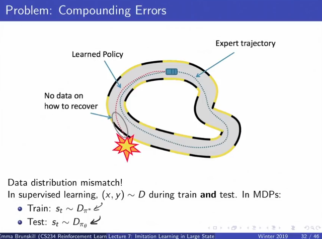
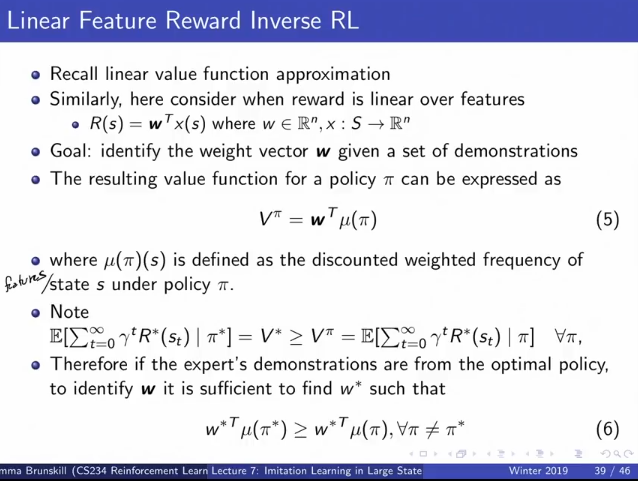
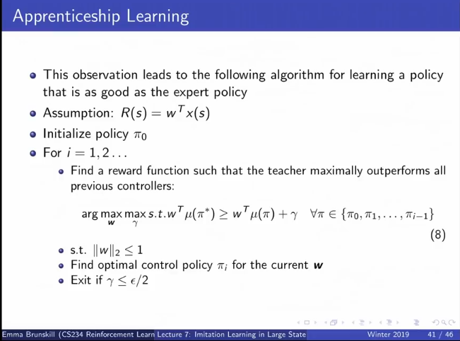

**Imitation Learning** - Learning from Demonstrations (Mostly Applications in Driving and Robotics). Why Imitation Learning? **Data Efficiency**: How much data is needed to learn good decisions. 

**Input:**
  - State Space, Action space
  - Transition model $P(s'|s,a)$
  - no reward function R
  - set of one or more teacher's demonstrations $(s_0,a_0,s_1,s_0)$ drawn from teacher's policy $\pi^*$

## Behavorial Cloning
(Appendix 1)
Behavorial Cloning: Formulate problem as a standard supervised machine learning problem, fixing a policy class (e.g. neural network). Estimate a policy from training examples $(s0,a0), (s1,a1)$, etc.
Supervised learning assumes iis (s,a) pairs and ignores temporal structure. Errors are independent in time.

Problem: Compunding Errors. 
We will compund errors because the distribution of actions taken is different from distribution of training data. i.e. if the teacher data has "go right" in a particular situation, but our supervised learner made an error and went "left", now all the current state distribution is something that we have not seen before and is not the same as the training distrbution. In a paper it was proved that the error at time $t$ with probability $\epsilon$ was (Appendix 1) $$\mathbb{E}[\text{Total Errors}] \le \epsilon(T+(T-1)+\cdots + 1) \propto \epsilon T^2$$ 

This leads to the situation pictured in Appendix 1.

### DAGGER
Do behavorial cloning (supervised learning), but when you hit a situation that you haven't seen before in the dataset, ask an in-the-loop expert what to do, and add that datapoint to your dataset. Grow dataset constantly using explored states and expert-given actions. 

**Pseudocode:** (Appendix 1)
Initialize dataset to be empty.
Initialize the current learned policy $\hat \pi_1$ to any policy.
Loop until done:
  - Mix the current learned policy with the expert policy seen so far $\pi_i = \beta_i \pi^* + (1-\beta_i) \hat \pi_i$ (Important for learning! - Although the prof said that in this case this step should be "toss a weighted coin as to whether the expert should give you the exact action or to follow the currently learned policy".)
  - Sample T-step trajectories using $\pi_i$
  - For all visited states in sampled trajectories, ask expert for actions they would have taken in those states to form the update dataset $D_i = \{(s, \pi^*(s))\}$
  - Aggregate datasets: $D \leftarrow D \cup D_i$
  - Train classifier $\pi_{i+1}$ on $D$.
  - Update policy with expert

Everything that you train the dataset on is with an expert label, and you slowly grow the size of that dataset.
DAGGER has good convergence properties. Requires a constantly in-the-loop expert, so its hard to scale up.

## Inverse RL
Can we recover $R$ given demonstrations?
Given: State space $S$, action space $A$, transition model $P(s'|s,a)$, and a set of one or more teacher's demonstrations $(s_0,a_o,s_1,a_1,...)$ drawn from the teacher policy $\pi^*$.
Goal: Infer the reward function $R$.
Note: Compatible reward functions to the action state are not unique. 
Note: Can be extended to situations where the transition model is unknown, but requires access to a simulator.
### Linear Feature Reward Inverse RL

**Feature Matching**
Feature Matching is one way to do linear feature reward inverse RL. Note that this is not an algo that a lot of people use anymore, most people use deep learning.

We model the reward as a linear function of the features: $R(s) = w^Tx(s) \;\;\; w \in R^n, x:\rightarrow R^n$.
Goal: Identify the weight vector $w$ given a set of demonstrations.
The resulting value function for a policy $\pi$ can be expressed as 
\begin{align}
V^\pi = \mathbb{E} \left[ \gamma^t R(s_t) | \pi \right] & = \mathbb{E}[\sum_{t=0}^\infty \gamma^t w^T x(s_t) | \pi] \\
& = w^T \mathbb{E} [\sum_{t=1}^\infty \gamma^t x(s_t) | \pi] \\
& = w^T \mu(\pi)
\end{align}

where $\mu(\pi)(s)$ is defined as the discounted weighted frequency of state features under policy $\pi$ (How much time you spend in differnet states - using featurized states, discounted by when you reach those states. Essentially the stationary distribution of states, weighted by the discount factor, and featurized)

So now instead of thinking about reward functions, we can start thinking about different distributions of states, which in a linear assumption is isomorphic to differnet reward functions. (Appendix 2)

Now, assuming we have the optimal reward function, the value function using $\pi^*$ is better than the value for any other policy (that is, 
$$\mathbb{E} [\sum_{t=1}^\infty \gamma^t R^*(s+t) | \pi^*] = V^* \ge V^\pi =  \mathbb{E} [\sum_{t=1}^\infty \gamma^t R^*(s_t) | \pi] \;\; \forall \pi$$

thus if the expert's demonstrations are from the optimal policy to identify $w$ it is sufficient to find $w^*$ such that (Appendix 2)
$${w^*}^T \mu(\pi^*) \ge {w^*}^T \mu(\pi) \;\;\; \forall \pi \ne \pi^*$$

Finally, (Abel and Ng 2004), if for some policy its distribution of states matches the distribution of states of the expert, formally if $||\mu(\pi) - \mu(\pi^*)||_1 \le \epsilon$, then for all $w$ with $||w||_\infty \le 1$:
$$|w^T \mu(\pi) - w^T \mu(\pi^*)| \le \epsilon$$

We don't know what the real reward policy, but we found the optimal policy, so that's good enough. Finding such a policy that matches state feature distributions with the teacher policy is called **feature matching**. 

There are also non-linear analogs.

### Apprenticeship Learning via Inverse RL
The above ovservation led to the **Apprenticeship Learning Algorithm**. Note that this is not an algo that a lot of people use anymore, most people use deel learning.

You try to find a reward function (a set of weights) such that the teacher policy looks better than every other policy. Still assumes $R(s)$ is linear in $s$.

Pseudocode: 
Initialize policy $\pi_0$

Iterate over possible policies $\pi_1, \pi_2,... $:
  - Find a reward function $w$ such that the teacher policy maximally outperforms all previous policies:
\begin{align}
& \arg \max_w \max_\gamma \\
& s.t. w^T \mu(\pi^*) \ge w^T \mu(\pi) + \gamma \;\; \forall \pi \in {\pi_0, \pi_1,...,\pi_{i-1}} \\
& s.t. ||w||_2 \le 1
\end{align}

  - Find optimal control policy $\pi_i$ for the $w$ found in previous step. This allows you to get a new $\mu(\pi_i)$ from the transition model.
  - Exit if a policy has been found that makes $\gamma \le \epsilon/2$.

**Issues with Apprenticeship Learning**
If expert policy is suboptimal then the resulting policy is a mexture of somewhat arbitrary policies which have expert in the convex hull. It's a bit tricky how to combine these. In practice: pick the best one of this set and pick the corresponding reward function.

**Amiguity**
There is an infinite number of reward functions with the same optimal policy. Two papers (Appendix 3)
  - Maximum entrope interse reinforcement leanring (Ziebart et al 2008)
    - Pick a reward function that produces the maximum uncertaincy given the teacher policy (make the least commitment, underfit as much as possible). Hugely influential.
  - Generative Adversarial Imitation Learning aka GAIL (Ho and Ermon 2016 - extension to feature matching using DNNs), since writing down the distrution of $\mu(\pi)$ is hard given a very high dimensional state space (for example, the space of all images). They use a discriminator that can tell between the expert demonstrations and the trajectories generated by an agent. Lots of extensions to this also.
  
If you want to get the actual reward function, you have to take a Bayesian Approach and specify a prior over reward functions, which you will then update with algos. If its not so important what the actual reward function is, you can just use the methods above.

**Summary:**
Imitation learning can greatly reduce the amount of data needed to learn a good policy. It is really useful practically in industry, Challenges remain and one exciting area is combining inverse RL / learning from demonstration and online reinforcement learning. 

## Appendices:
**Appendix 1: Behavorial Cloning**
Two notable success stories:
Pomerleau, NIPS 1989 (ALVINN - very early paper about driving on the road.)
Summut et al 1992 Flight Simulator

For behaviorial cloning, analysis of compounding errors
$\mathbb{E}[\text{Total Errors}] \le \epsilon(T+(T-1)+\cdots + 1) \propto \epsilon T^2$ done in "A rediction of imitation learning and structure prediction to no-rgret online learning, Ross et al 2011"

Pseudocode for DAGGER (Expert-in-the-loop Data Aggregation):

**Appendix 2: Inverse RL: Feature Mapping and Apprenticeship Learning**

**Appendix 3:**

**
**

