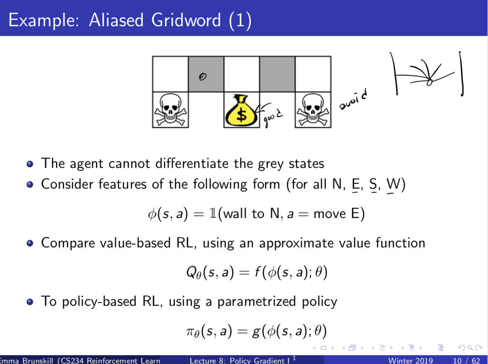
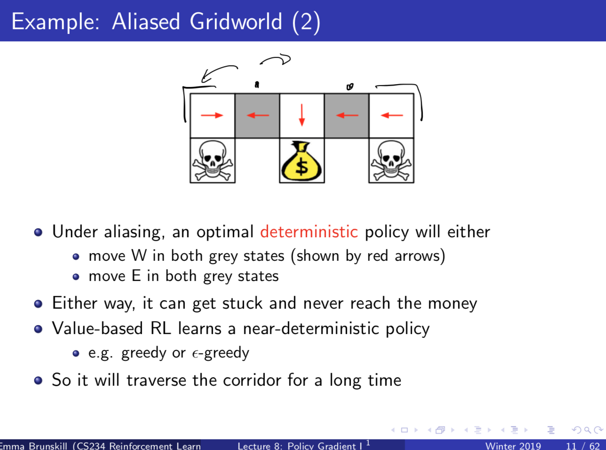
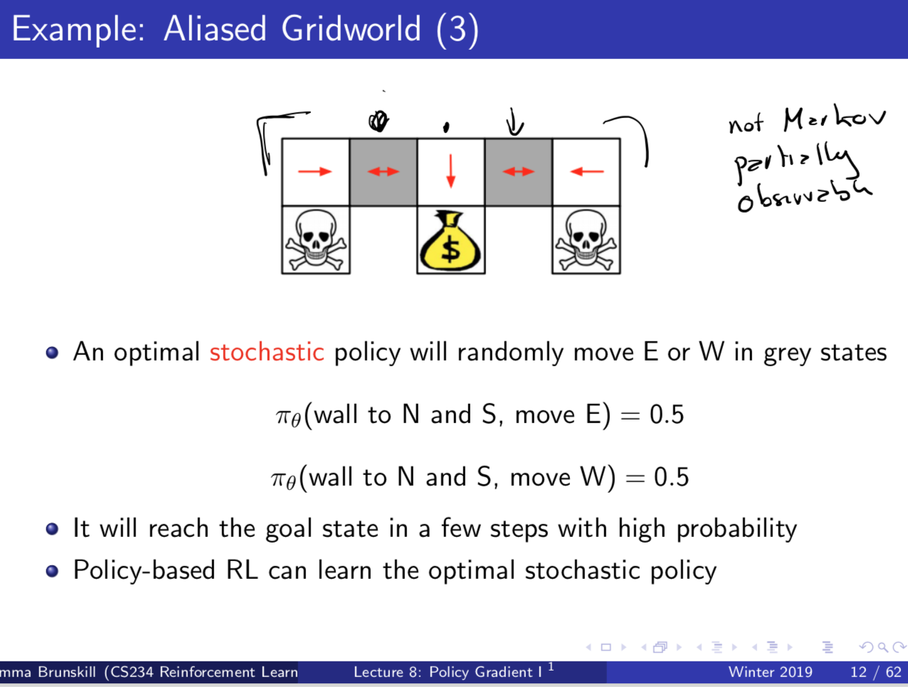
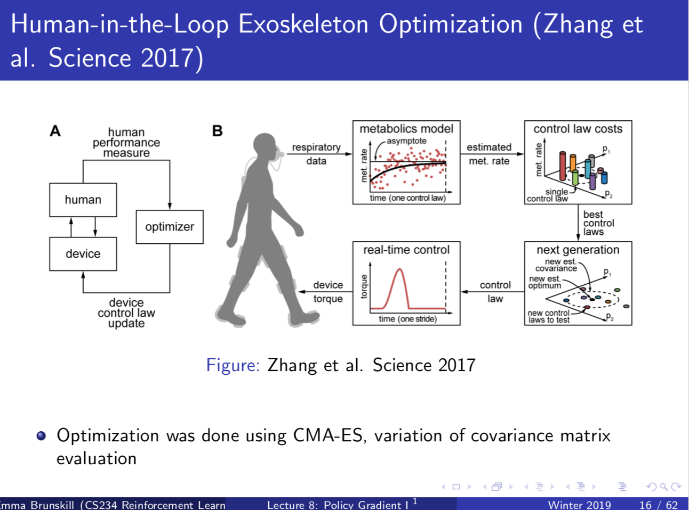
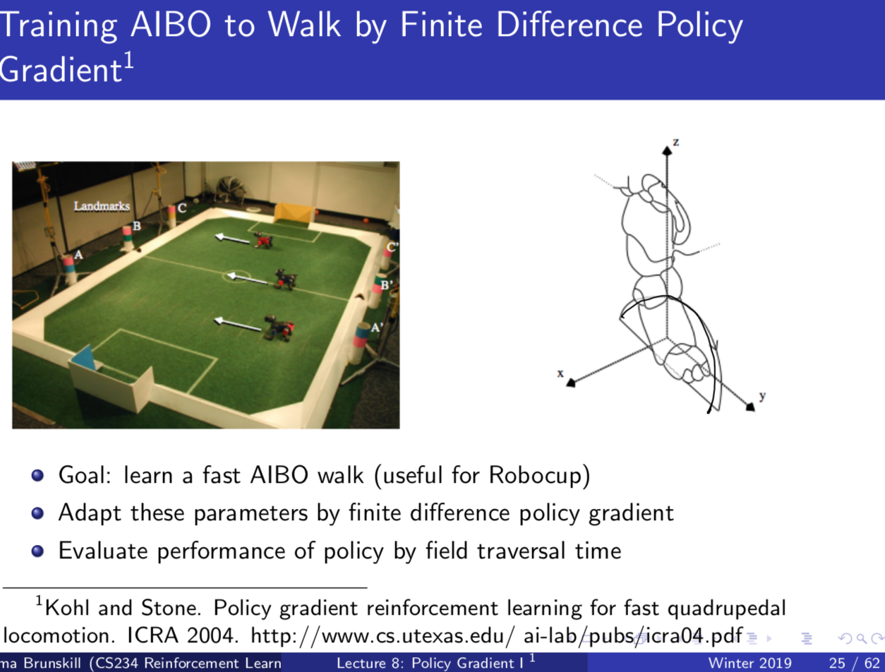
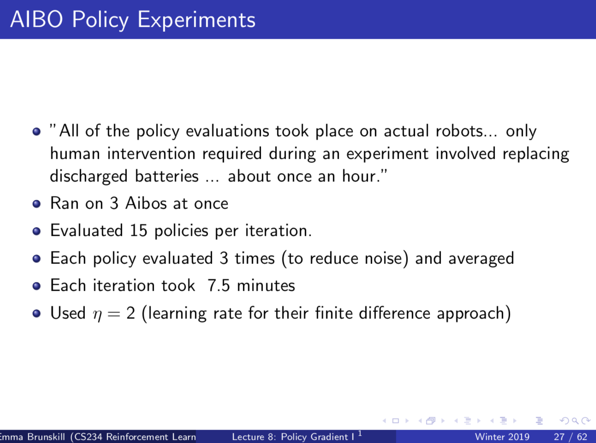
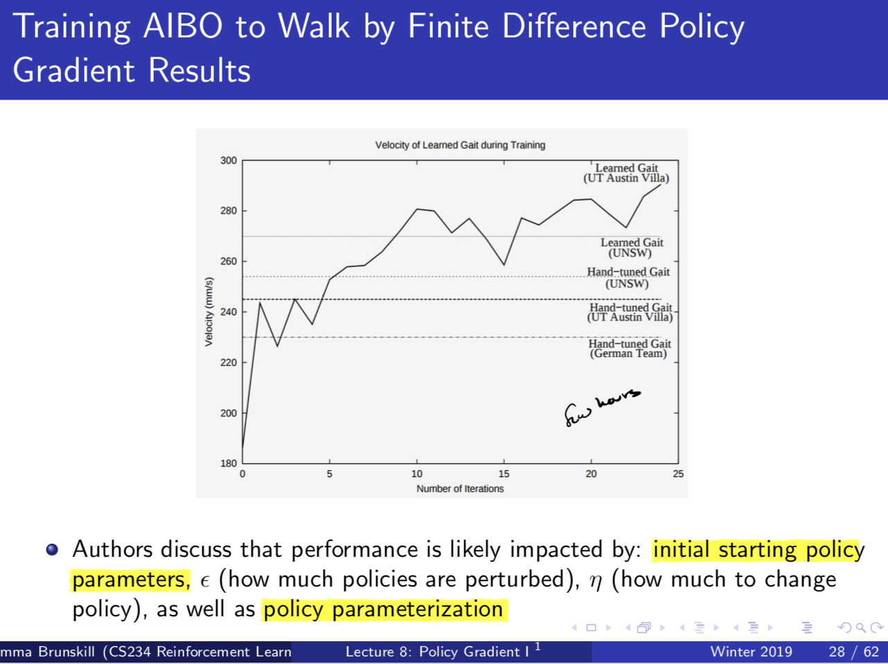
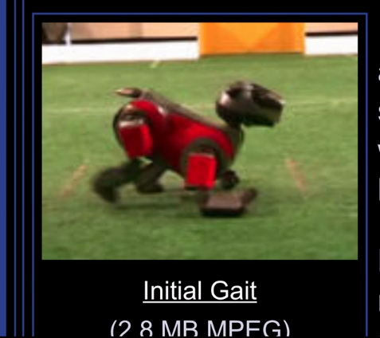

### Types of RL:
**Value based RL**: Learn a value function, optimal policy is implicit given value function (from $\epsilon$-greedy).
**Policy Based RL**: Try to learn optimal policy without using value function. Policy is parameterized.
**Actor-Critic RL**: Learn both value function (critic) and policy (actor)
(appendix 1)

**Policy Gradients** - Currently the most commonly used methods in RL right now. Used to encode structure (policy calss) to help constrain and speed reinforcement learning.  In this lecture we directly parameterize the policy

$$\pi_{\theta}(s,a) = \mathbb{P}[a|s;\theta]$$
Goal is to find a policy $\pi$ with the highest value function $V^\pi$
Common types of differentiable parameterized policies are Goftmax (discreate action spaces), Gaussian, DNNs.

Advantages:
  - Its hard to write down an explicit reward funciton. It's easier just to write down a parameterization of the space of policies rather than a parameterization in the space of state-action value functions. 
  - Better conergence properties.
  - Much more effective in high-dimensional or continuous action spaces
  - Can learn stochastic policies.
Disadvantages:
  - Typically converge to a local rather than global optimum
  - Evaluating a policy is typically inefficient and high variance.

**Stochastic Policies**:
In a tabular MDP, the optimal policy is deterministic. However, there are two cases where stochastic policies are preferred.
1. In a multi-agent case, the deterministic policy is easily exploited. The best (Nash Equilibrium) strategy is a uniform random strategy.
2. When we have **aliasing**: two states which cannot be distinguished. This is an example of a **partially-observable** situation, which is not Markov. Then, you might not want a deterministic policy. Even if you cannot distinguish between the two states, you dont want to to the same policy over and over in those states - you want to have different ways you can get out of the states. (Appendix 2)

## Policy Objective Functions
Goal: Given a policy $\pi_{\theta}(s,a)$ with parameters $\theta$, find the best $\theta$.

We measure the quality of a policy $\pi_{\theta}$ as follows:
  - In episodic environments we use the **start value** of the policy:
  $$J_1(\theta) = V^{\pi_{\theta}}(s_1)$$
  - In continuing environments we can use the **average value**.
    $$J_{avV}(\theta) = \sum_s d^{\pi_\theta}(s) V^{\pi_\theta}(s)$$
  where $d^{\pi_\theta}(s)$ is the stationary distribution of the Markov chain for $\pi_\theta$.
  - Alternately, in continuing environments we can use the **average reward per timestep**:
    $$J_{avR}(\theta) = \sum_s d^{\pi_\theta}(s)\sum_a \pi_{\theta}(s,a)R(s,a)$$
Today we focus on the episodic setting.

## Policy optimization
Find policy parameters $\theta$ that optimize the policy $\pi_{\theta}$
**Gradient free optimization**
  - Hill climbing, simplex, genetic algorithms, cross-entropy method, covariarance matrix adaptation.
  - Often a great simple baseline to try, easy to paralleize, can work with non-differentiable policy parameterizations, but are generally not sample efficient (because it ignores temporal structure). (Example in Appendix 3)
**Gradient-based optimization:** 
- Called **Policy gradient** methods (next section)
- Gradient Descnet, Conjugate descent, Quasi-Newton (BGFS)  
- Often leads to greater data efficiency.

## Policy Gradient Methods
In the below section we assume episodic MDPs.
Define $V(\theta) = V^{\pi_\theta}$ to make explicit the dependence of the value on the policy parameters.
Policy gradient methods search for a local maximum in $V(\theta)$ by apploying gradient ascient w.r.t. parameters $\theta$ to to the policy gradient:
$$\Delta \theta = \alpha \nabla_{\theta} V(\theta)$$

**Numerical gradient (Finite-Differences Gradient):**
  - To evaluate policy gradient of $\pi_\theta(s,a)$
  - For each simension $k \in [1,n]$ compute $\frac{\partial V(\theta)}{\partial \theta_k} \approx \frac{V(\theta+\epsilon u_k) - V(\theta)}{\epsilon}$.
Uses $n$ evlaluations to compute policy gradient in $n$ dimensions
Simple, noisy, inefficient, but sometimes effective, and works for arbitrary policies. (Although can be very data efficient if the policy space is tightly defined - Example in Appendix 3)

**Analytical Gradient Methods (Likelihood Ratio):**
Most techniques compute the policy gradient analytically.

Denote a state-action trajectory as $\tau = (s_0,a_0,r_0,...,s_{T-1}, a_{T-1}, r_{T-1})$, and use $R(\tau) = \sum_{t=0}^TR(S_t,a_t)$ to be the sum of rewards for a trajectory $\tau$.
Then the policy value is $V(\theta) = \mathbb{E}_{\pi_\theta} \left[\sum_{t=0}^T R(s_t,a_t) ; \pi \theta \right] = \sum_\tau P(\tau ; \theta) R(\tau)$ (the expected sum of rewards given this policy), where $P(\tau, \theta)$ denotes the probabilities over trajectories when executing policy $\pi(\theta)$.
In this new notation, our goal is to find the policy parameters $\theta$ s.t.
  $$\arg \max_\theta V(\theta) = \arg \max_\theta \sum_\tau P(\tau ; \theta) R(\tau)$$

The gradient is:
\begin{align*}  
\nabla_\theta V(\theta) & = \nabla_\theta \mathbb{E}_{\tau \sim \pi_\theta} [R(\tau)] \\
                      & = \nabla_\theta \sum_\tau P(\tau ; \theta) R(\tau) \\
                       & =\sum_\tau \nabla_\theta P(\tau ; \theta) R(\tau) \\
                       & =\sum_\tau \frac{P(\tau ; \theta)}{P(\tau ; \theta)} \nabla_\theta P(\tau ; \theta) R(\tau) \\
                        & =\sum_\tau P(\tau ; \theta)R(\tau) \underbrace{\frac{\nabla_\theta P(\tau ; \theta) }{P(\tau ; \theta)}}_\text{likelihood ratio}\\
                        & =\sum_\tau P(\tau ; \theta)R(\tau) \nabla_\theta \log P(\tau ; \theta) \\  
                        & = \mathbb{E}_{\tau \sim \pi_\theta} [R(\tau) \nabla_\theta \log P(\tau ; \theta)]  \tag{1} 
\end{align*}
(See CS231N Lecture 12)

Typically, we take $m$ Monte-Carlo sample paths under policy $\pi_\theta$ (notice that the sampling takes out the probability $P(\tau ; \theta)$. This is called **Policy Gradient with Monte Carlo Returns**:
$$\nabla_\theta V(\theta) = \hat g = (1/m) \sum_{i=1}^m R(\tau^{(i)}) \nabla_\theta \log P(\tau ; \theta)$$

The last term $$\nabla_\theta \log P(\tau ; \theta)$$ seems difficult to compute, but
\begin{align}
\nabla_\theta \log P(\tau ; \theta) & = \nabla_\theta \log \left[ \underbrace{\mu(s_0)}_\text{initial state distrib} \prod_{t=0}^{T-1} \underbrace{\pi_\theta(a_t|s_t)}_\text{policy} \underbrace{P(s_{t+1}|s_t,a_t)}_\text{dynamics model} \right] \\
                                    & = \nabla_\theta \left[ \log \mu(s_0) + \sum_{t=0}^{T-1} \log \pi_\theta(a_t|s_t) + \log P(s_{t+1}|s_t,a_t)  \right] \\
                                    & =  \sum_{t=0}^{T-1} \underbrace{\nabla_\theta \log \pi_\theta(a_t|s_t)}_\text{no dynamics model required!}  \tag{2} 
\end{align}
The term $\nabla_\theta \log \pi_\theta(a_t|s_t)$ in the sum is often called the **score function**. Note that it is summed per step.

Putting this together, in summary, we approximate with empirical estimate for $m$ sample paths under policy $\pi_\theta$ using the score function
\begin{align}
\nabla_\theta V(\theta) & = \hat g = (1/m) \sum_{i=1}^m R(\tau^{(i)}) \nabla_\theta \log P(\tau ; \theta) \\
                        & = (1/m) \sum_{i=1}^m R(\tau^{(i)}) \sum_{t=0}^{T-1} \nabla_\theta \log \pi_\theta(a_t^{(i)}|s_t^{(i)}) \tag{3}
\end{align}
That is, sample M Monte Carlo trajectories, compute the average over those trajectories, the total reward of each trajectory $R(\tau^{(i)})$ times the accumulated log-likelihood gradient of each action seen during that trajectory.

Intuition of Policy Gradient: Consider generic form of $R(\tau^{(i)}) \nabla_\theta \log P(\tau ; \theta)$, that is,  $\hat g_i = f(x_i) \nabla_\theta \log P(\tau ; \theta)$. $f(x)$ measures how good the same $x$ is, so moving in the direction $\hat g_i$ pushes up the log-probability of the actions seen in policy $\tau^{(i)}$, in proportion to how good it is; this is valid even if $f(x)$ is discontinuous, and unknown, or if sample space containing x is discrete.

**Policy Gradient Theorem**: The policy gradient theorem slightly generalizes the likelihood ratio approach for the non-episodic setting and for any policy objective function $J$ (could be $J_1$ (episodic reward), $J_{avR}$ (average reward per time step, or $\frac{1}{1-\gamma}J_{avV}$ (average value)).
For any differntiable policy $\pi_\theta(s,a)$ and any policy objective function $J$, the policy gradient is 
$$\nabla_\theta J(\theta) = \mathbb{E}_{\pi_\theta}[\nabla_\theta \log \pi_\theta (s,a) Q^{\pi_\theta}(s,a)]$$

This is an unbiased but very noisy estimate of the policy gradient. This is vaguely analogous to the Monte Carlo estimates - we run our policy and we get the estimated sum of rewards, and upgate our gradient accordingly, so the estimator is unbiased but very noisy. Adding some fixes will reduce the variance make it practical: 1. Temporal structure, 2. Baseline. 

## Temporal Structure
**Intuition**
According to Eqn (1) above, and making the substitution from (2), 
$$\nabla_\theta V(\theta) = \mathbb{E}_{\tau \sim \pi_\theta} [R(\tau) \nabla_\theta \log P(\tau ; \theta)] = \mathbb{E}_{\tau \sim \pi_\theta} \left[ R(\tau) \sum_{t=0}^{T-1} \nabla_\theta \log \pi_\theta(a_t|s_t) \right]  \\
= \mathbb{E}_{\tau \sim \pi_\theta} \left[ \left( \sum_{t=1}^{T-1} r_t \right) \left( \sum_{t=0}^{T-1} \nabla_\theta \log \pi_\theta(a_t|s_t) \right)  \right]$$

Our goal now is to stabilize the update equation in (3) by noting that a lot of the terms in (3) are superflous, because any actions the policy picks only affects rewards in later parts of the episode, and has no effect on rewards in previous time steps.

**Formalism**
To make this explicit, we build the above equation each timestep at a time. Using the same derivation as above, the gradient estimate for a simgle time-step reward $r_{t'}$, is below (making explicit that it only depends on the likelihood ratio of the probability over trajectories up until time $t'$):
$$\nabla_\theta \mathbb{E}_{\pi_\theta}[r_{t'}] = \left[r_t' \sum_{t=0}^{t'}\nabla_\theta \log \pi_{\theta} (a_t|s_t) \right]$$
Since $\sum_{t' = t}^{T-1} r_{t'}^{(i)}$ is the return $G_t^{(i)}$, we sum this up over all times steps for a trajectory to get

\begin{align}
\nabla_\theta V(\theta) = \nabla_\theta \mathbb{E}_{\tau \sim \pi_\theta} [R(\tau)]
                      & =  \mathbb{E}_{\pi_\theta} \left[ \sum_{t' = 0}^{T-1} r_t' \sum_{t=0}^{t'}\nabla_\theta \log \pi_{\theta} (a_t|s_t) \right]  \tag{4} \\
                       & = \mathbb{E}_{\pi_\theta} \left[ \sum_{t=0}^{T-1}\nabla_\theta \log \pi_{\theta} (a_t|s_t) \sum_{t' = t}^{T-1} r_t' \right] \tag{5} \\
                       & = \mathbb{E}_{\pi_\theta} \left[ G_t \sum_{t=0}^{T-1}\nabla_\theta \log \pi_{\theta} (a_t|s_t) \right] \tag{6}
\end{align}
Note the deivation example in Appendix 4.

Our final expression that is used in the policy gradient algorithm is thus as follows:
$$\nabla_\theta V(\theta) = \nabla_\theta \mathbb{E}_{\tau \sim \pi_\theta} [R(\tau)] 
 \approx \frac{1}{m} \sum_{i=1}^m \sum_{t=0}^{T-1} G_t^{(i)} \cdot \nabla_\theta \log \pi_{\theta} (a_t|s_t)$$

We multiply the above value by our learning rate $\alpha$ to get the next update. The interpretation is, we still do Monte Carlo averaging and then iterate over timesteps, but instead of using the total reward at the end of each trajectory we only use the future rewards (attributable to some action) to update that action's log-likelihood gradient.

**Appendix 1: Types of RL**

Appendix 2: Alias Gridworld Example

 

**Appendix 3: Examples of RL Applications**

Exoskeleton optimization - used non gradient method 

**RoboCup**

By 2050, have a robotic soccer teams that can win the world cup.

Robocup uses these AIBO robots (below pic), goal was to learn a fast way for AIBOs to e=walk. Want the AIBOs to really quickly optimize their gait with very little data.

Stone used finite differcing to compute these gradients. 

## Appendix 4: Derivation Example for Temporal Structure
Example
The above steps may not be obvious, so here is a quick example. Save we haev a trajectory that is three time steps long. Then (4) becomes
\begin{align}
\nabla_\theta V(\theta)=\mathbb{E}_{\pi_\theta}[& r_0 \nabla_\theta \log \pi_\theta (a_0 | s_0) + \\
                  & r_1 ( \nabla_\theta \log \pi_\theta (a_0 | s_0) + \nabla_\theta \log \pi_\theta (a_1 | s_1)) + \\
                  & r_2 ( \nabla_\theta \log \pi_\theta (a_0 | s_0) + \nabla_\theta \log \pi_\theta (a_1 | s_1) + \nabla_\theta \log \pi_\theta (a_2 | s_2))]
\end{align}
which rearranges to
\begin{align}
\nabla_\theta V(\theta) = \mathbb{E}_{\pi_\theta} [ 
                  & \nabla_\theta \log \pi_\theta (a_0 | s_0)(r_0 + r_1 + r_2) + \\
                  & \nabla_\theta \log \pi_\theta (a_1 | s_1)(r_1 + r_2) + \\
                  & \nabla_\theta \log \pi_\theta (a_2 | s_2)(r_2) ]
\end{align}
which equals equation (5).