**Transformers**

Attention is all you need (2017), Aswani, Shazeer et al.

Idea: We want parallelization but RNNs are inherently sequential. Despite GRUs and LSTMs, RNNs still need attention mechaism to deal with long range dependencies - path length between states growth with sequence otherwise.

But if attention gives us access to any state, maybe we can just use attention and don’t need the RNN? 

Recommended resource to learn about Transformers:

[The Annotated Transformer by Sasha Rush] (<http://nlp.seas.harvard.edu/2018/04/03/attention.html>)

A Jupyter Notebook using PyTorch that explains everything!

**Dot Product Attention**

****

Inputs: A query $q$ and a set of key-value (k-v) pairs to an output. Query, key, values and output are all vectors.
Ourput is weighted sum of values, where the weight of each value is computed by a dot product of query and corresopnding key, and looking up the weighting for each corresponding value. Queries and keys have the same dimensionality $d_k$ and value has dimensionality $d_v$.

$$A(q,K,V) = \sum_i \frac{e^{q \cdot k_i}}{\sum_j e^{q \cdot k_j}} v_i$$
In matrix form, this is
$$A(Q,K,V)=softmax(QK^T)V$$

The attention score is the weighted sum of the values weighted by the attention score, which squashes all the individula reprenstations into one. **Scaled Dot-Product Attention**

****

Problem: As $d\_k$ gets large, the variance of $q^Tk$ increases, so some values inside the softmax gets large, so the softmax gets incredibly peaked, and its graident gets smaller.
Solution: Scale by length of query/key vectors: (Pic in Appendix 4)
$$A(Q,K,V) = softmax \left(\frac{QK^T}{\sqrt{d_k}}\right)V$$****

**Self-Attention in the Encoder**

In the encoder, everything in the attention input is our word vectors: the queries, keys and values are all our word vectors. In other words, the word vectors themselves select each other. 

We’ll see in the decoder why we separate them in the definition.

**Multi-head Attention**

Problem with simple self-attention: Only one way for words to interact with one another. Maybe we wnat multiple types of attention, some to capture syntax, some semantics, some other dependencies.

Solution: Multi-head attention

First map Q, K, V into h=8 many lower dimensional spaces via W matrices. Then apply attention, then concatenate ourputs and pipe through linear layer. (Picture in Appendix 4)
\begin{align}
MultiHead(Q,K,V) = & \; Concat(head_1,...,head_h)W^O \\
\text{where } head_i = &\; Attention(QW_i^Q, KW_i^K, VW_i^V)
\end{align}
The multi-head attention was one of the successful innovations that made the transformer a successful architecture.

### Complete Transformer Block

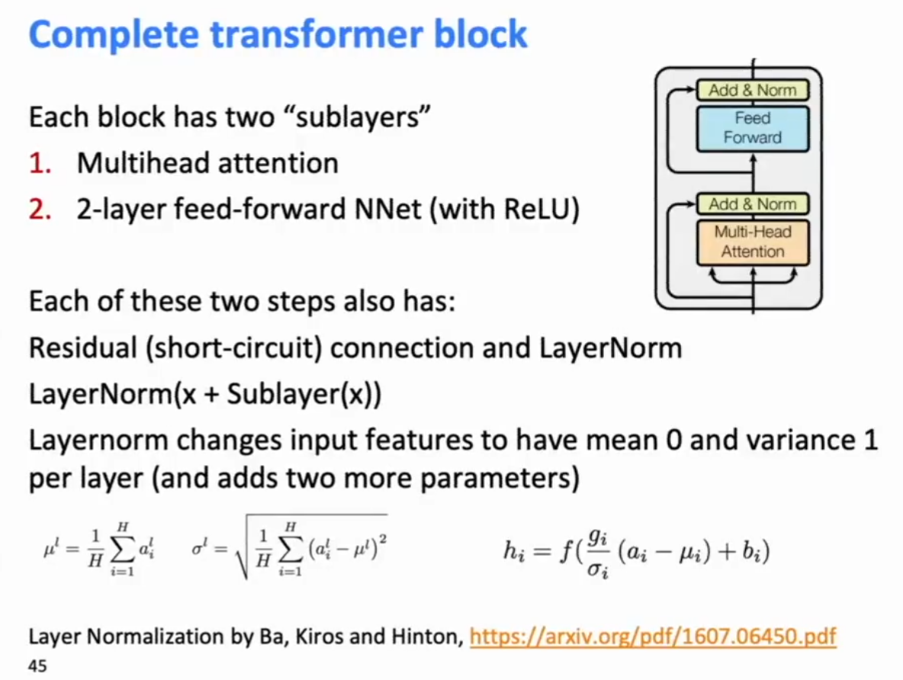

There’s no free lunch. You now no longer have recurrent informaiton carried along a sequence. You’ve got a word at some position which can be casting attention on other words, so if you like to have information carried along the chain, you ahve to walk the first step of the chain, and then you need to have another lauer that walks another step of the chain. So you’re getting rid of the recurrence but you’re substituting some depth to allow thigns to walk along multiple hops. But nevertheless, that is highly advantageous in GPU architectures which can compute everything at once.

**Positional Encoding**

Note that their actual word representaitons are byte-pair encodings.

The positional sinusoids are indices in sinusoids that are moving at different speeds, so that close by positions would have very similar values for the multiple sinusoids.

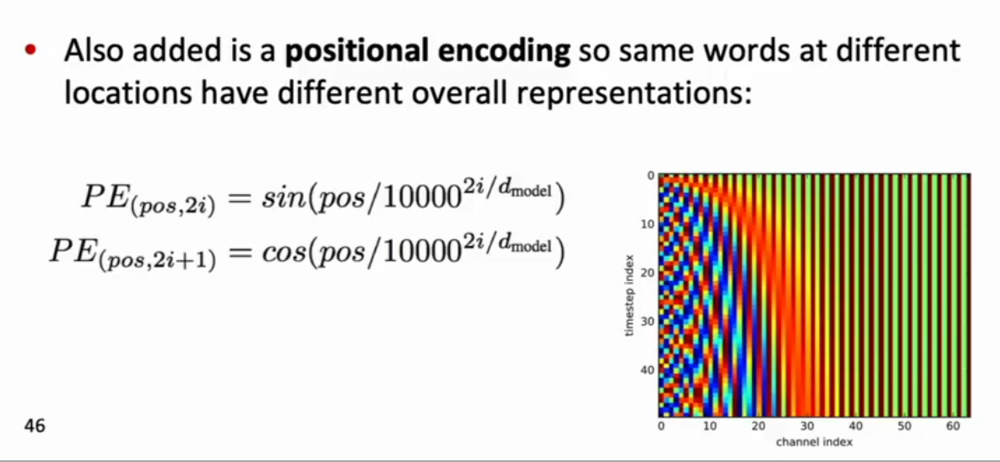

**Complete Transformer Encoder**

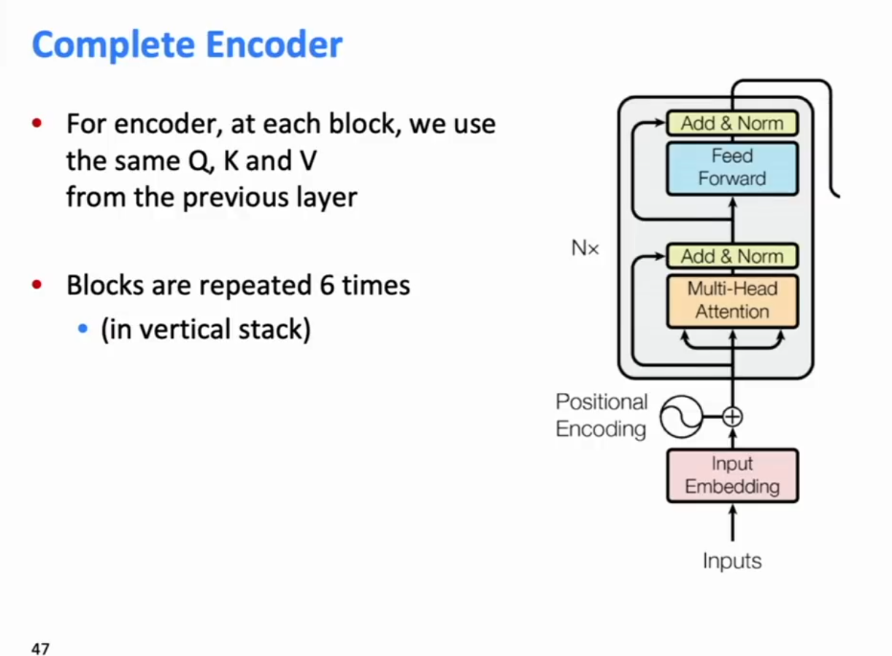

Interpretation: At each stage you can look with multi-headed attention at various places in the sentence, accumulate information, push it up to the next layer, and if you do that 6 times, you can be starting to progressively push information along the sequence in either direction to calculate values that are of interest.

The attention heads attend to each other in interprable ways, and can correspond to modifiers of the word, close by words, or anaphora resolution. (Appendix 6)

**Transformer Decoder**

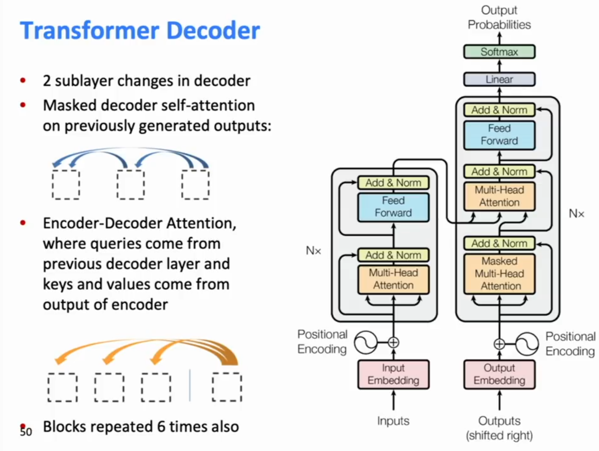

Each decoder state self-attends with all of its fellow decoder states as well as with all the encoder states. 

**Aswani’s Talk on Transformer**

Inspired PixelCNN.

RNN doesnt have an explicit way to model hierearchy which is very important in language.

Inspiration: Recursive self-attention: Convolutional Neural Networks

Long-distance dependencies require many layers

Attention - content based memory retrieval mechanism.

Compare your word embedding with all your words, and then refactor the embedding as a weighted combaination of all the words, and then add a feedforward layer to compute all the interaction features for you.

Self-attention:

* Get a constant ‘path-length’ between any two positions.
* You get gating/multiplicative interactions just by virtue of attention having a softmax at the end.

On the decoder side, they mimic a language model using self-attention, by masking future input by masking the input in the softmax to -inf

**They went for simplicity and speed in the attention mechanism they used**

Linearly transform the position we want to re-encode into the **query. (1)**

And then linearly transform every position in the position as the **key**. The output is an attention distribution, which is a softmax over scaled-dot-product outputs. The attention distribution is used to weight the output **value, **which is simply also th eencoding of eevry position, to get our attention output, which is an interpolation over the original embeddings weighted by the attention distribution. 

The linear transform projects the original 512 dimensional representaiton into 64 dimensions. They did this because they used 8 attention heads instaed of 1, so the total number of FLOPs of computation remained 64\*8 = 512.

This can be dome really fast in a GPU with just 2 matmuls and a softmax. 

(1) This linear transform is equivalent to projecting them into a space where dot product is a good metric for similarity.

In Convolutions, because you had different linear transformations based on different word distances from each other, you can pick out effects for the word ‘who’ and the word ’to whom’ etc. Get subject and object and verb.

However, if you ahve a single attention layer, you average all the attention heads together so you lose the information of distinctness. So they have multiple attention heads. 

Transformer trained 3x faster than the others. 

For short sequences when dimension \> length, attention has a very favorable convolutional profile. 

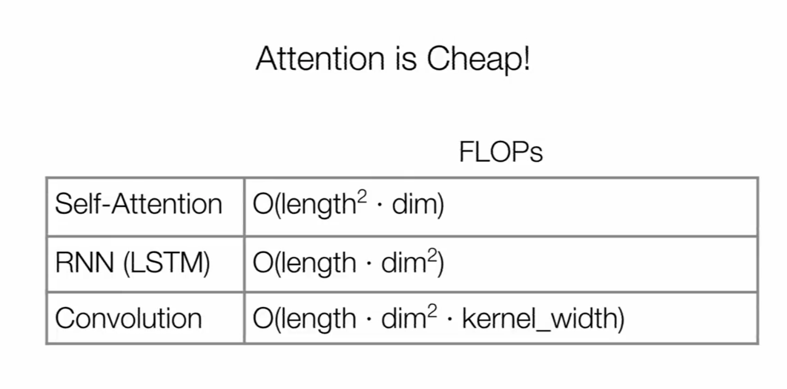

Tensor2Tensor

Sockeye (Amazon Transformer)

**The importance of residual connections:**

Residuals carry positional information to higher layers, among other information

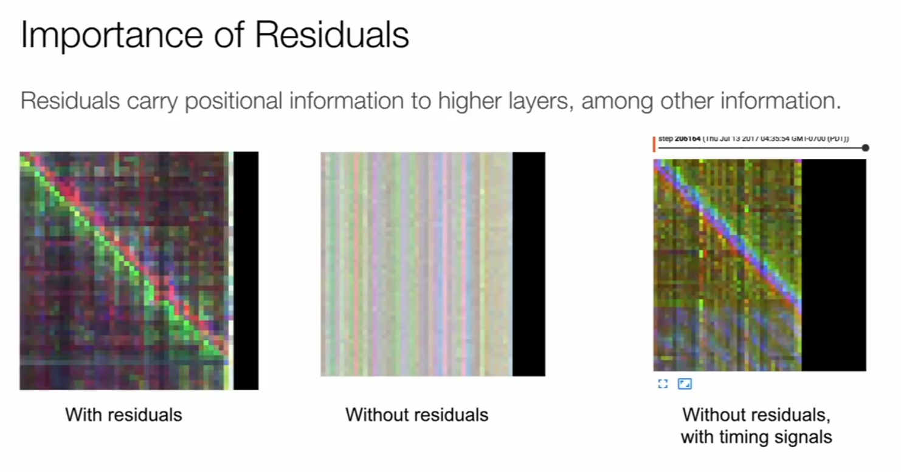

**Image Transformer**

**Probabilstic Image Generation: **Autoregressive image modeling (not GANs)

RNNs and CNNs are state of the art (PixelRNN, PixelCNN)

CNNs are informporating gating now matching RNN in quality

In images you often want symmetry, like synnetry in a face. likely increasinly importnat with increasing image size, but modeling long-range depencies with CNNs require wither

 - Many layers making training harder

 - Large Kernels at large parameter/computational cost.

Old Images about using similarity between image patches:

Texture Synthesis with Self-Similarity, Non-local Means

Attention is a ‘soft’ local similarity.

Attention is cheap ONLY if length \<\< dim! SO attention is expensive for images

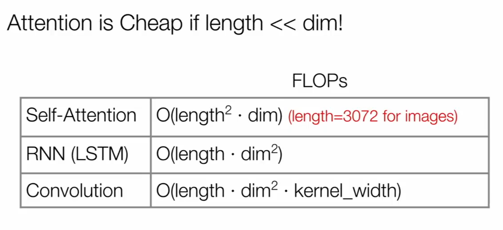

But you can combine locality with self-attention.

Restruct the attention windows to be lcoal neighborhoods. Good assumption for images because of spacial locality. 

**We had two differnt types of rasterzations for the ImageTransformer**

We had a 1d rasterization attending to a larger memory block in this rasterized fashion.

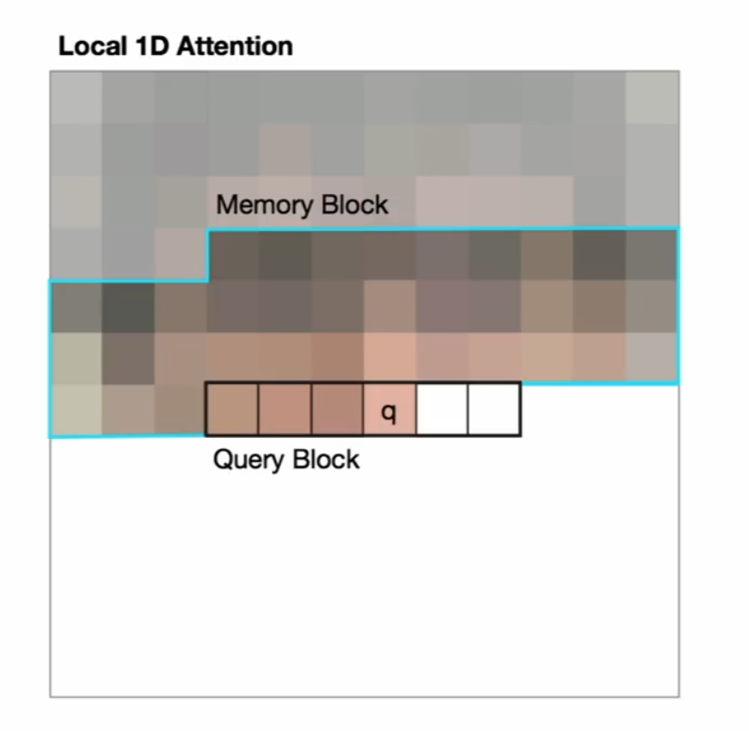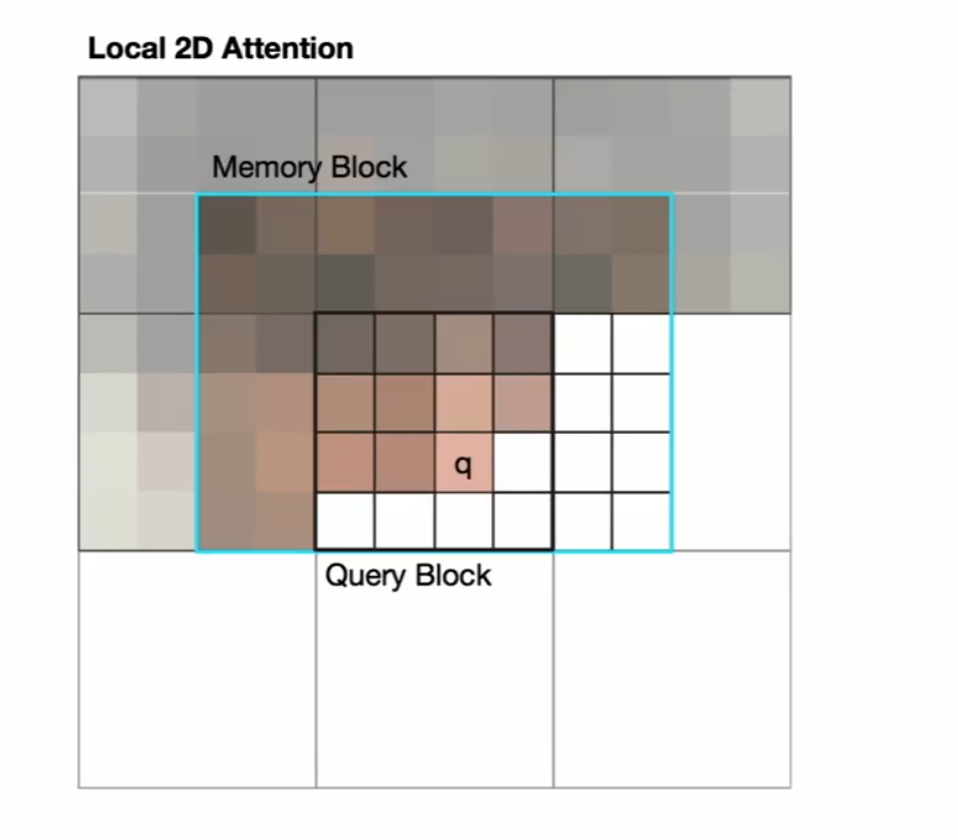

Tasks: Super Resoultion and Unconditional / COnditional Image Generation.

The factorizastion of your prbabilstic generative model just depends on how you rasterize. 

For 1D rasterization we went first rows then columns, in 2d rasterization we went for each block and inside of each block we rasterized. 

Not at GAN level. They can get structured objects really well

On Super Resolution - there’s a lock of conditioning information, because there’s a lot of conditioning. 

Anotehr test we did was image genration. The question is, do you get diversity? And does the image understand structure about the world?

So we did image completion - becasue you lock down a lot of probability so its very easy to sample, and see if the image generates with a bit of diversity

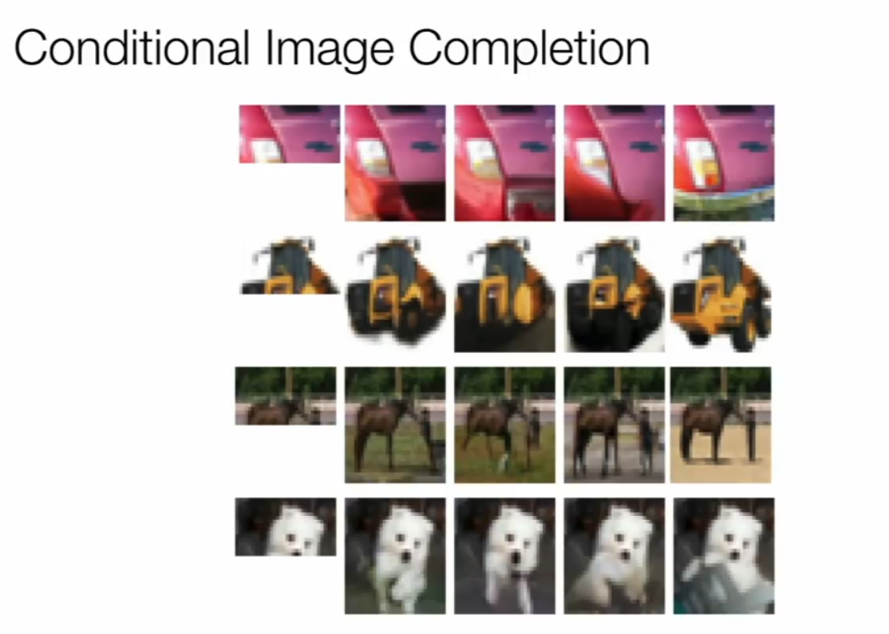

**MusicTransformer**

**Relative Attention (Difference Between Music Transformer and Ordinary Transformer)**

You can think of convolution as a fixed filters moving around that captures the relative distance (one-before, two-before…) These are kind of like a rigid structure that allows you to bring in the distance information very explicitly. 

You can imagine relative attention with multiple-heads to be some combination of these. On one hand you can access all of the past history (not just a convolutional kernel window) very directly, on the other hand you also know how you would relate to this history, capturing, for exampe, translational invariants. 

We think one of the reasons in one the the above exaxmples that music transformer was able to generate beyond the length it was trained on in a very coherent way is that it was able to rely on these translational invarants to carry the relational information forward.

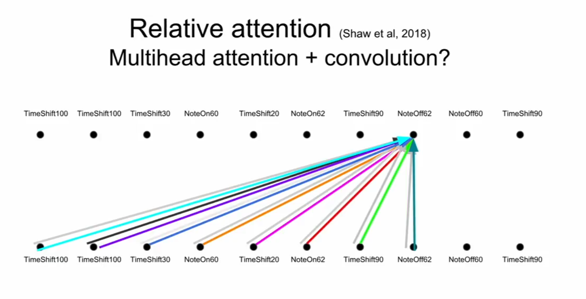

MusicTransformer’s addition over the Transformer was adding a positional emnedding to the attention - so things two timesteps away or three time steps away get treated differnetly and if there’s any 

The extra positional embedding is relative to the distance.

In machine translation in NLP, relative positions have been shown to help the translation.

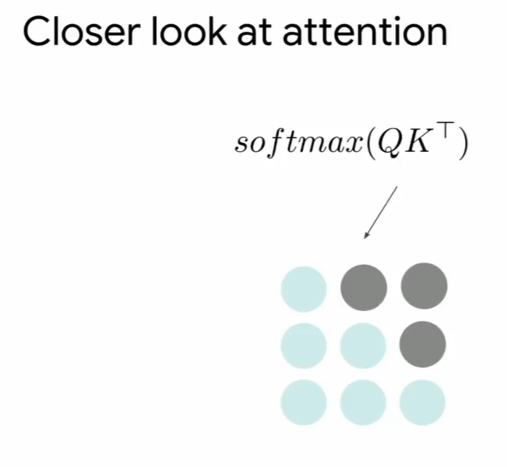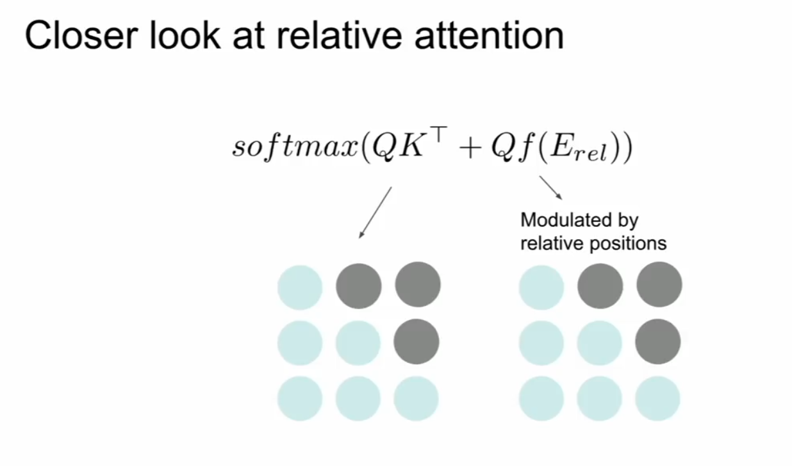

Previously, relative attention was calculated for every pair x distance triple, but this was very expensive: For every pair of tokens, you have their dot-product attention, and then you also look up a distance embedding for the distance between the pair which is applied to every pair. So you have a 3d tensor for the whole token-pair-distance embeddings.

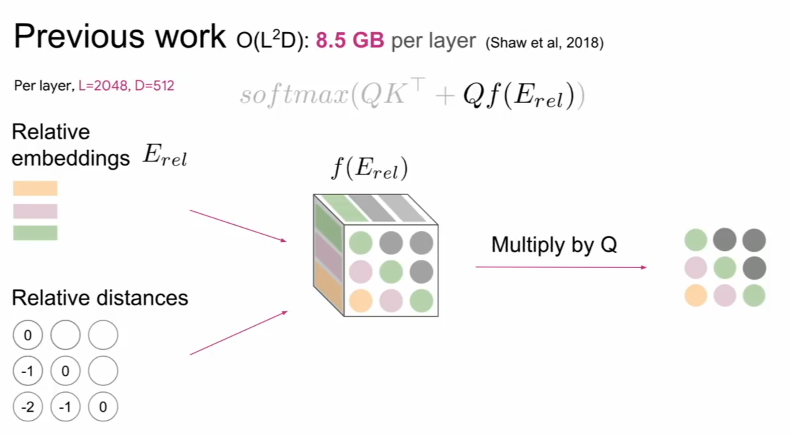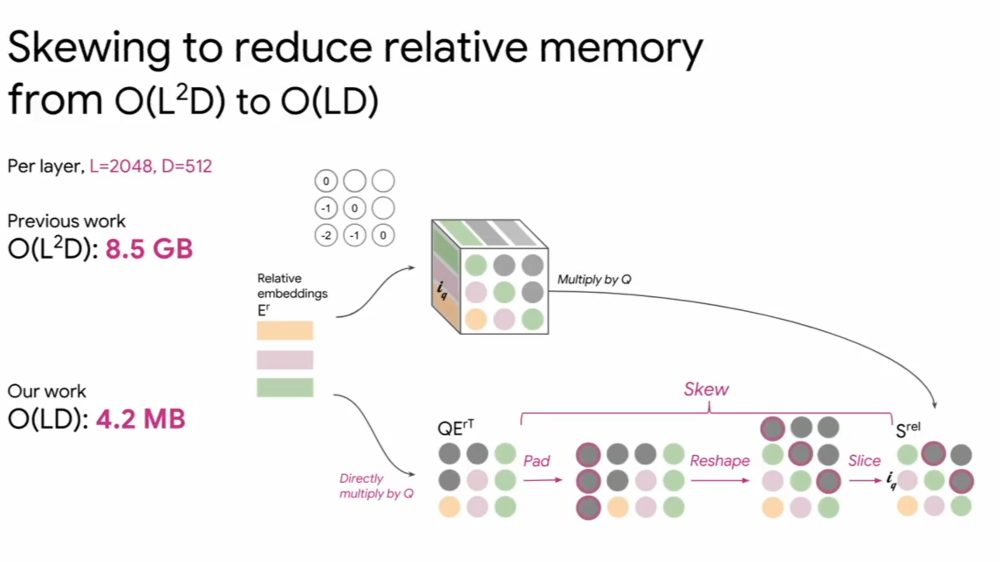

Colvolutions and Relative Attention has Translational Equivariance - a picture of a dog produces the same comvolutions no matter where in the image it is. 

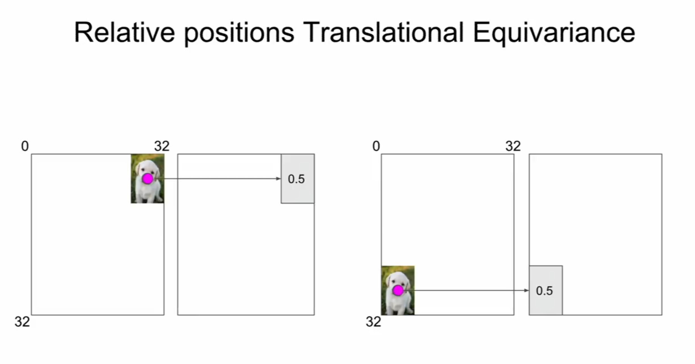

Graph Library

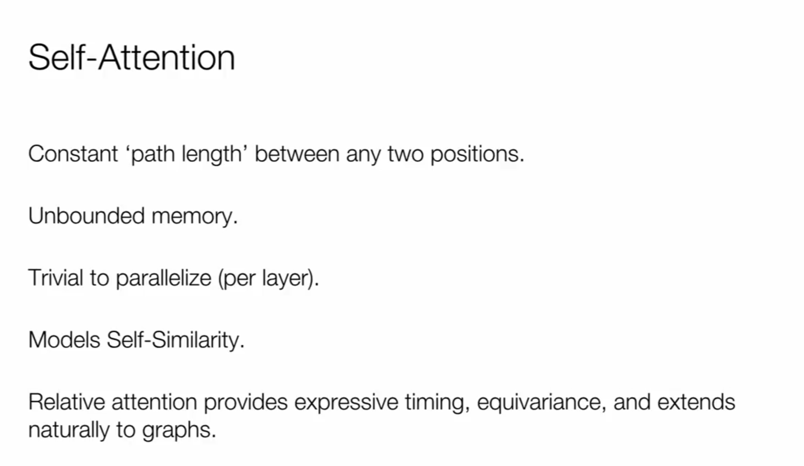