Reinforcement Learning
 - Problems involving an **agent** interacting with an **environment**, maximizing a reward.

RL Problem:
 - At time $t$, environment is at state $s_t$
 - Agent take action $a_t$, and recieves reward $r_t$, transitioning environment to next state $s_{t+1}$.

**Classic Examples:**

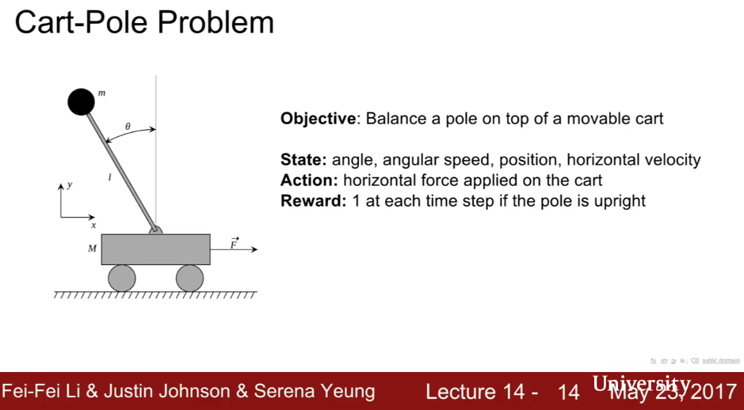

****

#Markov Decision Processes 

This is the mathematical formulation of all RL problems. It assumes the enviornment has the **Markov Property**, that the current state completely characterizes the state of the world.

The entire problem is defined as
$(S,A,R,P,\gamma)$, where
  - S: set of possible states
  - A: set of possible actions
  - R: distribution of reward given (state, action) pair
  - P: transition probability (distribution over next state given (state, action) pair) 
  - $\gamma$: discount factor.
  
At time step $t=0$, environment samples init $s_0 \sim p(s_0)$.
Then for $t$ from $0$ until done:
  - Agent selects $a_t$
  - Environment samples next reward $r_t \sim R(\cdot | s_t, a_t)$
  - Environment samples next state $s_{t+1} \sim P(\cdot | s_t, a_t)$
  - Agent recieves reward $r_t$ and next state $s_{t+1}$

A **policy** $\pi: S \rightarrow A$ is a function that specifies what action to take in each state.
Objective: find policy $\pi*$ that maximizes the cumulative expected discounted reward $\sum_{t>0}{\gamma^tr_t}$. More specifically 
$$\pi*  = \arg \max_\pi \mathbb{E}\left[\sum_{t>0}{\gamma^tr_t}|\pi\right] \;\; s.t. s_0 \sim p(s_0), a_t \sim\pi(\cdot | s_t), s_{t+1} \sim p(\cdot | s_t, a_t)$$.

Following a policy produces sample trajectories (or paths) $s_0,a_0,r_0, s_1,a_1,r_1,...$

The **value function** $V^\pi(s)$ at state $s$ is the expected cumulative reward from following the policy at state $s$. [Answers how good is a state?]
$$V^\pi(s) = \mathbb{E} \left[\sum_{t>0}{\gamma^tr_t}|s_0=s, \pi\right]$$

The **Q-value function** $Q^\pi(s,a)$ at state $s$ and action $a$ is the expected cumulative reward from taking action $a$ in state $s$ and then following the policy

$$Q^\pi(s,a) = \mathbb{E} \left[ \sum_{t>0}{\gamma^tr_t}|s_0=s, a_0=a, \pi\right]$$

The optimal Q value function $Q^*(s,a) = \max_\pi \mathbb{E} \left[ \sum_{t>0}{\gamma^tr_t}|s_0=s, a_0=a, \pi\right]$ satisfies the following **Bellman Equation**. (Intuition: if the optimial state-action values for the next time-step $Q^*(s',a')$ are known, then the optimal strategy is to take the action that maximizes the expected value of $r + \gamma Q^*(s',a')$).

$$Q^*(s,a) = \mathbb{E}_{s' \sim E}\left[r + \gamma \max_{a'} Q^*(s',a')|s,a\right]$$

Note that the optimal policy $\pi^*$ corresponds to taking the best action in any state as specified by $Q^*$.

## Value Iteration
Value iteration is one way to solve for the optimal policy. It is a DP algorithm that computes $Q_{i+1}(s,a)$ iteratively, using the Bellman equation as an interative update. $Q_i$ will converge to $Q^*$ as $i \rightarrow \infty$.
$$Q_{i+1}(s,a) = \mathbb{E}\left[r + \gamma \max_{a'}Q_i(s',a')|s,a\right]$$

Intuition: 
Problem: This is not scalable. Requires to compute $Q(s,a)$ for every state-action pair. If state is e.g. current game pixels, computationally infeasible to compute for entire state space!

Solution: Approximate $Q_{i}(s,a)$ using a function approximator, e.g. a neural network. This is **Q-learning**): $Q(s,a;\theta) \approx Q^*(s,a)$. Here, $Q(s,a;\theta)$ is interpreted as, "if I take action $a$ from state $s$, what is an approximation of the best cumulative reward I can hope for?"

## Q-Learning
We want to find a $Q$-function that satisfies the Bellman Equation:
$$Q^*(s,a) = \mathbb{E}_{s' \sim E}\left[r + \gamma \max_{a'} Q^*(s',a')|s,a\right]$$

We approximate Q* as a neural network $Q(s,a;\theta_i)$. The interpration of Q is "if I take action $a$ from state $s$, what is an approximation of the best cumulative reward I can hope for?"

**Forward Pass**
Loss Function: $L_i(\theta_i) = \mathbb{E}_{s,a\sim \rho(\cdot)} [(y_i - Q(s,a;\theta_i))^2]$,
where $y_i = \mathbb{E}_{s' \sim E}\left[r + \gamma \max_{a'} Q(s',a';\theta_{i-1})|s,a\right]$

Idea: This neural network enforces closeness to the Bellman function, that is, it iteratively tries to make the Q-value close to the target value ($y_i$) that it should have if the Q-function corresponds to optimal $Q^*$ and optimal policy $\pi^*$. Note that this is an RNN, with the same weights shared for all values of $s$, $a$, so it becomes more precise after iteration.

**Backward Pass**
Gradient Update (w.r.t. Q-function parameters $\theta$):
$$\nabla_{\theta_i}L_i(\theta_i) = \mathbb{E}_{s,a \sim \rho(\cdot); s' \sim E}
\left[r + \gamma \max_{a'} Q(s',a'; \theta_{i-1}) - Q(s,a;\theta_i)) \nabla_{\theta_i}Q(s,a;\theta_i)\right]$$

**Example: Atari Games**

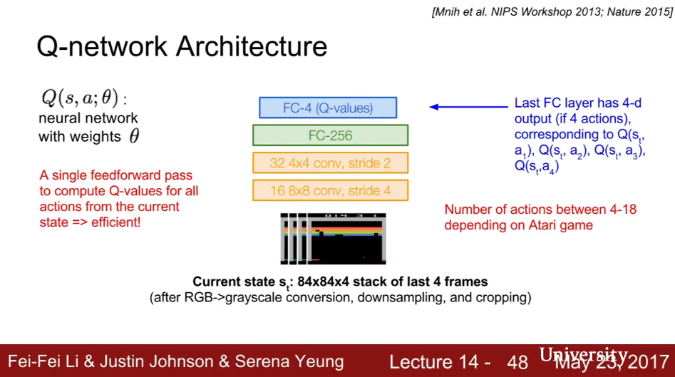

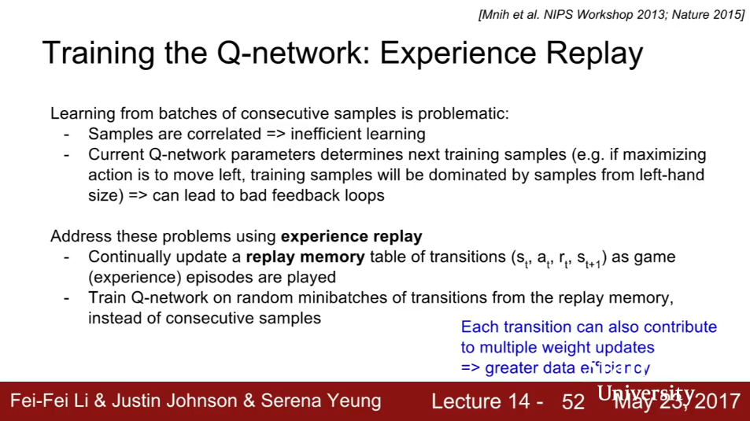

(Don’t train the learnign algorithm sequentially over the game - break up gameplay into chunks, and learn over those chunks randomly - this is Experience Replay)

## Policy Gradients
(See Appendix 1 for slides for Policy Gradients)

A problen with Q-learning is that the Q-function can be very complicated. You have to learn the Q function for every state-action pair. This leads us to wonder whether or not we can simplfy the state space and not store every state-action pair. This leads us to **policy gradients**.

Define a class of parameterized policies $\Pi = \{\pi_{\theta}, \theta \in \mathbb{R}^m\}$.
For each policy, define its value (=expected reward):
\begin{align}
J(\theta) & = \mathbb{E} \left[ \sum_{t \ge 0} \gamma^t r_t | \pi_{\theta}\right] \\
          & = \mathbb{E}_{\tau \sim p(\tau; \theta)} [r(\tau)] \\
          & = \int_{\tau} r(\tau)p(\tau;\theta) d\tau
\end{align}
where $r(\tau)$ is the reward of a trajectory $\tau = (s_0,a_0,r_0,s_1,...)$.
We can find the optimal policy $\theta^* = \arg \max_{\theta} J(\theta)$ using **gradient ascent** on the parameters $\theta$. This algorithm is also called the **REINFORCE algorithm**.

We can compute the gradient of policy value, which unforunately is intractable.
$$\nabla_{\theta} J(\theta) = \int_{\tau} r(\tau)\nabla_{\theta}p(\tau ; \theta) d\tau$$
However, using the clever substitution
$$\nabla_{\theta}p(\tau ; \theta) = p(\tau ; \theta) \frac{\nabla_{\theta}p(\tau ; \theta)}{p(\tau ; \theta)} = p(\tau ; \theta) \nabla_{\theta}\log p(\tau ; \theta)$$
we obtain 
\begin{align}
\nabla_{\theta} J(\theta) & = \int_{\tau} (r(\tau)\nabla_{\theta}\log p(\tau ; \theta)) p(\tau ; \theta) d\tau \\
& = \mathbb{E}_{\tau \sim p(\tau ; \theta)}[r(\tau) \nabla_{\theta} \log p(\tau ; \theta)]
\end{align}
which we can estimate with Monte Carlo Sampling.
See repeat of this defivation in CS234 Lecture 8.
Now, 
\begin{align}
p(\tau ; \theta) & = \prod_{t \ge 0} p(s_{t+1} | s_t, a_t) \pi_{\theta}(a_t|s_t)\\  
\implies \log p(\tau ; \theta) & = \sum_{t \ge 0} \log p(s_{t+1}| s_t, a_t) + \log \pi_{\theta}(a_t|s_t) \\
\implies \nabla_{\theta}\log p(\tau ; \theta) & = \sum_{t \ge 0} \nabla_{\theta} \log \pi_{\theta}(a_t|s_t) 
\end{align}
since the state transition probabilities $p(s_{t+1}| s_t, a_t)$ do not depend on the parameters $\theta$.
So when sampling the trajectory $\tau$, we estimate $J(\theta)$ directly with 
$$ \nabla_{\theta} J(\theta)= \sum_{t \ge 0} r(\tau) \nabla_{\theta} \log \pi_{\theta}(a_t|s_t) 
$$
which again do not depend on transition probabilities $p(s_{t+1}| s_t, a_t)$. This update step is the essense of the **REINFORCE** algorithm. The interpretation of this is: if the recieved reward $r(\tau)$ is high, push up the probabilities of all actions seen. If the reward  $r(\tau)$ is low, push down the probabilities of all actions seen. It might seem simplistic to say that if a trajectory is good, then all its actions were good. But in expectation, it averages out and is unbiased! However, this suffers from high variance because credit assignment is really hard. See repeat of this defivation in CS234 Lecture 8.

Because of high variance, the challenge with policy gradients is **sample efficiency**.

**Variance Reduction** is thus an important area of research in policy gradients. All basic (vanilla) implementations of REINFORCE use the cumulative future reward, discount factor, and baseline methods mentioned below.

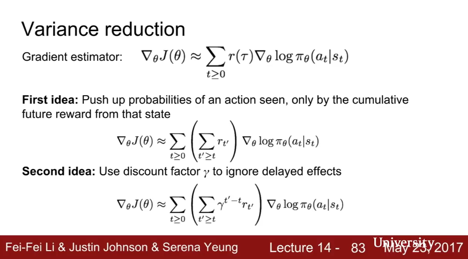

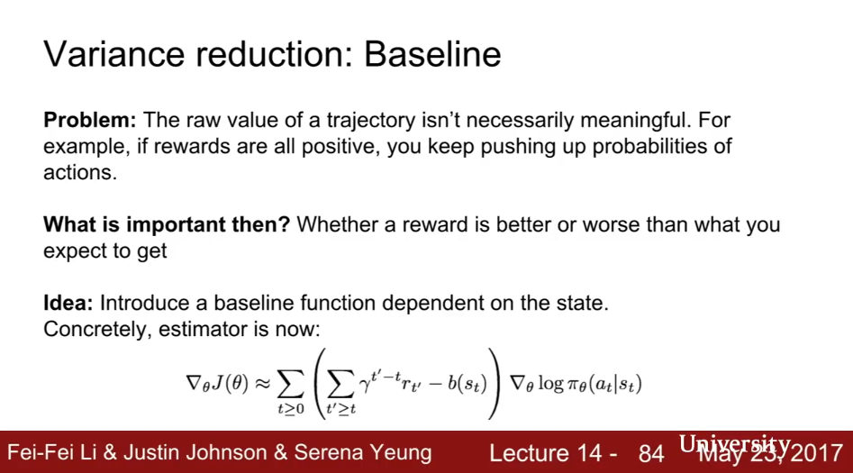

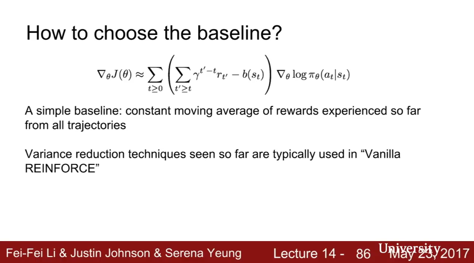

### Actor-Critic Algorithm
Often times we use the value function $V^{\pi}(s_t)$ of the policy $\pi$ at state $s_t$ as the baseline, because the value function is the expected cumulative reward following a policy from state $s_t$. This is known as the **Actor-critic algorithm**, a variant of policy gradient which integrates Q-learning.

**
**

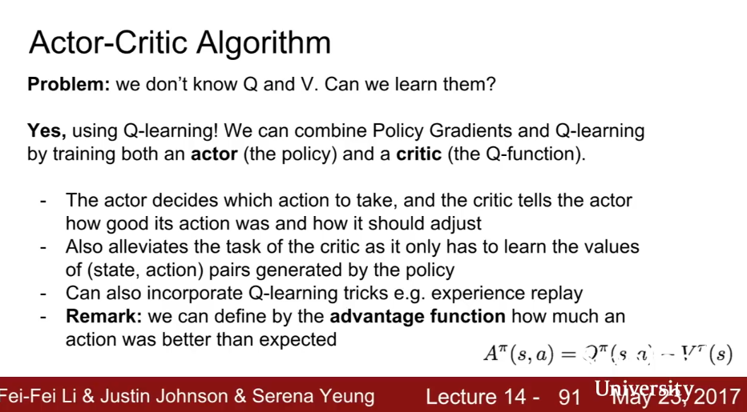**
**

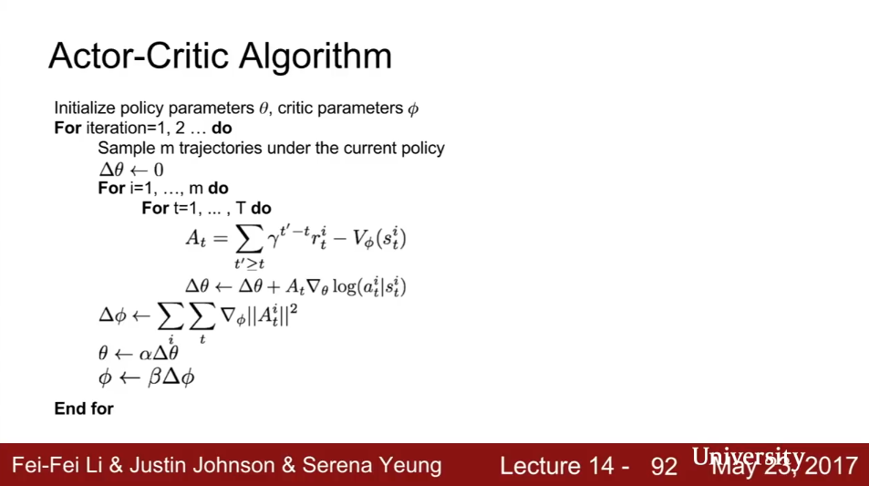

**
**

**REINFORCE in action: **

**Recurrent Attention Model (RAM)**

This is the first example of **hard attention**, which is also becoming more popular in image processing lately.

**
**

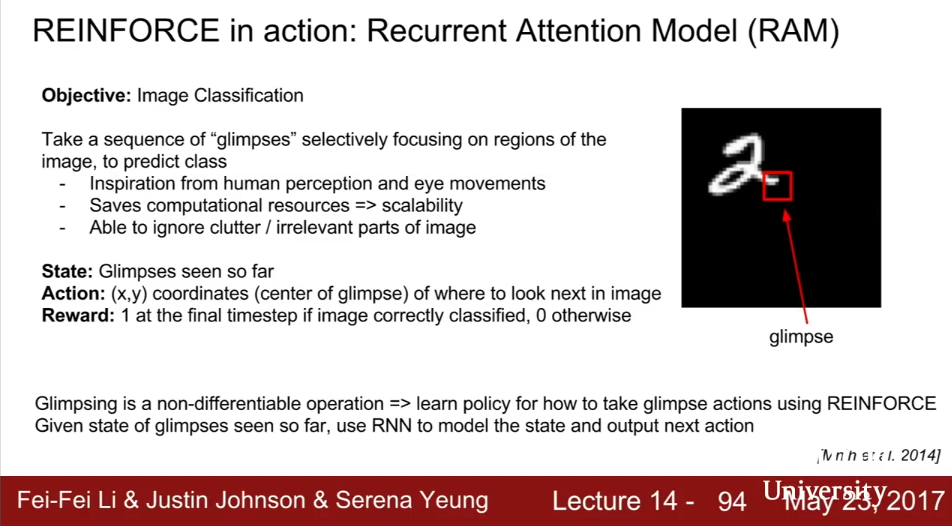

The REINFORCE algorithm is used to ask the network where to glimpse at next.

Has also been used in visual QA, fine-grained image recognition, image captioning.

**
**

**AlphaGo**

**
**

**Summary**

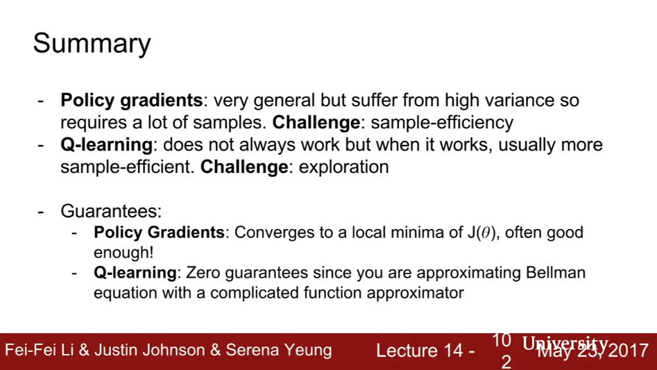**
**

**Appendix 1: Slides for policy gradients**

**
**

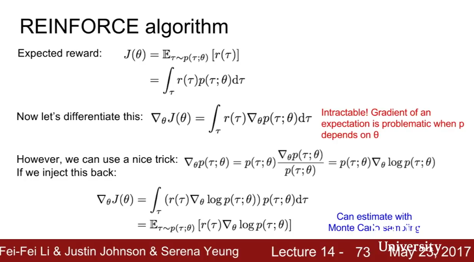

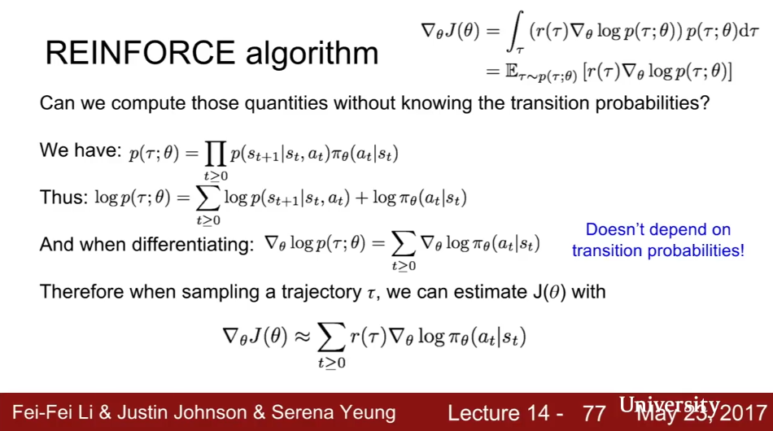

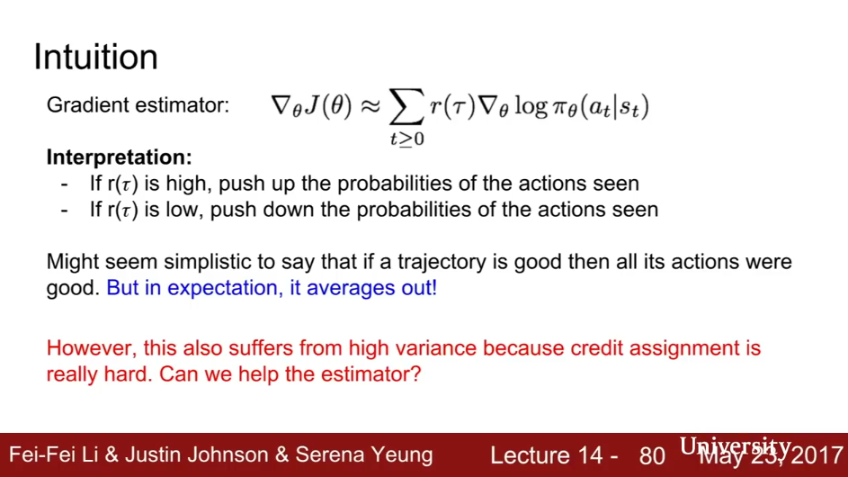