Ian Goodfellow spent most of his career looking at adversarial examples.

Adversarial Examples are not due to overfitting: [i.e. overfitting to parameter contours that the network only found in gibbon images].

Surprisingly, it has somethign deeper to do with CNNs themselves.

Goodfellow et al found that the same fooled image was able to output the wrong label on many different types of models, including the ones it was not trained on. In addition, the attack vector which is added to the original image to get the adversarial example could be added to any clean example and we would get an adversarial example in most cases.

**Adversarial Examples are from Underfitting (Excessive Linearity) (Appendix 1)**

The mapping from inputs to NN to outputs are piecewise linear. (The mapping from parameters to outputs are highly nonlinear becuase a lot of parameters are multiplied together).

The issue with linear functions (or piecewise linear functions) is that examples very far from the training data will be classified with veyr high probability, even though no data was ever seen in that subspace, just because of linear extrapolation. 

They picked a random vector with which to adjust the image, and plotted the classification scores when adding different levels of the noise to the image. Because the model uses ReLU, the output is a piecewise lienar function of the input. But in fact, the output is very linear.

Small changes to individual pixels can add up to big changes after multiplying through all the layers of the neural network. You can make small changes that are almost inperceptible but that move you very far when measured by the L2 norm. When we make adversarial examples we limit the change to any particular pixel to a certain band (called the **maxnorm**) so that the changes cannot be concentrated in one place. The overall L2 norm difference might still be large. An easy way to do this is with the **fast gradient sign method**. (Apendix 1)

**Appendix 1:**

All models are extremely easy to fool, not just deep models. Linear models, decision trees can all be fooled in this way.

Suppose we have an image on the left is 60% classified as a Panda. After adding the attack adjustment, it is classified with 99.9% confidence that it is a gibbon.

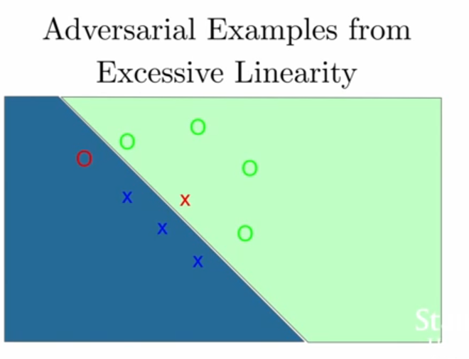

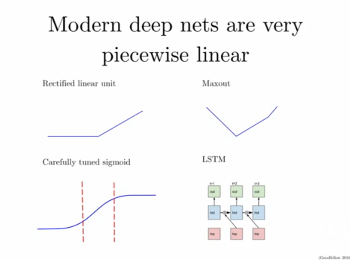

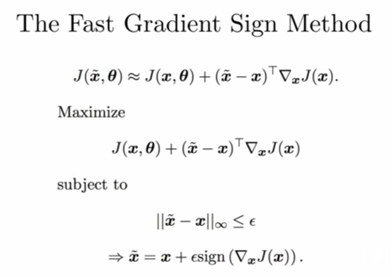

The Fast Gradient Sign Method has identified a direction where if we get a large dot product with that direction, we can get an adversarial example. 

Adversarial examples live in linear subspaces. Nearly every linear example is near an adversarial example, and once you move into that subspace, it remains an adversarial example however far you go.

Security implications: you don’t need to get the magnitude right to make an adversarial example: You only need to get the direciton right. Once you move more or less approx to that direction you can fool the model.

Adversarial Examples are not Noise - adding noise preserves classification decision in most cases.

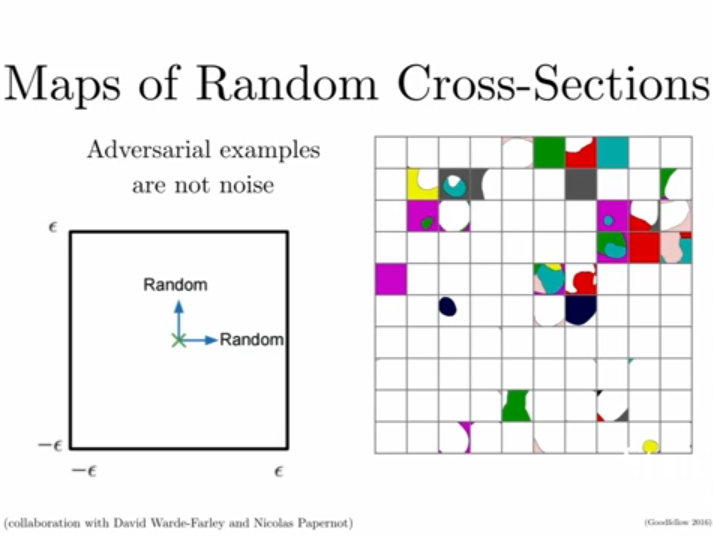

In high dimensional spaces, if you choose a reference vector and a random vector in that space, the random vector will on average have a zero dot product with the reference vector. On average, random examples have zero effect on the cost, but adversatial examples are chosen to maximize it.

The adversarial subspace have on average 25 dimensions on MNIST.

Adversarial examples work across multiple models because the overlap between the adversarial subspaces are quite large. Even though they are only 25 dimensional compared to a 3000-dimensional image, the adversarial subspaces tend to be highly dependent on the image classes, for example “pointing from one class centroid to another class centroid”. This increases the probability that the adversarial subspaces of two models overlap. If two different models have a very large adversarial subspace, you know you can transfer adversarial examples fron one to another.

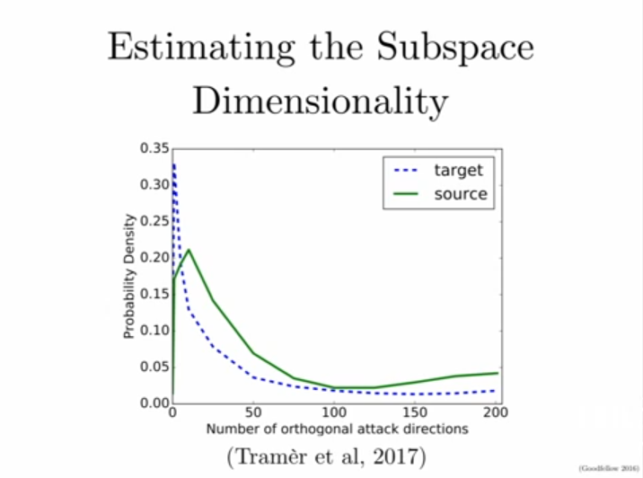

Moden ML ALgorithms are like Clever Hans, the horse that folled everyone by doing arithmetic. They are wrong almost everywhere.

They are correct on naturally occuring input, that is, input that is distributed i.i.d. according to the same distribution of the data they were trained on. But outside of that data manifold, on random data, they are wrong almost everywhere. 

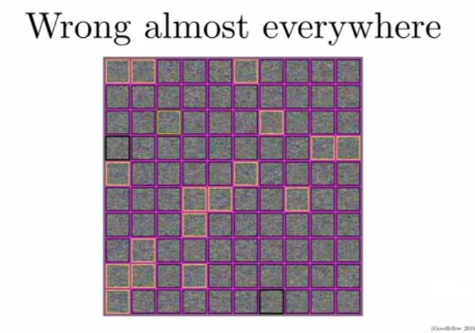

Pink Box - classified as somethign rather than nothing.

Yellow Box - Fast Gradient Sign Method can make it think it’s an airplane.

**Universal Adversarial Pertubations**

Below: Logistic regression model that discriminates between 7 and 3\. the FGSM attack on the image is just adding the sign of the weights.

When the sign of weights is positive the image looks like the most quintisential 7, when negative, it will look like the most quintisential 3.

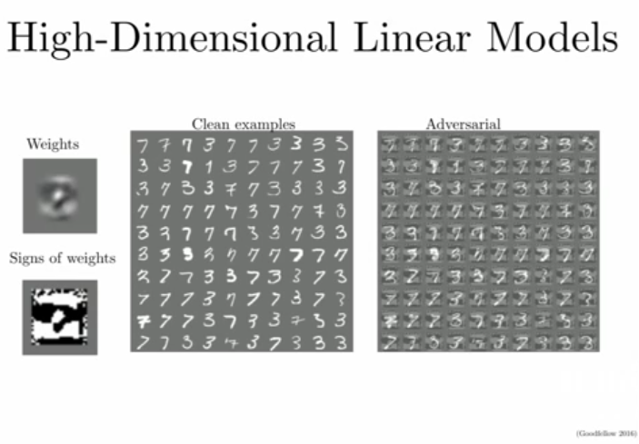

You can do the same thing on ImageNet. This one uses the daisy class. This filter when added to any image is able to make the image be interpreted as a daisy.

Quadratic networks (**shallow rbf network**) is able to resist adversarial examples really well.

But Deep RBF networks are essentially super hard to train, the quadratic term makes the gradient 0 almost always. 

**Adversarial Examples Transferability**

Adversarial exampels generaize from dataset to dataset. Imaging an attacker wants to fool a model, but they don’t know what model architecture is, they don’t know what algorithm (decision tree or DNN), and they also don’t know the parameters.

They can train their own model to create an attack, make adversarial examples on your model, and with high probability fool the original model without any access to it. 

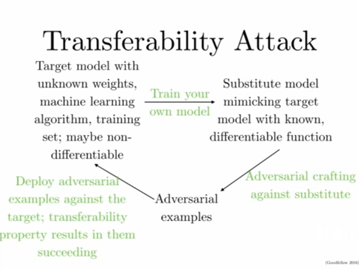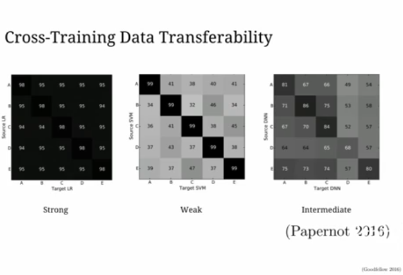

Dawn Song’s group - 

If you do an Ensemble of many models, and make an adversarial examples, theres a very high probability that your adversarial example will generalize to new models.

You can print out adversarial examples and the new physical version will also fool computer vision models.

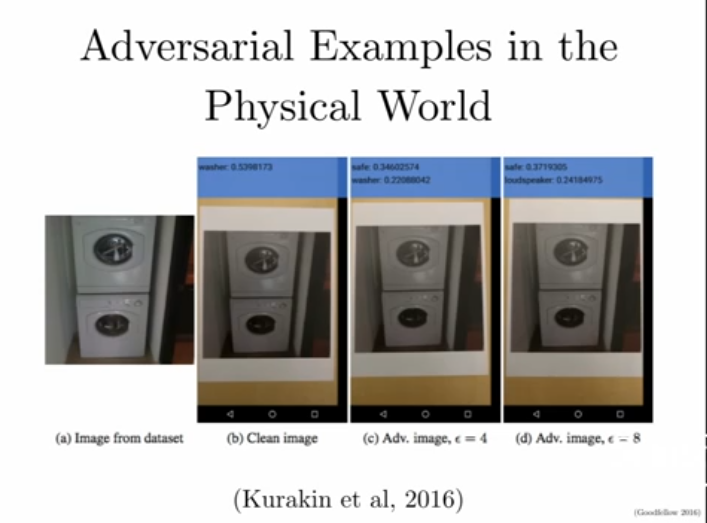

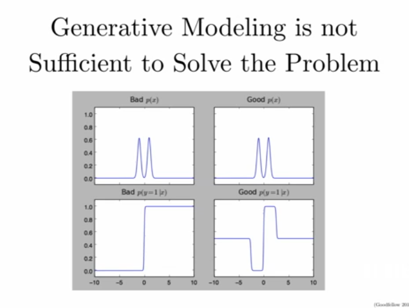

Left: Mixture of two Gaussians, Right: Mixture of two Laplacians, Model: Logistic Regresson

**Adversarial Training**

A partial solution: Training on adversarial examples can make models partially more robust. Adversarial training is a very data hungry and compute hungry process, because with each iteration you need to update the adversarial examples with whatever it is that the model has learned recently.

Adversarial training provides regularization and semi-supervised learning.

**Virtual Adversarial Training: **

If we solve adversarial examples, we could do model-based optimization.

**High level Idea:**

Neural networks are not just brittle from overfitting (see a bunch of cases and not generalise becase you don’t correctly parameterize the input distribution), they are also brittle from underfitting. 

Could human thought processes be the same? Overfitting produces nonsense cognition but underfitting means we study everything on a small manifold which is the real world but we dont realize that that is on a much bigger manifold/space.

