Backgammon, Go, Robot Locomution, Helicoper flight, Robocup soccer, Autonomous driving, Customer Ad selection, Patient Management
Def: **On-policy learning**: Get direct experience from the world and learn to estimate and evaluate a policy from experience obtained from following that policy
Def: **Off-policy learning**: Learn to estimate and evaluate a policy using experience gathered from following a different policy. (i.e. Q-learning)
Example: Say you have two episodes $(s_1,a_1,s_1,a_1)$ and $(s_1,a_2,s_1,a_2)$, and you wanted to learn something about $(s_1,a_1,s_1,a_2)$.

## Relations to Previous Material
The basic model-free control problem is almost exactly the same as the policy evaluation problem - we use model-free policy evaluation to evaluate the value of all policies, then we pick a new policy which is the argmax of the estimated values, or an exploration policy with $1-\epsilon$. The exploration part is the only difference between model-free control and basic model based control. 

Monte Carlo Control is exactly the same as Monte-Carlo policy evaluation (Lecture 3) with $\epsilon$ greedy. SARSA is exactly the same as TD-learning policy evaluation with $\epsilon$ greedy. Q-learning is a slight modification of SARSA that uses the max expectation of future rewards over actions chosen in the Q-step instaed of the expecation of future rewards. The general framework for control remains: 1. You do policy evaluation. 2. You do policy improvement (through $\epsilon$ greedy).

# Monte Carlo Control
## Model-Free Generalized Policy Iteration
1. Initialize policy $\pi$
2. Repeat:
   - Policy evaluation: Compute $Q^\pi$ from an estimate
   - Policy improvement: Update $\pi$
For the policy evaluation step, we can use Monte Carlo for on policy Q evaluation (Appendix 1).

## Exploration
Use an $\epsilon$ greedy policy: with prob $1-\epsilon$ take the current best action, else with prob $\epsilon$ take any of the other actions at random. (Proof that epsilon-greedy monotonically improves Q function in Appendix 2).

## Full Monte Carlo Online Control Algorithm
Use Model-Free Policy Iteration with Monte Carlo with epsilon-exploration. Note: Can change to every visit instead of first visit. GLIE Monte Carlo control converges to the optimal state-action value $Q(s,a) \rightarrow Q^*(s,a)$

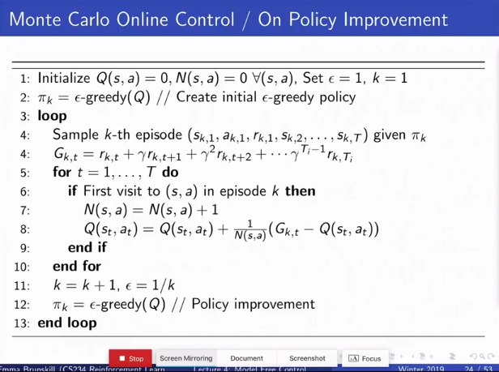

## Temporal Differnece Control Methods
Recall TD methods:
$$V^\pi(s_t) = V^\pi(s_t) + \alpha ([r_t + \gamma V^\pi(s_{t+1})] - V^\pi(s_t))$$
We can do the same as Monte Carlo Online control, but use TD methods to do policy evaluation step, but SARSA is generally faster (because it fully takes advantage of temporal difference and updates the Q-function and the policy with every step in every episode). 

### SARSA
Now the Q policy we are generating will be over different samples and will correspond to different policies over time.
We don't have to wait to the end of the episode to update our Q function,
We don't have to wait to the end of the episode to change how we act in the world.
We need $(s,a,r,s',a')$ to update.

SARSA can be a little better than Q-learning early on, but often not. Generally just use Q-learning.
Convergence Properties of SARSA in Appendix 3.

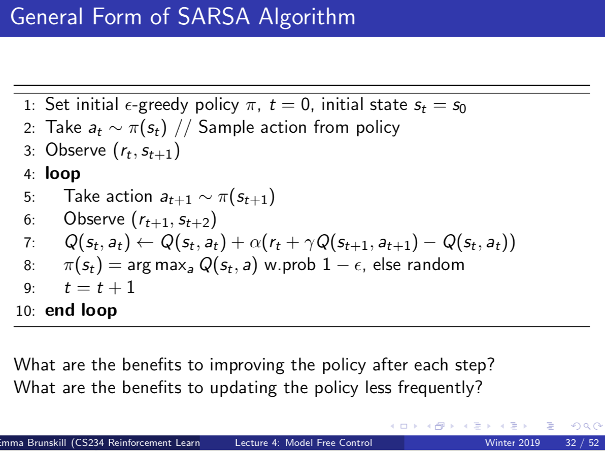

### Q-learning (Off-Policy)
Generally use this instead of SARSA.
Q takes the argmax action as the sampled action every time. Thus it is now **off-policy learning**.
Why are we picking that particular action for next step when we can just pick the max instead?

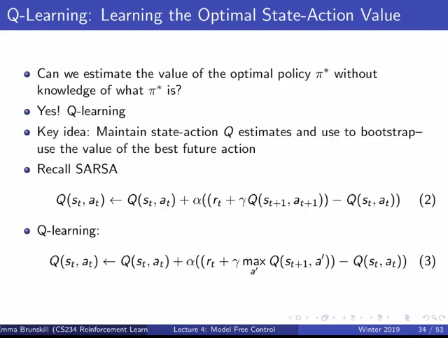

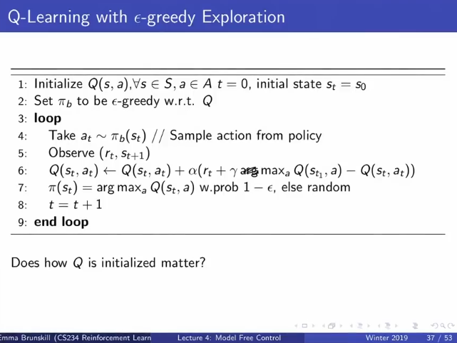

Q-learning updates can take a bit longer to propagate than Monte Carlo, because you only update your reward for the state that you’re currently in. You don’t backpropagate the reward information to states that you previously visited, which happens in Monte Carlo.

## Maximization Bias and Double Q-Learning

Double Q-learning was developed to help deal with the maximization bias. Instead of having one Q function, we make two independent estimators of Q and we use of them for decision making and the other to try to estimate the value. This makes the estimator unbiased.

(Note: I understand the maximization bias, but if you use two functions, dont you still get maximization bias, but slower?)

(Bias = you tend to choose more things that tend to look good before).

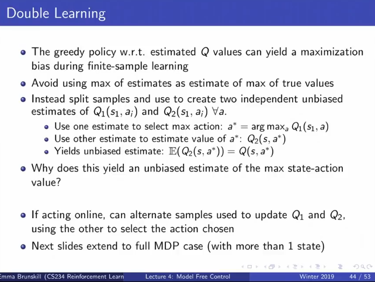

Double Q-learnign spends a lot less time doing bad actions than Q-learning!

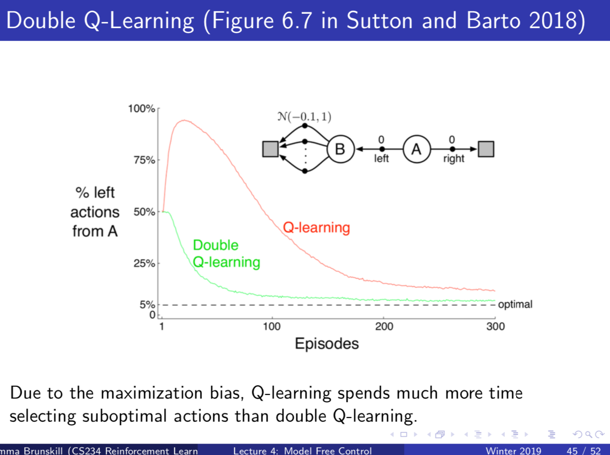

**Summary:**

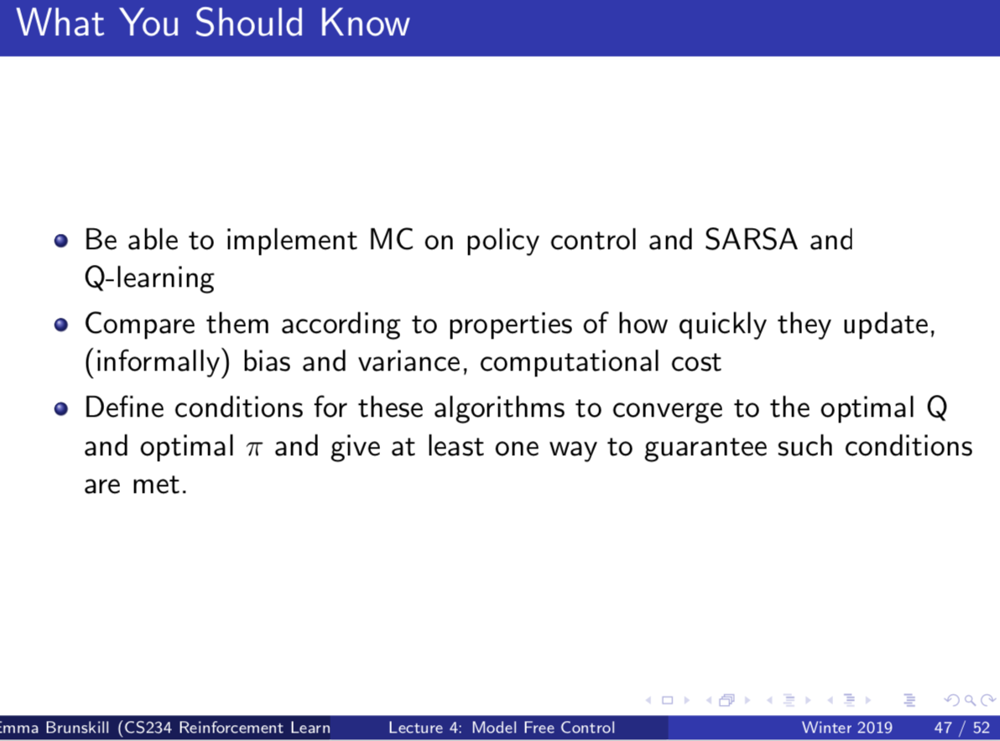''**
**

**Appendix 1: Monte Carlo for On Policy Q evaluation**

Basically esactly the same as monte Carlo for value evaluation, except that instead of considering every s, we consider every possible s,a.

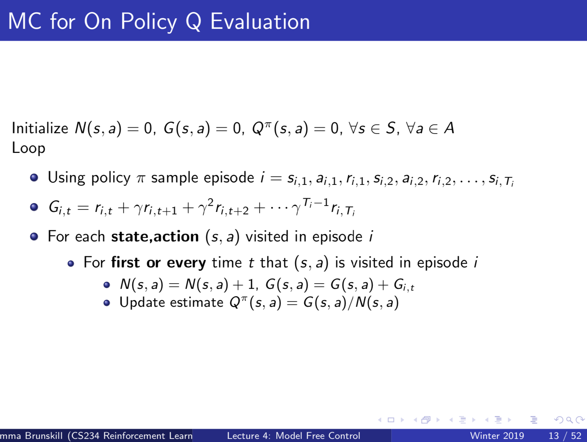

**Appendix 2: Proof that epsilon greedy monotonically improves Q function:**

Under GLIE conditions, you will be guarenteed to converge to the optimal policy for Monte Carlo and TD methods.

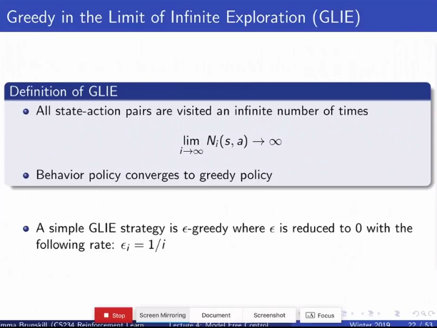

**Appendix 3: Convergence Properties of SARSA and Q-learning**

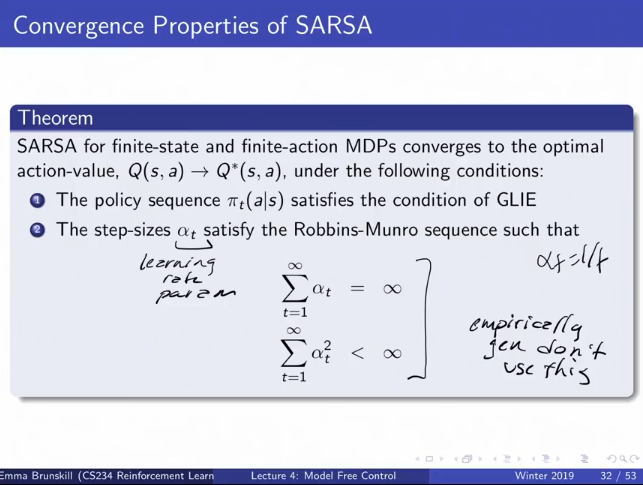

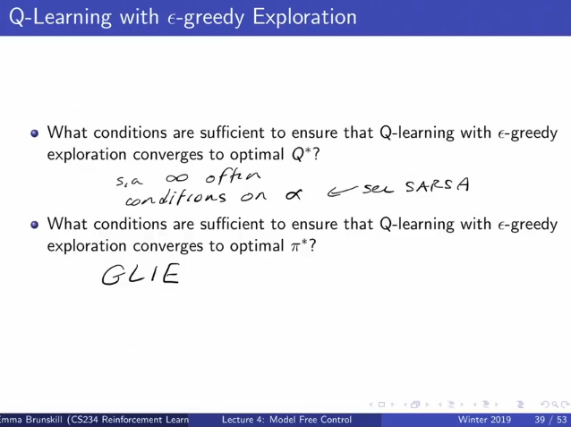

The conditions needed to ensure that Q-learning with e-greedy converges to optimal Q - need to visit s,a infiintely often for each s,a. (basically GLIE without the greedy in the limit requirement). If you want to policy to converge to the optimal you need the full GLIE (all states and actions visited infintely many times and greedy in limit of exploration).