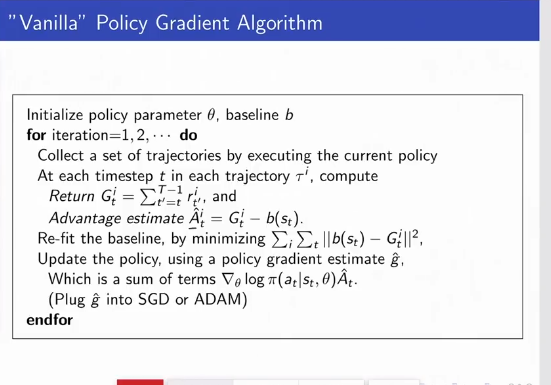
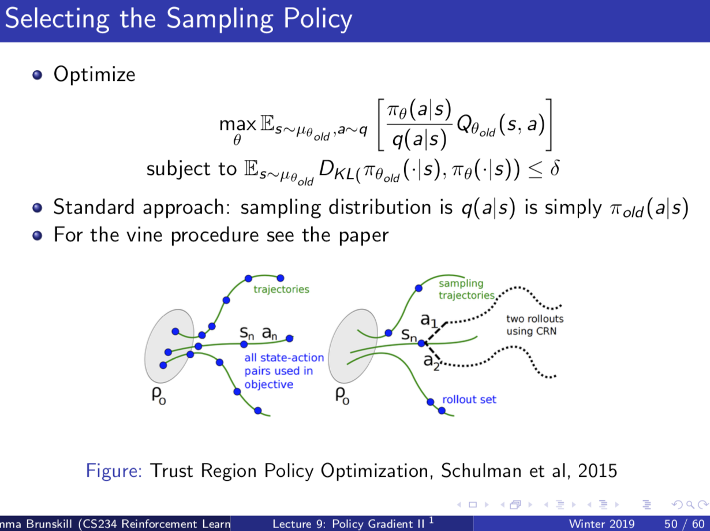
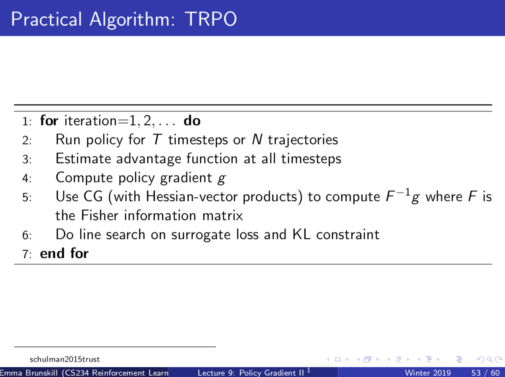
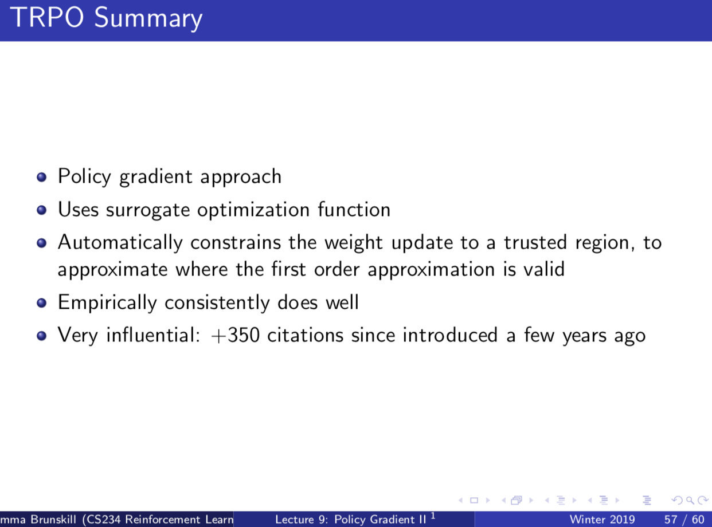
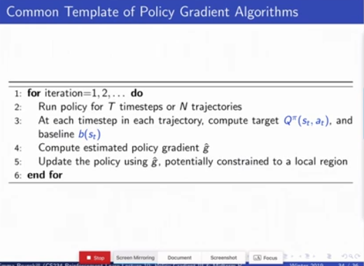
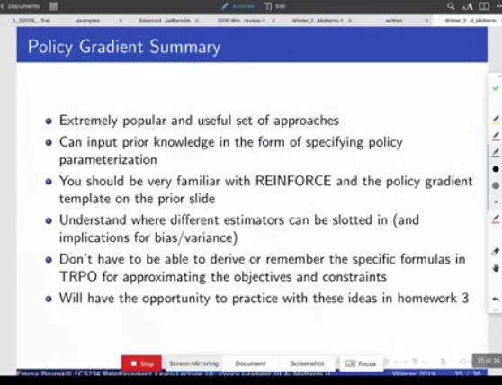

Desired Properties of a Policy Gradient RL Algorithm
 - Obtain large monotonic improvements with each timestep. =\> Make it more efficient and less noisy.
 - Note that DQN is not monotonically improving

## Baselines:
The Policy Gradient Update without Baseline
$$\nabla_\theta V(\theta) = \nabla_\theta \mathbb{E}_{\tau \sim \pi_\theta} [R(\tau)] 
 = \mathbb{E}_{\tau \sim \pi_\theta} \left[ \sum_{t=0}^{T-1} G_t^{(i)} \cdot \nabla_\theta \log \pi_{\theta} (a_t|s_t) \right]$$
using $G_t^{(i)} = \sum_{t' = t}^{T-1} r_{t'}^{(i)}$ is quite noisy. One way to reduce the variance is to use a baseline, which is using $G_t^{(i)} = \sum_{t' = t}^{T-1} r_{t'}^{(i)} - b(s_t)$, substracting off a baseline which only depends on the current state being evaluated. The most common and optimal baseline is the value function as the baseline ($b(s_t) = \mathbb{E}[r_t + r_{t+1} + \cdots + r_{T-1}]$).

The interpretation of the update is now, increase the logprob of action $a_t$ proportionally to how much returns $\sum_{t' = t}^{T-1} r_{t'}^{(i)}$ are better than expected. 

Note: Changing the logprob is equivalent to the update multiplicatively scaling the weight instead of arithmetically adding to it. 

## The Vanilla Policy Gradient Update

**Vanilla Policy Gradient Algorithm**
You start with an initial policy parameters and an initial estimate of the baseline.
For each iteration,
 - Collect trajectories by executing th ecurrent policy
 - Compute the return $G_t^i$ and the advantage estimate $A_t^i = G_t^i - b(s_t)$
 - You have to refit the baseline by minimizing $\sum_i \sum_t || b(s_t) - G_t ^i|| ^2 $ in the vanilla case or some other loss in other cases.
 - Update the policy using a gradient estimate $\hat g$ as per the equation

$$\nabla_\theta V(\theta) = \mathbb{E}_{\tau \sim \pi_\theta} \left[ \sum_{t=0}^{T-1} A_t^{(i)} \cdot \nabla_\theta \log \pi_{\theta} (a_t|s_t) \right]$$
 
Most of the time its best to use on-policy data for the baseline, but sometimes estimating the baseline using off-policy data also works. 

## Actor-Critic:
Actor-Critic is now the mainstream RL algorithm in business settings when it is applicable, because it is more stable than other methods.

Recall our Original Monte Carlo update equation for value iteration was:
$$\nabla_\theta V(\theta) 
 = \frac{1}{m} \sum_{i=1}^m \sum_{t=0}^{T-1} G_t^{(i)} \cdot \nabla_\theta \log \pi_{\theta} (a_t|s_t)$$
$G_t^{(i)}$ is an estimation of the value function $v^{\pi_i}(s_t)$ at $s_t$ from a single trajectory. It is biased but has high variance.
Just as we saw in TD vs MC, we can reduce the variance by introducing bias using function approximation and bootstrapping.
We call a function to compute the value of $V$ or $Q$ of a policy a **critic**. We could potentially change our target $G_t^{(i)}$ to the critic estimate to learn the appropriate update.
**Actor-Critic methods** maintian an explicit representation of policy and the value function, and update both.
Most popular actor critic algorithm is A3c Mninh et al 2016.

### N-Step Estimators 
In Actor-Critic, we do not have to make a hard choice between bootstrapping and using a pure monte-carlo estimate. N-step estimators are interpolations between Monte Carlo and TD-learning estimators.
Define 
\begin{align}
  \hat R_t^{(1)} & = r_t + \gamma V(s_{t+1}) \\
   \hat R_t^{(1)} & = r_t + \gamma r_{t+1} + \gamma^2 V(s_{t+2}) \cdots \\
    \hat R_t^{(1)} & = r_t + \gamma V(s_{t+1}) + \gamma^2 r_{t_2} + \cdots
\end{align}
and, subtracting baselines from above, 
\begin{align}
  \hat A_t^{(1)} & = r_t + \gamma V(s_{t+1}) - V(s_t)\\
   \hat A_t^{(1)} & = r_t + \gamma r_{t+1} + \gamma^2 V(s_{t+2}) \cdots - V(s_t)\\
    \hat A_t^{(1)} & = r_t + \gamma V(s_{t+1}) + \gamma^2 r_{t_2} + \cdots - V(s_t)
\end{align}

$\hat A_t^{(1)}$ is the TD learnign return and has low variance and high bias. $\hat A_t^{(\infty)}$ is the Monte Carlo return and has high variance but low bias. Using intermediate $k$, say 20, can give an intermediate amount of bias and variance. Note that the TD learning case makes a strong Markovian domain, but requires less data. THe Monte Carlo case makes no Markovian assumptions but requires more data.

**Actor-critic should be the default method of RL that you use.**

## Policy Gradient and Step Sizes
We would like to ensure **monotonic improvement** in expectation: that our updated policy $\pi'$ has value greater than or equal to the prior policy $\pi$: $V^{\pi'} \ge V^{\pi}$ (in expectation). To do that we need to estimate the advantage of the new policy.

Step size is particularly imporant in RL because if you step into a bad policy subspace, you will affect future policies and may never get out of it. 

### Conservative Policy Iteration
Express value of the new policy in terms of the advantage over the original policy:
$$V(\tilde \theta) = V(\theta) + \mathbb{E}_{\pi\theta} \left[\sum_{t=0}^\infty \gamma^t A_\pi (s_t,a_t) \right] \tag{1}$$
$$ = V(\theta) + \sum_s \underbrace{\mu_{\tilde \pi}(s)}_\text{new policy} \sum_a \tilde \pi (a|s) A_\pi (s|a) \tag{2}$$
where $\mu_{\tilde \pi}(s)$ is the discounted weighted frequency of state $s$ under polict $\tilde \pi$ (similar to imitaiton learning). (1) -> (2) is changing from averaging over timesteps to averaging over states using the new stationary distrbution. The right-hand sum in (2) refers to the advantage in each policy for some action, multiplied by the probability we take that action, starting from some state which is determined by our new policy $\tilde \pi$. In this case advantage is defined in terms of $Q$-values.
However we can't compute the above because we don't know $\mu_{\tilde \pi}$, the state distribution over hte new policy. We only have data from our old policy.

We make the **local approximation assumption**, that $\mu_{\pi} \approx \mu_{\tilde \pi}$, that is, we can use the state distribution from our old policy to estimate the state distribution of the new policy. Now we have:

$$V(\tilde \theta) \approx L_{\pi}(\tilde \pi) := V(\theta) + \sum_s \underbrace{\mu_{\pi}(s)}_\text{old policy} \sum_a \tilde \pi (a|s) A_\pi (s|a) \tag{2}$$
Note that $L_\pi(\pi) = V(\pi) := V(\theta)$ is just the original value function.

**Lower Bounds, mixture policy case**
Consider a mixture policy which is an interpolation between the old policy and a differnet policy
$$\pi_{new}(a|s) = (1-\alpha) \pi_{old}(a|s) + \alpha \pi' (a|s)$$
In this case, we can guarentee a lower bound on the value of the new $\pi_{new}$ (we will call $\pi_{i+1} = \pi_{new}$ and $\pi_i = \pi_{old}$ for simplicity):

$$V^{\pi_{i+1}} \ge L_{\pi_i}(\pi_{i+1}) - \frac{2 \epsilon \gamma}{(1-\gamma)^2}\alpha^2 , \;\;\text{where } \epsilon = \max_s \left| \mathbb{E}_{a \sim \pi ' (a|s)}[A_{\pi}(s,a)] \right|$$

**Lower Bounds, General Case**
Def: The **distance of total variation** between two policies $D_{TV}(\pi_1(\cdot | s) , \pi_2(\cdot | s)) = \max_a | \pi_1(a|s) - \pi_2(a_s)|$ as the maximum difference in action probability between the two policies over all actions.
Def: Let $D_{TV}^{max}(\pi_1,\pi_2) = \max_s D_{TV} (\pi_1(\cdot | s) , \pi_2(\cdot | s))$
Def: The **KL divergence** between two policies is the regular KL distance $D_{KL}(\pi_1(\cdot | s) , \pi_2(\cdot | s))$.
Def: Let $D_{KL}^{max}(\pi_1,\pi_2) = \max_s D_{KL} (\pi_1(\cdot | s) , \pi_2(\cdot | s))$

**Theorem**: 
$$V^{\pi_{i+1}} \ge  L_{\pi_i}(\pi_{i+1}) - \frac{4 \epsilon \gamma}{(1-\gamma)^2}D_{TV}^{max}(\pi_i,\pi_{i+1})^2, \;\;\text{where }\epsilon = \max_s,a \left| A_{\pi}(s,a) \right|$$

We can also use $D_{TV}(p,q)^2 \le D_{KL}(p,q)$ for prob distributions $p,q$ to get:
$$V^{\pi_{i+1}} \ge  M_i(\pi_{i+1}) := L_{\pi_i}(\pi_{i+1}) - \frac{4 \epsilon \gamma}{(1-\gamma)^2}D_{KL}^{max}(\pi_i,\pi_{i+1}), \;\;\text{where }\epsilon = \max_s,a \left| A_{\pi}(s,a) \right|$$

This is a lower bound for the value of the new policy, which we call $M_i$ above. Note that 
$$M_i(\pi_i) = \underbrace{L_{\pi_i}(\pi_i)}_{=V^{\pi_i}} - \frac{4 \epsilon \gamma}{(1-\gamma)^2}\underbrace{D_{KL}^{max}(\pi_i,\pi_i)}_{= 0} = V^{\pi_i}$$
as the KL divergence between any distribution and itself is 0 and $L_\pi(\pi) = V(\pi)$.

Then we have $V^{\pi_{i+1}} \ge  M_i(\pi_{i+1}) \implies V^{\pi_{i+1}} -  V^{\pi_i}  \ge  M_i(\pi_{i+1})- V^{\pi_i} \iff V^{\pi_{i+1}} -  V^{\pi_i}  \ge  M_i(\pi_{i+1})- M_i(\pi_i)$.
That means that if you optimize w.r.t this lower bound $M_i(\pi_i)$ and your new lower bound is higher than your old lower bound, then you are guanenteed monotonic improvment. This is called a **Minorization Maximization Algorithm**
Better is with respect to an infinity norm - that all states are improved.  

### TRPO: Trust Regions Policy Gradient Optimization
TRPO is the policy gradient algorithm that most people build on for applications today. Very influential.
  - Empircally consistently does well and has monotonic improvement. 

In order to pick our next update, our goal is to optimize
$$ max_\theta L_{\theta_{old}}(\theta_{new}) - \underbrace{\frac{4 \epsilon \gamma}{(1-\gamma)^2}}_{C} D_{KL}^{max}(\pi_i,\pi_{i+1}) = L_{\theta_{old}}(\theta_{new}) - C\cdot D_{KL}^{max}(\pi_i,\pi_{i+1}) $$
where $C$ is the penality coefficient. In practice if we use the penalty coefficient recommend by the theory $C=\frac{4 \epsilon \gamma}{(1-\gamma)^2}$, the step sizes would be very small.

New Idea: Instaed of subtracting the KL term as above, we use a "**Trust Region**" KL divergence constraint on step sizes. Any parameter update is allowed as long as the KL divergenve with the old policy is within a particular bound. Note: This uses the average KL instead of the max, as the max requires the KL is bounded at all states and yields an impractical number of constraints.
\begin{align}
  & \max_\theta L_{\theta_{old}}(\theta) = V(\theta) + \sum_s \mu_{\theta_{old}}(s) \sum_a \pi(a|s,\theta) A_{\theta_{old}}(s,a)\\
  & s.t.  D_{KL}^{s \sim \mu_{\theta_{old}}}(\theta_{old},\theta) \le \delta 
\end{align}

They also do a few substitutions to make this practical:
1. Since the state space might be very large or continuous, they estimate it using reweighted sampline (below $[\cdots]$ represents $\sum_a \pi(a|s,\theta) A_{\theta_{old}}(s,a)$):
$$\sum_s \mu_{\theta_{old}}(s) [ \cdots ] \rightarrow \frac{1}{1-\gamma} \mathbb{E}_{s \sim \mu_{\theta_{old}}} [\cdots]$$
2. Since the action space might be a continuous set, instead of summing over all the actions, we use importance sampling. Note: the $q$ below is just the notation for importance sampling, normally $q = \pi_{old}(a,s)$.
$$\sum_a \pi(a|s,\theta) A_{\theta_{old}}(s,a) \rightarrow \mathbb{E}_{a \sim q} \left[ \frac{\pi_{\theta}(a|s_n)}{q(a|s_n)} A_{\theta_{old}}(s,a)\right]$$
where $q$ is some sampling distribution over the actions and $s_n$ is a particular sampled state.
"We look at times when we took some actions under our current policy, and we reweight them according to the probabilty they would have taken that action under the new policy".
Importance sampling essentially allows us to sample according to an alternate sampling distribution $q$ rather than the new policy $\pi_\theta$ which may have a continuous action space.
3. Third substituion is switching the advantage back to the Q function: 
$$A_{\theta_{old}} \rightarrow Q_{\theta_{old}}$$

Note that these three substitutions don't change the solution to the optimization problem.
(Schulman et al ICML 2015)

**Putting it all together**

**
**

**Summary:**

**Appendix 1**
 On why subtracting a baseline does not bias the estimator.

 

Break Up Expectation: Expectation over current/prev states+actions and future ones

Pull baseline term out: because b(s\_t) depends on the current state only, which is a function of previous states, not affected by future states

Remove irrelevant variables: $\\nabla\_\\theta \\log \\pi(a\_t | s\_t, \\theta)$ only depends on a\_t, not any future states or actions

Likelihood ratio: Simply an expansion of the expectation term and the log-derivative term

The general gist of this argument is, the log derivative term only depends on a\_t, and at time-step $a\_t$, the expectation is constant so its derivative does not contribute to the bias term.

This property depends on the baseline being a funciton only on the state (not dependent on the action)