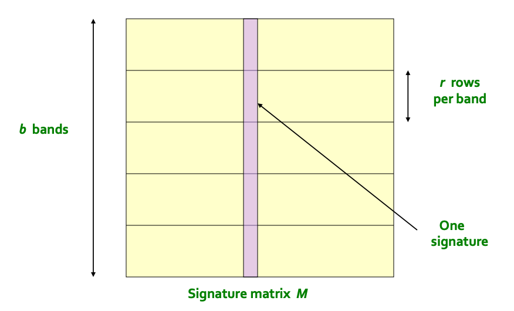
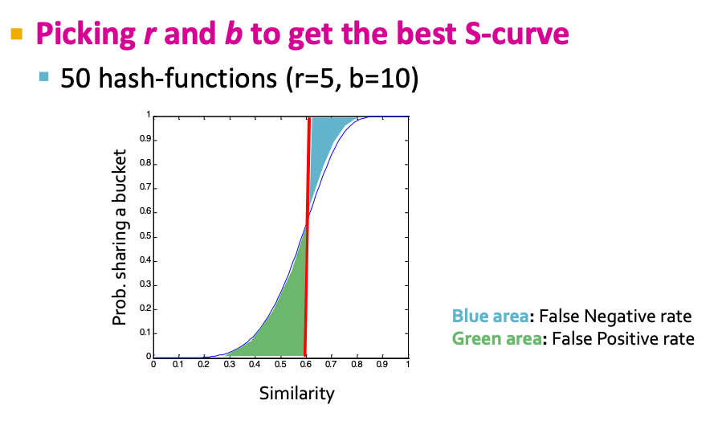

# Lecture 3 - Locality Sensitive Hashing

Locality Sensitive hashing is a brilliant use of hashing (Jure: The most brilliant), very important, part of the buildup to recommender systems.
It solves the problem of **nearest neighbours in high dimensions**.

**Motivation:**
How do you do similar image search over billions of images in real (constant) time? (Ie Pinterest does this) 
	How to do it?
	Use an embedding of an image. You have a distance function to compute similarities between two different image embeddings. But you have billions of images and you want to do it in constant time.

Many problem can be expressed as finding ‘similar sets’. - Find near-neighbnors in high-dimensional space.

Examples
	- Web Pages with similar words
		- Ie Near duplicate detection, classification by topic
	- Customers who purchased similar products
		- Useful for recommender systems
		- Products with similar customer sets
	- Computer vision: Images with similar features - 
		- Pinterest - similar image search
		- Image completion 

Given:
	- High dimensional data points `x1, x2,...`
	- And some distance function `d(x1,x2)`
	- Goal: Find all pairs of data points `(xi,xj)` that are within distance threshold `d(xi,xj)<s`
	- Mote: Naive solution would take O(N^2), but this can be done in O(N).

Locality Sensitive hashing:
	- In general, one throws items in to buckets using several different ‘locality-sensitive hash functions’.
	- You examine only those pairs of items that share a bucket for at least one of these hashings.
	- Upside: Designed correctly, only a small fraction of pairs are ever examined.
	- Downside - You have some false negatives, some pairs never get considered. Thats ok

**Finding Similar Documents**
Suppose we need to find near-duplicate documents among N=1 million documents. 
	Naively, we would have to compute pairwise similarities for every pair of docs. Impossible.
3 Steps:
	**Shingling**: Converts document into a long 1-0 set (Boolean Vector)
	**Min-hashing**: Convert large set representation to short signatures that preserve similarity and distance.
	**Locality-sentive hashing**: Focus on pairs of signatures likely to be form similar documents.

Step 1: **Shingling** (k-gramming)
	- A k-shingle (k-gram) for a document is a sequence of k tokens (words, characters, etc) that appears in the doc. k = 8,9, or 10 is often used in practice.
	- Example:
		- k=2; document D1 = abacb (1)
		- Set of 2-singles S(D1) = {ab, bc, ca}. 
		- Hash the shingles h(D1)= {1,5,7}

	- To compress long shingles, we hash them to (say) 4 bytes. That is, we represent a document by the set of hash values of its k-shingles. So if we use 10-grams on a vocab of 10^5, we have 10^50 shingles, which is way too much. But you don’t work with raw shingles, you hash them to some ids, and ignore the collisions.

	- Similarity between the shingles uses **Jaccard Similarity**
		- `jaccard_sim(D1,D2) = |C1 n C2|/|C1 u C2|` intersection / union.
		- `Jaccard distance` is 1- Jaccard Similarity.
	
	- Finally, Convert Shingle Sets to Boolean (bit) vectors by holding in a sparse matrix
		- Rows = elements (shingles)
		- Columns = Sets (documents)

Step 2: **Min-hashing**:
		- Motivation: Convert large sets to short signatures, while preserving similarity. Idea: hash docs into buckets. Expect that ‘most’ pairs of near duplicate documents hash to the same bucket.
			- Use a hash function h() such that
				- If sim(C1,C2) is high, then with high prob. h(C1) = h(C2)  (2)
				- If sim(C1,C2) is low, then with high prob. h(C1) ≠ h(C2)
				- This depends on the similarity matric-  not all similarity metrics have a suitable hash function, but there is a suitable hash function for the Jaccard similarity: **min-hashing**.
		- Min-hashing algo overview
			- “Permute” the rows of the Boolean matrix using some permutation π. 
										(You don’t actually permute which is expensive, instead you hash the rows)
			- Define `minhash` function `hπ(C)` for this permutation π, 
			`hπ(C) = the number of the first (in the permuted order) row in which column C has value 1`.
			Apply to all columns, use several randomly chosen permutations π to create a signature for each column.
			Result is a signature matrix: `Columns = sets`, `rows = minhash values for each permutation π`. (3)
							- Min-hasing has the min-hash property, that is, it is a similarity-preserving hash function for the Jaccard similarity. Proof in (4).
							- We just showed that similarity of hash functions corresponds to similarity of docuemnts.
			- Define the **similarity of two signuatures** as the fraction of the hash functions in which they agree. Then the expected similarity of two signatures, equals the Jaccard similarity of the columns or sets that the signatures represent.
		- Implementation of min-hashing.
			- Use row-hashing to simulate ‘permutation’.
			- Pick K=100 hash functions `hi`. Ordering under `hi` gives a random ‘permutation’ π of rows
			- One-pass implementation
				- For each column `c` and hash function `hi` help a “slot” `M(i,c)` for the min hash value of that slot so far.
				- Initialize all `M(i,c) = ∞`
				- Scan rows looking for 1s

```text
				for each row r:
					for each hash function hi:
						compute hi (r);
				for each column c
					if c has 1 in row r
					for each hash function hi
						if hi (r) < M(i, c) then
							M(i, c) := hi (r);
```

Step 3: **Locality-Sensitive Hashing**:
	- A general step that can be applied to the results of any similarity preserving signature. 
	- Focus on pairs of signatures liekly to be from similar documents
		- Goal: Find documents with Jaccard similarity at least threshold s.
		- General idea: We hash the hashes again with a hash function that tells whether x and y is a candidate pair. We hash the columns several times, arranging the tonly similarly columns hash to the same bucket.
		- Process: For min-hash matrices:
			- Hash columns of signature matrix M to many buckets
			- Each pair of documents that hashes into the same bucket is a candidate pair.
	- Let M be the signature matrix.
	- Columns x and y of M are a candidate pair if their signatures agree on at least fraction s of their rows. 
		- We expect documents x and y to have the same (Jaccard) similarity as their signatures.
	- Algo:
		- Partition M into `b` bands with `r` rows per band (Img 1)
		- For each band, hash its portion of each column to a hash table with k buckets. Make k as large as possible so we only have collisions when documents are similar. (Img 2)
		- Candidate column pairs are those that hash to the same bucket for >= band.
				- Explanation: Simplifying Assumption: There are enough buckets that columns are unlikely hash to the same bucket unless they are identical in a particular band. (Everything still works if we don’t make this assumption, but its a bit more involved)
					- Suppose 100,000 columns of M. (100K docs)
					- Signatures of 100 integers
					- Therefore, signatures take 40MB.
					- Goal: Find pairs of documents that at at least s= 0.8 similar.
						- For similar pairs:
							- Choose b=20 bands and r=5 integers/band. Suppose sim(C1,C2)=0.8. Then the probability that they are identical in a band is 0.8^5 =0.328
							- Probability that C1, C2 are not similar in all of the 20 bands is (1-0.328) ^ 20 = 0.00035. This is the probability that we miss C1, C2 as a candidate pair. So we can find 99.965% of truly similar documents.
						- For dissimilar pairs
							- suppose sim(C1,C2) = 0.3
								- Then Prob C1, C2 identical in one particular band is (0.3)^5 = 0.00243.
								- Prob C1, C2 identical in at least one of 20 bands = 1 - (1- 0.00243) ^20 = 0.0474.
								- So in 4.74% pairs of docs with similarity 0.3 end up becoming candidate pairs.
								- We need to examine their similarity to see if they are truly similar or are false positives.
			- Tune b and r to catch most similar pairs and not many non-similar pairs. Note that `b * r must = M`
				- The prob that at least 1 band identical is `1-(1-t^r) ^b`
				- Pick r and b to get the best s-curve that minimizes your false negative and false positive rate (Img 3)
				- 

(Img 1)


(Img 2)

(Img 3)


Locality-Sensitive hash functions:

(1) k = 8,9, or 10 is often used in practice.
(2) Documents are now columns, represented by C1, C2 etc.
(3) We can define  `hπ(C) = the number of the first (in the orignal order) row in which column C has value 1` or `hπ(C) = the number of the first (in the permuted order) row in which column C has value 1`, it doesn’t really matter.
(4)



#cs246