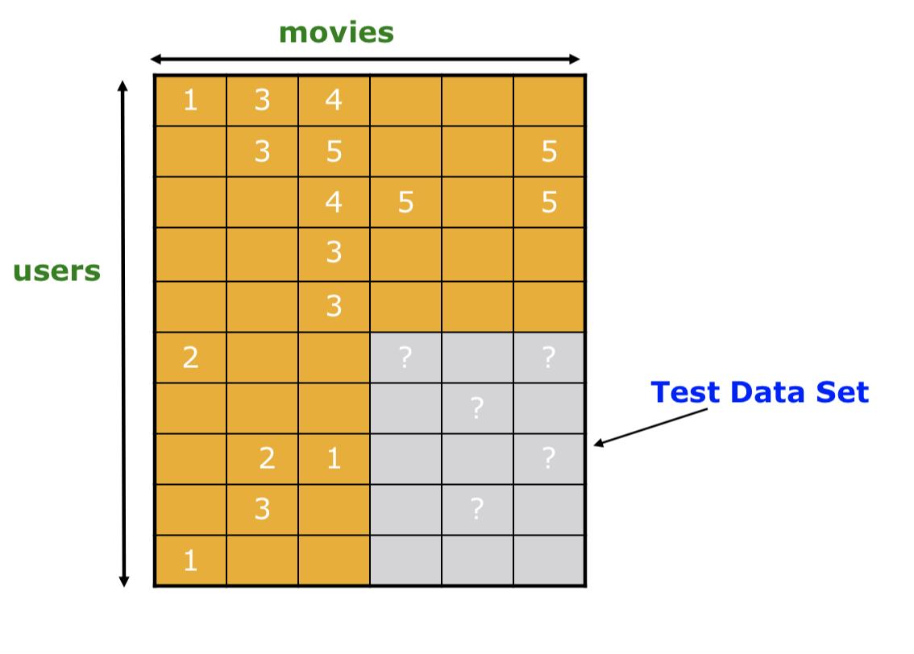

## Hybrid Recommender Systems
 - Implement two or more different recommenders and combine predictions (ie linearly)
 - Add content based methods to collaborative fitlering to solve cold start for users and items.

## Content-based filtering

 - Pros: Explainable, no cold start problem 
 - Cons: Are overspecialized to the user: unable to explot quality judgements of other users

## Collaborative Filtering
- Pros: Works for any kind of item
- Cons: Cold Start problem,
  - Sparsity (hard to find users that have rated the same items, solved using dimensinoality reduction)
  - First rater (cannot recommend new item)
  - Popularity Bias: Tends to recommend popular items, cannot recommend items to someone with unique taste.
    - Althrough, granted, a recommender system that just gives the most popular x items is hard to beat in practice.
### Algo Summary: 
 - Consider User x
 - Find set N of other users whose have rated item k, who are ’similar’ to x’s ratings (nearest neighbors).
 - Estimate x’s ratings based on ratings from users in N.
  
Similarity measure used: **Pearson correlation coefficient** (covariance divided by standard deviation, or cosine but over values normalized by average): (1)

If $S_{xy} = $ items rated by both users x and y, then

(In the below we switched to an item-item filtering view, but same idea for user-user)
In Practice, we estimate the rating $r_{xi}$ of item i for user x as the similarity weighted average:

$$r_{xi} = b_{xi} + \frac{\sum_{j \in N(i;x)} s_{ij} \cdot (r_{xj}-b_{xj})} {\sum_{j \in N(i;x)}s_{ij}}$$

where $b_{xi}$ is the baseline rating for $r_{xi}$.
$b_{xi} = \mu + b_x + b_i$, where
 - $ \mu$ = overall mean movie rating
 - $b_x$ = rating deviation of user x = (avg. rating of user x) - $\mu$
 - $b_i$ = rating deviation of movie i = (avg. rating of movie i) - $\mu$
 
## Notes: 
  - Item-item filtering generally works better than user-user in practice. This is becuause items have more stable profiles.

## Evaluation for RecSys:

Take the original utility matrix, mask a part of it, and use it as a test dataset

Ratings metrics used:
  - Precision at top 10.
    - RMSE is NOT useful (somewhat problematic because we don’t really care about all values, _we only care about highly rated items_)
  - Spearman Rank Correlation (correlation between ordinal ranks of system's and user's complete ranking)

Or, in the 0/1 model (implicit feedback, all values are 1 or 0).
  - Coverage: Number of items/users for which the system can use predictions. 
    - A very important thing for all RecSys, you want to compute this as soon as possible  
  - Precision: Accuracy of predictions
  - ROC: Tradeoff curve between false positives and False Negatives.
  
Problems wiht Error Measures - Narrow focus on accuracy sometimes misses the point. SOmetimes we also care about
  - Prediction diversity (serendipity)
  - Prediction Context (what did the user buy before and after?)
  - Order of Predictions

## Other Notes
### Time complexity of Collaborative Filtering:
   - Most expensive step is to find the $k$ most similar customers: This is $O(|X|)$.
   - However, we must save space by precomputing this and saving using LSH (or clustering, dimensionality reduction).
   
### Tip for RecSys:
  - Leverage all the data
    - Don't try to reduce data size in an effort to make fancy algos work. Simple methods on large data do best. If stuck, Add more data (both features and observations) (add imdb data on genres). More data beats better algorithms. ("The Unreasonable Efficacy of Data")
  

(1) Note: We use Pearson instead of Cosine because treats missing ratings as ’negative’ (zero). Pearson is simply Cosine if the ratings are adjusted by the user's average rating. This is simply the correlation normalized by stddevaitions, or the Pearson coefficient