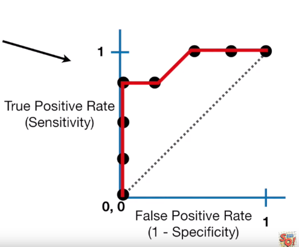
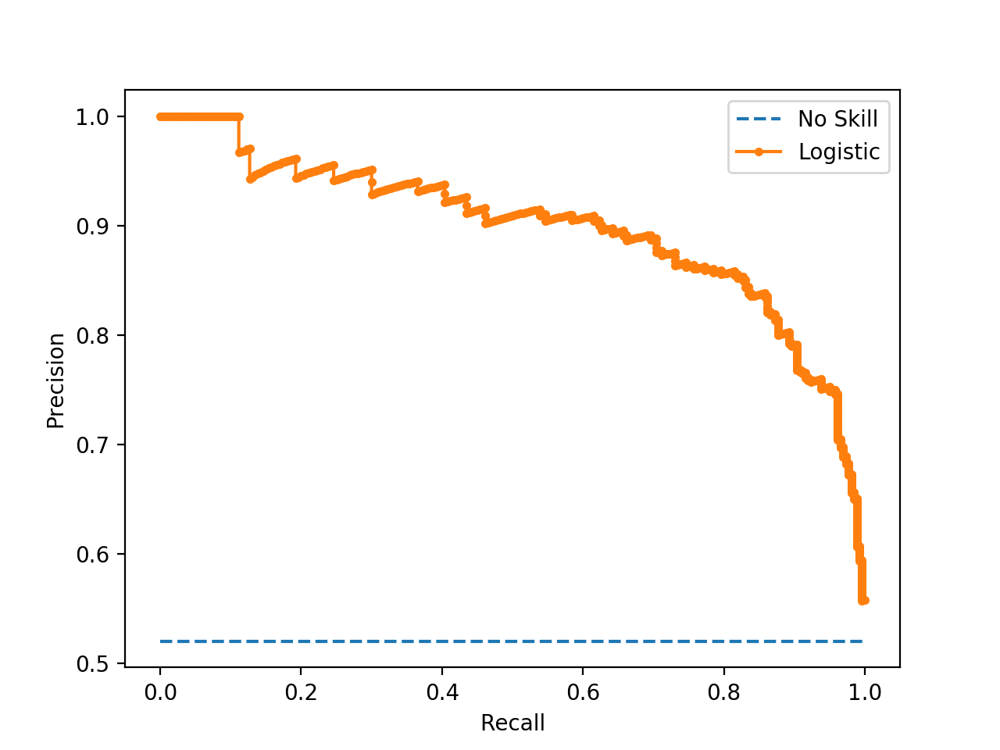

Methods:
Cross-validation, usually only used with smaller datasets

Evaluation Metrics
Tricks: 
Incremental Dev Set Testing - At every ~100th iteration, make predictions on dev set and store that vector of predictions. Plot a learning curve
You can observe training on tensorboard.

# When to Use ROC vs. Precision-Recall Curves?
Generally, the use of ROC curves and precision-recall curves are as follows:
  - ROC curves should be used when there are roughly equal numbers of observations for each class.
  - Precision-Recall curves should be used when there is a moderate to large class imbalance. (1)

### Accuracy, Precision, Recall
Accuracy fails to control for size inbalances - so rarely used.
Precision - Pitfall: You can achieve very high precision for a category by rarely guessing it. (1- false positive rate)
Recall - ‘true positive rate’ - Pitfall: you can achieve a very high recall for a category by always guessing it
F score - harmonic mean of precision / recall biased one way or another. F1 is balanced. Pitfall: There is no normalization for the size of the dataset within the class of the dataset or outside of it. Working with very diffrent datasets, you may get very similar F1 scores.

Maco-averaged F-scores: mean of F scores per each category. Each class, no matter what its size, gets the same weight. This may make sense if we care about the small classes as much as the large classes.
Weighted-average F scores: Each class has a differnt weight when averaging the F scores.
Micro-average F scores - same as accuracy. Preferred if there is a class imbalance problem

The general formula for F score (where $\beta$ is chosen such taht recall is $\beta$ times more important than precision, is
$$F_\beta = (1+\beta^2) \frac{\text{precision} \cdot \text{recall}}{\beta^2 \cdot \text{precision} + \text{recall}}$$

### ROC/AUC-
If we slide the threshold from 0 to 1, we plot the True positive rate and the false positive rate.
If at some point the true positive rate is close to 1 and the false positive rate is close to 0, this is a great classifier.

**ROC **

**
**

**Precision - Recall Curve**

**
**

**Appendix 1:**

Area under Precision-Recall Curve (AUCPR) is another possible metric, though less used.**
**